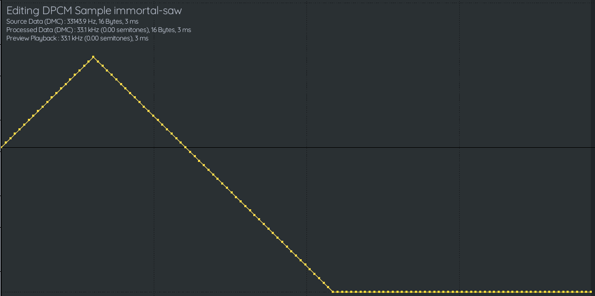
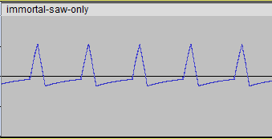
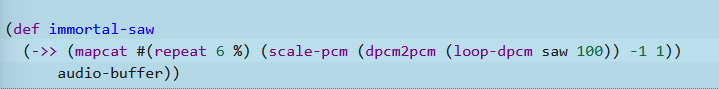
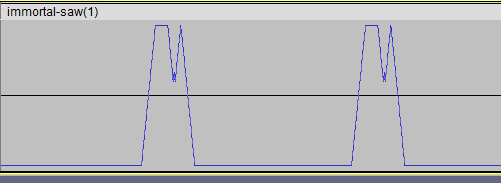
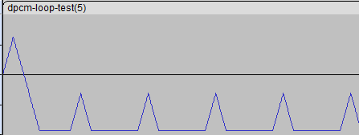
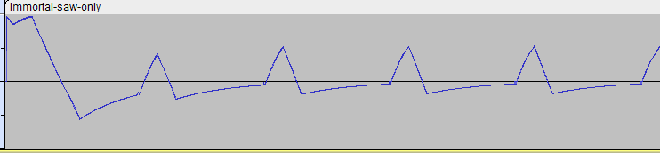
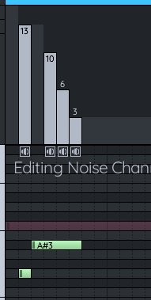
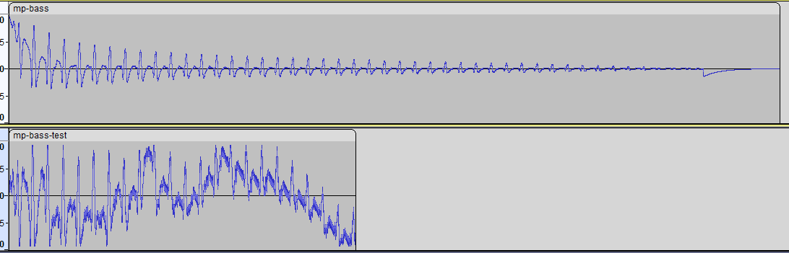

- So this is actually ridiculously simple. Instead of building the audio buffer the normal way, we just keep track of the current value and either raise or lower it depending on the next bit.
- The DMC sample files are packed little-endian, so say the first byte is EF, that is
- ```
  1 1 1 0 1 1 1 1
  ```
- These bits are read right to left, which means the wave goes up 4, down 1, and up 3.
- So we can just use a single function that converts it to values and outputs an array of PCM values. Simple.
- I've got the SimLispy project running, but actually this isn't the right one
- hmm, but it's the best working one. the bobbi-lisp-audio repo is a mess
- Let's go with simlispy but rename it to something, like toffee-nes
- not going to worry about that just yet. But let's take a DPCM file and read it in as binary data.
- I should use something very common, like from one of the famistudio demos
- There's Journey to Silius which has the Sunsoft bass, would be funny to troll cc
- There's Castlevania, has a kick and snare
- Gimmick has a pretty cool slap bass
- Gradius 2 has the kick and snare, and also some very good release/echo arps... now I know what heydon meant by that.
- Lupin the Third has some great congas, toms, and even vocal samples that are split over 2 samples
- Now, I can use literally any NSF, since I'm not particularly liking these
- I think I'll do a song from Gremlins 2 with the sunsoft bass, because it actually fucking rocks, and also because it will force me to implement the pitches
- Oh, and there's looping too.
- There's Zeta's DPCM triangle...
- Oh nice, I've got the Rob Hubbard sawtooth thing from The Immortal
- Fuck, I also need to finish the stupid noise pitches
- The song from The Immortal also uses the short noise
- so shit... anyway, it's track 18
- Oh wait... track 2 uses the pitched sample and only one noise pitch/mode
- Ok going with the Gremlins sunsoft thingy. there's 4 of them.
- I added the samples to the project... now I need to read them in, and I'll actually save the values in the source code I think
- hmmm, if I do that I won't need to bother with a file input thingy
- but hmmm. lol. maybe I will anyway. but not quite yet. lol
- The Rob Hubbard thingy is so small it could go right in the thing. the editor, that is. It might be the ideal test for that reason!
- It's just `FF FF 0F 00 00 00 00 00 00 00 00 00 00 00 00 00`
- or
- ```clojure
  (concat '(0xFF 0xFF 0x0F)
    (repeat 13 0x00))
  ```
- Ok, so now how the fuck do I turn this to binary
- ```js
  function hex2bin(hex){
      return (parseInt(hex, 16).toString(2)).padStart(8, '0');
  }
  ```
- I already have `dec2bin` from something else... so this works
- ```clojure
  (apply str (map dec2bin (concat '(0xFF 0xFF 0x0F)
    (repeat 13 0x00))))
  => 
  "111111111111111111110000000000000" 
  ```
- That's not actually correct though. There needs to be twice as many zeros. Because it needs to interpret `00` as `00000000`. The `hex2bin` function does that correctly. But it doesn't do the other ones right! See:
- ```clojure
  (hex2bin 0xFF)
  => 
  "1001010101" 
  ```
- Oh... `hex2bin` just wants a string:
- ```clojure
  (hex2bin "FF")
  => 
  "11111111" 
  ```
- This works:
- ```clojure
  (def saw "FFFF0F00000000000000000000000000")
  
  (hex2bin (apply str (mapcat reverse (partition 2 saw))))
  => 
  "11111111111111111111000000000000000000000000000000000000000000000000000000000000000000000000000000000000000000000000000000000000" 
  ```
- I was confused why the wave ends up like this 
- Like where do those extra values come from when it flattens out?
- And I realized, by experimenting that they're not extra values. Those are in the file, and it flattens out when it exceeds the acceptable values. Cool!
- How about with a function
- ```clojure
  (def saw "FFFF0F00000000000000000000000000")
  
  (defn dpcm [hex]
    (hex2bin (apply str (mapcat reverse (partition 2 hex)))))
  
  (dpcm saw)
  => 
  "11111111111111111111000000000000000000000000000000000000000000000000000000000000000000000000000000000000000000000000000000000000" 
  ```
- Or with a threading macro
- ```clojure
  (defn dpcm [hex]
    (->> hex
    (partition 2)
    (mapcat reverse)
    (apply str)
    hex2bin))
  ```
- ok, so now, how many steps do we have? 64? It's 0-127.
- If I'm feeling adventurous I'd make an SVG plot... but that's kind of distracting from the issue at hand, which is to write a function that turns it into properly scaled values... so first we'll scale it to 0-127
- wait... it's 64. Why does it say 0-127? That would be 7 bits
- Ah... the FamiStudio docs explain:
- > DMC Initial Value : Initial value of the DMC counter (0-63, values are actually 1/2 of what the hardware uses). This can be tweaked to that the first value matches the initial value of the WAV file, or to off the entire DMC data as a whole.
- ok, so 127 it is
- Somewhat annoyingly, we need to get it back to a sequence of numbers
- ```clojure
  (map #(parseInt % 2) (dpcm saw))
  ```
- Derp, let's just put it in the dpcm function
- ```clojure
  (defn hex2dpcm [hex]
    (->> hex
    (partition 2)
    (mapcat reverse)
    (apply str)
    hex2bin
    (map #(parseInt % 2))))
  ```
- Yes, I'm calling it `hex2dpcm` now
- So, we start at 64, and process the sequence while keeping track of the output. That sounds like `reduce`.
- The accumulator will contain the finished sequence of PCM values scaled 0-127.
- You add or subtract 2... so that's why it actually makes more sense to use 64, hahaha
- So the reducing function will take the running total and:
- oh, wait.... yeah, I just realized we need to track 2 variables, but that will probably still work
- But maybe I'll write it with a loop first
- I think this works... first try!
- ```clojure
  (loop [dpcm (hex2dpcm saw) output 32 result [32]]
    (if (empty? dpcm) result
      (let [v (if (zero? (first dpcm)) (dec output) (inc output))]
        (if (< 1 v 63)
          (recur (rest dpcm) v (conj result v))
          (recur (rest dpcm) (first dpcm) (conj result (first dpcm)))))))
  
  [32 33 34 35 36 37 38 39 40 41 42 43 44 45 46 47 48 49 50 51 52 51 50 49
   48 47 46 45 44 43 42 41 40 39 38 37 36 35 34 33 32 31 30 29 28 27 26 25
   24 23 22 21 20 19 18 17 16 15 14 13 12 11 10 9 8 7 6 5 4 3 2 0 0 0 0 0 0
   0 0 0 0 0 0 0 0 0 0 0 0 0 0 0 0 0 0 0 0 0 0 0 0 0 0 0 0 0 0 0 0 0 0 0 0 0
   0 0 0 0 0 0 0 0 0 0 0 0 0 0 0]
  ```
- So now If I just modify it by abstracting the computation from the loop logic, I should be able to turn it into a reducing function... maybe by using a vector tuple, like this:
- ```clojure
  (let [v (if (zero? (first dpcm))
            (dec (first acc)) 
            (inc (first acc)))]
        (if (< 1 v 63)
          [v (conj (last acc v))]
          [(first dpcm) (conj (last acc (first dpcm)))]))
  ```
- It doesn't work... I'm doing something wrong. oh well, let's go on with the scaling part
- ```clojure
  (defn dpcm2pcm [vals]
    (loop [dpcm vals output 32 result [32]]
      (if (empty? dpcm) result
        (let [v (if (zero? (first dpcm)) (dec output) (inc output))]
          (if (< 1 v 63)
            (recur (rest dpcm) v (conj result v))
            (recur (rest dpcm) (first dpcm) (conj result (first dpcm))))))))
  
  (defn scale-pcm [values t-min t-max]
    (let [maximum (apply max values)
          minimum (apply min values)
          spread (- maximum minimum)]
      (map #(+ (* (/ % 64) (- t-max t-min)) t-min)
        values)))
  
  (scale-pcm (dpcm2pcm (hex2dpcm saw)) -1 1)
  
  [0 0.03125 0.0625 0.09375 0.125 0.15625 0.1875 0.21875 0.25 0.28125 0.3125 0.34375 0.375 
   0.40625 0.4375 0.46875 0.5 0.53125 0.5625 0.59375 0.625 0.59375 0.5625 0.53125 0.5 0.46875 
   0.4375 0.40625 0.375 0.34375 0.3125 0.28125 0.25 0.21875 0.1875 0.15625 0.125 0.09375 0.0625 
   0.03125 0 -0.03125 -0.0625 -0.09375 -0.125 -0.15625 -0.1875 -0.21875 -0.25 -0.28125 -0.3125 
   -0.34375 -0.375 -0.40625 -0.4375 -0.46875 -0.5 -0.53125 -0.5625 -0.59375 -0.625 -0.65625 
   -0.6875 -0.71875 -0.75 -0.78125 -0.8125 -0.84375 -0.875 -0.90625 -0.9375 -1 -1 -1 -1 -1 -1 -1 
   -1 -1 -1 -1 -1 -1 -1 -1 -1 -1 -1 -1 -1 -1 -1 -1 -1 -1 -1 -1 -1 -1 -1 -1 -1 -1 -1 -1 -1 -1 -1 
   -1 -1 -1 -1 -1 -1 -1 -1 -1 -1 -1 -1 -1 -1 -1 -1 -1 -1 -1 -1]
  ```
- Now we just loop it and pass it to the engine as an audio buffer!
- Do I still have that? what does the play function do?
	- It takes an audiobuffer and an optional time, that's right
	- the `audioBuffer` function takes an array of vals
	- which is `audio-buffer` in the Lisp core library
	- Let's try it!
- holy shit, it works! this is the final code:
- ```clojure
  (def saw "FFFF0F00000000000000000000000000")
  
  (defn hex2dpcm [hex]
    (->> hex
    (partition 2)
    (mapcat reverse)
    (apply str)
    hex2bin
    (map #(parseInt % 2))))
  
  (defn dpcm2pcm [vals]
    (loop [dpcm vals output 32 result [32]]
      (if (empty? dpcm) result
        (let [v (if (zero? (first dpcm)) (dec output) (inc output))]
          (if (< 1 v 63)
            (recur (rest dpcm) v (conj result v))
            (recur (rest dpcm) (first dpcm) (conj result (first dpcm))))))))
  
  (defn scale-pcm [values t-min t-max]
    (let [maximum (apply max values)
          minimum (apply min values)
          spread (- maximum minimum)]
      (map #(+ (* (/ % 64) (- t-max t-min)) t-min)
        values)))
  
  (->> (mapcat #(repeat 6 %) (scale-pcm (dpcm2pcm (hex2dpcm saw)) -1 1))
    (repeat 100)
    (apply concat)
    audio-buffer
    play)
  
  (spit-wav "immortal-saw-test"
  (->> (mapcat #(repeat 6 %) (scale-pcm (dpcm2pcm (hex2dpcm saw)) -1 1))
    (repeat 100)
    (apply concat)
    audio-buffer))
  ```
- I'll commit this with it on the default page
- ok so TakuikaNinja pointed out that that's not how DPCM looping works, it needs to keep track of the delta value *across* the loops, so it ends up like this:
- 
- > the thing is, it probably also relies on the output filtering
  so flatlines would trend back towards the middle
- I can ignore the filtering thing for now and just try to get looping working properly... so it will need to be a stateful thing
- My (apply concat (repeat 100)) is taking so long it's basically crashing the page, hmm
- oh I think I see... it's taking so long just processing that many values, even at all
- What I'm gonna have to do is write a function on the javascript side
- The hex2dpcm function, that is. That's where it's hanging. Which is fine because I don't want that in Lisp land anyway
- oh weird something funny is going on anyway
- ```clojure
  (hex2dpcm looped-saw)
  => 
  (NaN NaN NaN NaN NaN NaN NaN NaN) 
  ```
- no wonder it wasn't playing correctly, hahaha
- I'm gonna hold this for now and maybe chip a tune in FamiStudio... I found myself singing Hahu from Bava Bathra, hahahaha
- ok, coming back...
- This gets us a string of binary digits
- ```js
  function hex2bin(hex){
      return (parseInt(hex, 16).toString(2)).padStart(8, '0');
  }
  
  // this will take a hex string, i.e. "FFFF0F00000000000000000000000000"
  
  export function loopDPCM(hex, n) {
      const bytes = hex.match(/../g);
      const le = bytes.map(x => x.split("").reverse().join(""))
      return le.map(x => hex2bin(x)).join("")
  }
  ```
- ```clojure
  (def saw "FFFF0F00000000000000000000000000")
  
  (loop-dpcm saw)
  => 
  "111111111111111111110000000000000000000 ..."
  ```
- I guess that's workable? Feels pretty dumb but whatevs
- So uh... I guess that will be `hex2dpcm`, not the loop one
- ```js
  function loopDPCM(s, n) {
      return hex2DPCM(s).repeat(n)
  }
  ```
- ok, now I need to do the main dpcm2pcm function
- huh, this is disappointing. The JavaScript function even hangs while trying to repeat it 100 times...
- hmm, maybe because it's printing it in the editor. That might be it
- I think this should work
- ```js
  function dpcm2pcm(vals) {
     let output = 32
     let result = [32]
     for (let i = 0; i < vals.length; i++) {
      const v = vals[i] == 0 ? output - 1 : output + 1 
      if (v > 1 && v < 63) {
          output = v
      }
      result.push(output)
     }
     return result
  }
  ```
- it hung trying to eval this 
- Anyway... now I need to scale them. This is the Lisp function
- ```clojure
  (defn scale-pcm [values t-min t-max]
    (map #(+ (* (/ % 64) (- t-max t-min)) t-min)
          values))
  ```
- ok, it's closer now. I'm getting audio but it's still fucked
- ```clojure
  (def saw "FFFF0F00000000000000000000000000")
  
  (spit-wav "dpcm-loop-test.wav"
    (audio-buffer (dpcm2pcm (loop-dpcm (apply str (mapcat #(repeat 6 %) saw)) 100))))
  ```
- 
- huh, I think the scaling is actually fine... the problem is how I'm doing the sample rate, you can't just repeat the differentials like that!
- But even if I do it normally it's still fucked
- ```clojure
  (def saw "FFFF0F00000000000000000000000000")
  
  (spit-wav "dpcm-loop-test.wav"
    (audio-buffer (dpcm2pcm (loop-dpcm saw 500))))
  ```
- 
- it's uh... going down too many steps
- no... it's just... wait... could it actually be right, and just the output filter is supposed to be balancing it?
- Here's the beginning of the original:
- 
- ok so the sample rate needs to be handled by the function that actually builds the sequence of PCM values, so it can insert the proper number of repetitions then
- Actually I think instead of doing even repetitions, we have to do something more precise, by keeping count of how many samples are being processed, and changing the value every n samples, where n could be say, 1.5
- So how would I write that function? This is breaking my brain and it should be so simple. How do I think of this?
- Let's say we want the value to change every 1.1 samples. This would result in needing to *not* switch the value every 10 samples:
- ```clojure
  (range 0 100 1.1)
  => 
  (0
   1.1
   2.2
   3.3000000000000003
   4.4
   5.5
   6.6
   7.699999999999999
   8.799999999999999
   9.899999999999999
   10.999999999999998
   12.099999999999998
   ...)
  ```
- What we can do is take the number of the sample we are on, say it's 8.
- multiply 8 by 1.1 = 8.8. change the sample, because 8.8 floored is 1 more than the previous value floored.
- multiply 9 by 1.1 = 9.9. change the sample
- multiply 10 by 1.1 = 11. We do *not* change the value because 11 is not 1 more than the previous value floored.
- maybe I should think about it from the other direction. Say we want to repeat a value every 10 frames. Which values get repeated?
- ```clojure
  (range 0 100 10)
  => 
  (0 10 20 30 40 50 60 70 80 90) 
  ```
- it's like the concept of a lag frame.
- ```clojure
  (for [n (range 100)]
    [n (Math/floor (* n 1.1))])
  => 
  ([0 0]
   [1 1]
   [2 2]
   [3 3]
   [4 4]
   [5 5]
   [6 6]
   [7 7]
   [8 8]
   [9 9]
   [10 11]
   [11 12]
   [12 13]
  ```
- Whenever the value on the right increases by more than 1, that means we need to repeat a value to let it "catch up".
- Ok, coming in for a landing:
- ```clojure
  (/ 100 1.1)
  => 
  90.9090909090909 
  ```
- That means there need to be 10 repeated values, because 100 - 90 = 10.
- ok I think I've got it! omg why was that so hard?
- So let's modify the `dpcm2pcm` function to take a rate. we'll just pass an integer for now.
- I guess we're going to use a while loop instead of a for? Because we want the index to not advance if we're at a repeat frame. So the end condition will just be when the array is empty.
- We initialize a variable to our rate value, called samplesLeft (until a repeated value)
- Every iteration, we:
	- check the number of samples left before a repeated one
		- If zero, we put the current output value in the result array, set samplesLeft back to the rate, and go to the next iteration
		- if not zero, we shift the array of values, compute the next output value and add it to the results array, and decrement the samplesLeft.
- This is what I got:
- ```js
  function dpcm2pcm(vals, rate) {
     let samplesLeft = rate
     let output = 32
     let result = [32]
     while (vals.length > 0) {
      if (samplesLeft === 0) {
          result.push(output)
          samplesLeft = rate
      } else {
          let v = vals[0] == 0 ? output - 1 : output + 1
          if (v > 1 && v < 63) {
              output = v
          }
          result.push(output)
          vals.shift()
          samplesLeft -= 1
      }
     }
     console.log(result)
     return scalePCM(result)
  }
  ```
- ok. so that works great! But it only takes the pitch down so far until we're repeating each value twice.
- So what if we need more repeats than that? Sometimes we might need to add 2. Or more.
- So let's try thinking of it as a quota. At any point while building the array, we run a calculation that determines whether we need to add a repeat.
- Let's try to make a table or something
- Let's say for clarity that our input is alternating 0 1 0 1, and there's a point where it needs to have 3 repeats in a row
- ```
  0 1 2 3 4 5 6 7 8 9
  
  ```
- That would be because there are so many less input values than samples left to allocate
- Instead of keeping a counter until we add a repeat sample, we repeat by default, and have a test to decide whether to use a *new* value.
- In the example above, there are 10 samples. How many inputs?
- If there were 5, that would be exactly doubles. So let's say 4.
- 10 divided by 4 is 2.5. Which means we allocate a new input every 2.5 samples.
- since it needs to be an even frame, we're gonna need to floor something.
- Frame 0. 10 samples left, 4 inputs left.
- Actually, we could just calculate the frames that change like so:
- ```clojure
  (for [n (range 4)]
    (Math/floor (* n 2.5)))
  => 
  (0 2 5 7)
  ```
- So our result is this:
- ```
  0 1 2 3 4 5 6 7 8 9
  0 0 1 1 1 0 0 1 1 1
  ```
- Let's implement it!
- So we'll build an array called `newFrames`, and populate it like so:
- ```js
  let newFrames = []
      for (let i = 0; i < vals.length; i++) {
          newFrames.push(Math.floor(i * rate))
      }
  ```
- For the iteration, I guess it will still be a while loop because we're gonna go until our...
- wait no. It will be a for loop, because we need to calculate how many frames there are to be total, then populate them all.
- So we loop through vals.length * rate
- Test whether i = the first element of newFrames
	- If so, we shift both arrays, to exhaust the current value and put the next newFrame index at the head
- I guess that's it. We don't need an else branch, because either way we're going to compute the next sample based on the next input value.
- Yes! It works!
- ```js
  function dpcm2pcm(vals, rate) {
      let newFrames = []
      for (let i = 0; i < vals.length; i++) {
          newFrames.push(Math.floor(i * rate))
      }
      let output = 32
      let result = [32]
      for (let i = 0; i < (vals.length * rate); i++) {
          if (i === newFrames[0]) {
              vals.shift()
              newFrames.shift()
          }
          let v = vals[0] == 0 ? output - 1 : output + 1
          if (v > 1 && v < 63) {
              output = v
          }
          result.push(output)
      }
      return scalePCM(result)
  }
  ```
- So that will scale the pitch down, but not up
- I guess that's fine, because that's how the actual hardware works, right?
- Great, so we're cooking.
- I think I want to port over my function docs thingy
- Done!
- I might be able to apply a similar technique as the dpcm pitching to the noise. It will only switch bits on specific "switch frames"
- And then we'll be essentially done! As far as features of the NES, sans filtering which I'm not overly concerned with atm.
- Here is the current drum function:
- ```js
  export function drum_seq(notes) {
      const lastNote = notes.reduce(
          (prev, current) => {
              return prev.get("ʞtime") > current.get("ʞtime") ? prev : current
          }
      );
      const bufferLength = Math.ceil(ctx.sampleRate * lastNote.get("ʞtime") + lastNote.get("ʞlength"))
      // initialize buffer of proper length filled with zeros
      let buf = Array(bufferLength).fill(0)
      // loop through notes
      for (let i = 0; i < notes.length; i++) {
          // loop through the note's samples
          const start = Math.floor(notes[i].get("ʞtime") * ctx.sampleRate)
          const duration = Math.ceil(notes[i].get("ʞlength") * ctx.sampleRate)
          for (let j = 0; j < duration; j++) {
              x = feedback(x)
              var multiplier = 1 - (j * (1 / duration))
              buf[start + j] = multiplier * (0.3 * x / 32767 * 2 - 0.25)
          }
      }
      return audioBuffer(buf)
  }
  ```
- What I need to do is remove the fade, which is the `var multiplier = 1 - (j * (1 / duration))` part
- Then modify the API so that noise notes accept a `pitch` key (like the others), and the `x = feedback(x)` part will be conditionally run based on the pitch.
- That's all! Let's go
- So the pulse/tri functions do
- ```js
  const freq = midiToFreq(notes[i].get("ʞpitch"))
  ```
- But we're gonna do something different, I guess like FamiTracker's pitches... na actually I think Zeta said he switched it because it makes more sense to go low to high. So pitch will be 0-15.
- We'll do something like this to build an array of indices on which we tick the LFSR
- ```js
  let newFrames = []
      for (let i = 0; i < vals.length; i++) {
          newFrames.push(Math.floor(i * rate))
      }
  ```
- Wait so if I just code it the same as the rate it will work like FamiTracker, fine for now then I'll make some conversion later if I want
- It works!
- ```js
  export function drum_seq(notes) {
      const lastNote = notes.reduce(
          (prev, current) => {
              return prev.get("ʞtime") > current.get("ʞtime") ? prev : current
          }
      );
      const bufferLength = Math.ceil(ctx.sampleRate * lastNote.get("ʞtime") + lastNote.get("ʞlength"))
      // initialize buffer of proper length filled with zeros
      let buf = Array(bufferLength).fill(0)
      // loop through notes
      for (let i = 0; i < notes.length; i++) {
          // loop through the note's samples
          const pitch = notes[i].get("ʞpitch")
          const start = Math.floor(notes[i].get("ʞtime") * ctx.sampleRate)
          const duration = Math.ceil(notes[i].get("ʞlength") * ctx.sampleRate)
          let newFrames = []
          for (let i = 0; i < duration; i++) {
              newFrames.push(Math.floor(i * pitch))
          }
          for (let j = 0; j < duration; j++) {
              if (j === newFrames[0]) {
                  x = feedback(x)
                  newFrames.shift()
              }
              buf[start + j] = 0.2 * x / 32767 * 2 - 0.25
          }
      }
      return audioBuffer(buf)
  }
  ```
- Now I just need to figure out the pitches.
- It works great up until the highest few, where there will be some frames which will have to tick the LFSR twice! Which means I'm gonna have to come up with another way to calculate it...
- There's got to be some abstraction, some calculation we could do on the remaining samples and the pitch to determine how many times to tick it.
- Does that even make sense? Let's see what happens if we tick it twice each time.
- ```
  (play (drum-seq [{:length 1 :time 0 :pitch 105}
                   {:length 1 :time 1 :pitch 53}
                   {:length 1 :time 2 :pitch 26}
                   {:length 1 :time 3 :pitch 20}
                   {:length 1 :time 4 :pitch 13}
                   {:length 1 :time 5 :pitch 10}
                   {:length 1 :time 6 :pitch 6.5}
                   {:length 1 :time 7 :pitch 5.2}
                   {:length 1 :time 8 :pitch 4.13}
                   {:length 1 :time 9 :pitch 3.3}
                   {:length 1 :time 10 :pitch 2.478}
                   {:length 1 :time 11 :pitch 1.652}
                   {:length 1 :time 12 :pitch 1}
                   {:length 1 :time 13 :pitch 0.6}
                   {:length 1 :time 14 :pitch 0.4}
                   {:length 1 :time 15 :pitch 0.35}]))
  ```
- Got it! I think... see, I can get the last pitch by ticking it a certain number of times in between, but there are 2 others that are uneven, where I think it's ticking it like every other, 2 every 3, etc.
- I guess it's close enough for now. I posted a test file on NESDev, we'll see if anyone says anything. But hey... I guess we're ready to start a test track!
- Pinobatch:
- > when you tick it more than once, you need to average the results of ticking it each time
  (it's slightly more subtle than that, but that'll get them pretty close)
- Zeta says to actually generate the audio at 1.7MHz, and downsample it at 20 kHz with a lowpass just to get the ultrasonic stuff, but I think that's overkill
- But that bit about *averaging* the samples is important. Instead of ticking the LFSR multiple times and picking one, it should calculate the results of each one and record the average after n ticks. sounds good to me... it's fucking noise, we're not worshipping the gods of the NES.
- I could try clocking it at full speed and see if it's viable...
-
- ## Gremlins song
- So for this I need to get the Sunsoft bass samples, which I have already, but need to put in the source code.
- Hmm... I'm going to want to do a file reader thing, to actually upload samples into the page, otherwise there would be no way for the user to do that. So let's do that. Each sample that's loaded could just be stored and called using functions like `dpcm-0`, `dpcm-1`, etc.
- We'll have a button that's like "Add DPCM sample"
- Cool, I've got the sunsoft bass samples loaded, but I realized we're gonna need a sequencing function like we have for drums, triangle and pulses... otherwise we are using the web audio scheduler which will allow overlapping notes... which I suppose would work for a demo? I kind of want to run with it!
- Did the first few bars of the Gremlins 2 track... I think I want to try to push this live, that would be neat
- Oh you know what... it is live already, I just have to merge the dpcm branch, hahahaha
- I want to rename the repo so it's not SimLispy
- oh... it's built from the pages branch
- Cool, so that's done, I got it launched now and renamed the project nes-music-engine
- Here's the first 2 bits:
- ```clojure
  (for [[time note]
    [[0 0] [1 0] [1.75 0] [2.25 0] [3 0]
     [4 0] [5 0] [5.75 0] [6.25 0] [7 0]
     [8 0] [8.25 1] [8.5 0] [8.75 1] [9 0] [9.25 1] [9.5 0] [9.75 1]
     [10 0] [10.25 1] [10.5 0] [10.75 1] [11 0] [11.25 1] [11.5 0] [11.75 1]
     [12 2] [12.25 3] [12.5 2] [12.75 3] [13 2] [13.25 3] [13.5 2] [13.75 3]
     [14 2] [14.25 3] [14.5 2] [14.75 3] [15 2] [15.25 3] [15.5 2] [15.75 3]
     [16 4] [16.25 5] [16.5 4] [16.75 5] [17 4] [17.25 5] [17.5 4] [17.75 5]
     [18 4] [18.25 5] [18.5 4] [18.75 5] [19 4] [19.25 5] [19.5 4] [19.75 5]]]
  (play (sunsoft-bass note) (inc (* tempo time))))
  
  (for [[time note]
    [[0 5] [0.25 6] [0.5 7] [0.75 8]
     [1 0] [1.25 0] [1.75 4] [2 0] [2.25 0] [2.75 4]
     [3 0] [3.25 0] [3.75 4] [4 0] [4.25 5] [4.5 7] [4.75 0]
     [5 2] [5.25 2] [5.75 4] [6 2] [6.25 2] [6.75 4] 
     [7 8] [7.25 4] [7.75 4] [8 5] [8.25 4] [8.75 4]]]
  (play (sunsoft-bass note) (inc (* tempo time))))
  ```
- I made this function for generating the octave thingies:
- ```clojure
  (defn bass-1
    "Generates eighth-notes alternating between downbeat note d 
     and upbeat note u starting at time t for n beats."
    [t d u n]
    (apply concat
      (for [beat (range 0 n 0.5)]
      [[(+ t beat) d] [(+ t beat 0.25) u]])))
  ```
- And that's used like this:
- ```clojure
  (for [[time note]
    (concat (bass-1 0 0 1 4)
            (bass-1 4 4 5 8)
            (bass-1 12 0 1 7.5) [[19.5 9] [19.75 10]]
            (bass-1 20 0 1 1.5) [[21.5 4] [21.75 5]])]
  (play (sunsoft-bass note) (inc (* tempo (+ 0 time)))))
  ```
- ```clojure
  (defn bass-2 [t p]
    [[(+ t 0) p] [(+ t 0.25) p] [(+ t 0.75) p] [(+ t 1.25) p] [(+ t 1.5) p]
     [(+ t 2) p] [(+ t 2.25) p] [(+ t 2.75) p] [(+ t 3.25) p] [(+ t 3.5) p]])
  
  (for [[time note]
    (concat (bass-2 0 0) (bass-2 4 11) (bass-2 8 0) (bass-2 12 11))]
  (play (sunsoft-bass note) (inc (* tempo (+ 0 time)))))
  ```
- ok I've got the bass pretty much done, it's basically just repeats now. I need to tackle the drums next I think, which will be interesting because I need to make, uh, drums
- It starts off with this thing
- 
- The A#3 is the highest noise note
- Oh shit, I need to implement volume. Won't be hard because the value is literally set in the function
- Cool, that works great!
- I guess I could make a recording of the drum track to compare to mine, which I can output
- Made it so the pitch is 0-15, which is hardcoded to the values I computed before. 0 is low, 15 is high. And volume is similar
- So I guess a frame is 0.0125
- It seems to work well enough! This is the first drum, I guess I'll call it a hat because kick doesn't make much sense
- Oh there is also a kick, hehe
- ```clojure
  (defn hat [time]
    [{:time time :length 0.0125 :pitch 12 :volume 13}
     {:time (+ time 0.0125) :length 0.0125 :pitch 15 :volume 12}
     {:time (+ time 0.025) :length 0.0125 :pitch 15 :volume 9}
     {:time (+ time 0.0375) :length 0.0125 :pitch 12 :volume 6}
     {:time (+ time 0.05) :length 0.0125 :pitch 12 :volume 3}])
  
  (defn kick [time]
    [{:time time :length 0.0125 :pitch 14 :volume 14}
     {:time (+ time 0.0125) :length 0.0125 :pitch 12 :volume 15}
     {:time (+ time 0.025) :length 0.0125 :pitch 15 :volume 15}
     {:time (+ time 0.0375) :length 0.0125 :pitch 15 :volume 15}
     {:time (+ time 0.05) :length 0.0125 :pitch 15 :volume 14}
     {:time (+ time 0.0625) :length 0.0125 :pitch 15 :volume 11}
     {:time (+ time 0.075) :length 0.0125 :pitch 15 :volume 8}
     {:time (+ time 0.0875) :length 0.0125 :pitch 15 :volume 5}
     {:time (+ time 0.1) :length 0.0125 :pitch 15 :volume 1}])
  
  (defn snare [time]
    [{:time time :length 0.0125 :pitch 14 :volume 14}
     {:time (+ time 0.0125) :length 0.0125 :pitch 6 :volume 15}
     {:time (+ time 0.025) :length 0.0125 :pitch 12 :volume 15}
     {:time (+ time 0.0375) :length 0.0125 :pitch 12 :volume 15}
     {:time (+ time 0.05) :length 0.0125 :pitch 12 :volume 14}
     {:time (+ time 0.0625) :length 0.0125 :pitch 12 :volume 13}
     {:time (+ time 0.075) :length 0.0125 :pitch 12 :volume 11}
     {:time (+ time 0.0875) :length 0.0125 :pitch 12 :volume 10}
     {:time (+ time 0.1) :length 0.0125 :pitch 12 :volume 8}
     {:time (+ time 0.1) :length 0.0125 :pitch 12 :volume 6}
     {:time (+ time 0.1125) :length 0.0125 :pitch 12 :volume 5}
     {:time (+ time 0.1375) :length 0.0125 :pitch 12 :volume 3}
     {:time (+ time 0.15) :length 0.0125 :pitch 14 :volume 14}
     {:time (+ time 0.1625) :length 0.0125 :pitch 14 :volume 9}
     {:time (+ time 0.175) :length 0.0125 :pitch 14 :volume 5}
     {:time (+ time 0.1875) :length 0.0125 :pitch 14 :volume 4}])
  ```
- ok so I need to do the thing. To make the dpcm-seq function
- ## dpcm-seq
- Ok, so what will the actual API be, and we can start from there
- drum-seq, for example, gets a sequence of these
- ```clojure
  {:time 0.3
   :length 0.0125
   :pitch 14
   :volume 14}
  ```
- For samples... we're going to need to pass, for each note, a reference to which sample it is, it can't be assumed like the other channels which is what makes it different
- The DPCM sample, in memory, is accessed by the functions `(dpcm-0)`, `(dpcm-1)`, etc.
- Hmmm... I suppose it could just be passed the buffer itself, that might be the easiest way
- Kind of like how `mix` is passed an array of buffers and it makes it into one
- So like in the Gremlins tune, a buffer is `(sunsoft-bass 0)`
- So that means there's no pitch, because it's already rendered
- Nor need there be a length
- So I guess it would be like this:
- ```clojure
  (for [[time note]
    [[0 0] [1 0] [1.75 0] [2.25 0] [3 0]]]
    {:buffer (sunsoft-bass note)
     :time (* tempo time)})
  => 
  ({:buffer [object AudioBuffer]
   :time 0}
   {:buffer [object AudioBuffer]
    :time 0.8}
   {:buffer [object AudioBuffer]
    :time 1.4000000000000001}
   {:buffer [object AudioBuffer]
    :time 1.8}
   {:buffer [object AudioBuffer]
    :time 2.4000000000000004}) 
  ```
- So it will do like the other channels do... initialize a buffer of the total length filled with zeroes
- ```js
  let buf = Array(bufferLength).fill(0)
  ```
- Fuck it, here's the entire function
- ```js
  export function drum_seq(notes) {
      const lastNote = notes.reduce(
          (prev, current) => {
              return prev.get("ʞtime") > current.get("ʞtime") ? prev : current
          }
      );
      const bufferLength = Math.ceil(ctx.sampleRate * lastNote.get("ʞtime") + lastNote.get("ʞlength"))
      // initialize buffer of proper length filled with zeros
      let buf = Array(bufferLength).fill(0)
      // loop through notes
      for (let i = 0; i < notes.length; i++) {
          // loop through the note's samples
          const pitch = notes[i].get("ʞpitch")
          const volume = notes[i].get("ʞvolume")
          const start = Math.floor(notes[i].get("ʞtime") * ctx.sampleRate)
          const duration = Math.ceil(notes[i].get("ʞlength") * ctx.sampleRate)
          let newFrames = []
          for (let i = 0; i < duration; i++) {
              newFrames.push(Math.floor(i * noisePitch[pitch]))
          }
          for (let j = 0; j < duration; j++) {
              if (pitch > 12) {
                  let ticks = (1 - noisePitch[pitch]) * 10
                  while (ticks > 0) {
                      x = feedback(x)
                      ticks--
                  }
              } else if (j === newFrames[0]) {
                  x = feedback(x)
                  newFrames.shift()
              }
              buf[start + j] = (volume / 10 || 1) * 0.2 * x / 32767 * 2 - 0.25
          }
      }
      return audioBuffer(buf)
  }
  ```
- Calculating the buffer length will be slightly different, we'll need to take the last note and find the length of its buffer, then add that, like this:
- ```js
  export function dpcm_seq(notes) {
      const lastNote = notes.reduce(
          (prev, current) => {
              return prev.get("ʞtime") > current.get("ʞtime") ? prev : current
          }
      );
      const lastNoteLength = lastNote.get("ʞbuffer").getChannelData(0).length
      const bufferLength = Math.ceil(ctx.sampleRate * lastNote.get("ʞtime") + lastNoteLength)
      // initialize buffer of proper length filled with zeros
      return bufferLength
  }
  ```
- Oh shit I just remembered that we need to sort the notes by time for this to work as expected, and I think the other channels don't do this yet either. For now we're just assuming they are in order :\
- So we loop through each of the notes. For each one, we:
	- Find the start sample:
	- ```js
	  const start = Math.floor(notes[i].get("ʞtime") * ctx.sampleRate)
	  ```
	- get the note's buffer length so we know which samples to loop through
	- ```js
	  const duration = notes[i].get("ʞbuffer").getChannelData(0).length
	  ```
	- loop through the appropriate samples for that note, and:
		- set the index of our new buffer to that value
		- I think this is right:
		- ```js
		  for (let j = 0; j < duration; j++) {
		      buf[start+j] = notes[i].get("ʞbuffer").getChannelData(0)[j]
		  }
		  ```
- It must be wrong because it hangs, lol
- Even with just this
- ```clojure
  (dpcm-seq [{:buffer (audio-buffer (dpcm2pcm (loop-dpcm (dpcm-0) 1) 2.85))
              :time 0}])
  ```
- How do I debug this? I guess I'll print stuff to the console as it goes
- It got to sample 11492 and hangs
- Oh wait... it's only hanging because I am returning the array, rather than an audio buffer of the array, lol
- And it works!
- Oh wait you know what... we *do* need a duration, for when you don't want to play the entire sample
- Alright, so take 2, with duration...
- Do we want to *require* a duration?
- Wait... we could keep the same function we just wrote, and instead modify the buffer that is passed. Like we have a function that takes a buffer...
- no, I think I'll handle it in the dpcm-seq function. But duration will be optional, it will default to playing the whole sample.
- I can modify the function so that I only have to put the lengths in it that aren't 1 (or whatever is a whole note):
- ```clojure
  (for [[time note length]
    [[0 0] [1 0] [1.75 0 0.5] [2.25 0 0.5] [3 0]
     [4 0] [5 0] [5.75 0 0.5] [6.25 0 0.5] [7 0]
     [8 0] [8.25 1] [8.5 0] [8.75 1] [9 0] [9.25 1] [9.5 0] [9.75 1]
     [10 0] [10.25 1] [10.5 0] [10.75 1] [11 0] [11.25 1] [11.5 0] [11.75 1]
     [12 2] [12.25 3] [12.5 2] [12.75 3] [13 2] [13.25 3] [13.5 2] [13.75 3]
     [14 2] [14.25 3] [14.5 2] [14.75 3] [15 2] [15.25 3] [15.5 2] [15.75 3]
     [16 4] [16.25 5] [16.5 4] [16.75 5] [17 4] [17.25 5] [17.5 4] [17.75 5]
     [18 4] [18.25 5] [18.5 4] [18.75 5] [19 4] [19.25 5] [19.5 4] [19.75 5 0.5]]]
    {:buffer (sunsoft-bass note)
     :length (if length (* tempo length) 1)
     :time (* tempo time)})
  ```
- Something is fucked about the samples, actually. They're being truncated, and... whatever this is:
- 
- One thing that's complicating things is that the loopdpcm function is being used.
- Well... that shouldn't be a problem because it's just converting it to 1s and 0s.
- The most confusing part is that it's not even close to the right length.
- huh... I think the problem is it's supposed to be played at 33143.9 Hz
- So what I need to do is learn how to resample it... or, rather... yeah. Convert it to 33.1K PCM and resample to 44.1K.
- We will continue this in [[DPCM Page 2]] because this is getting kind of long, and I'd like to check this in as design notes.