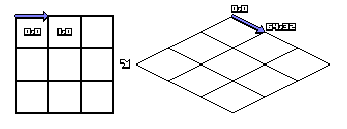
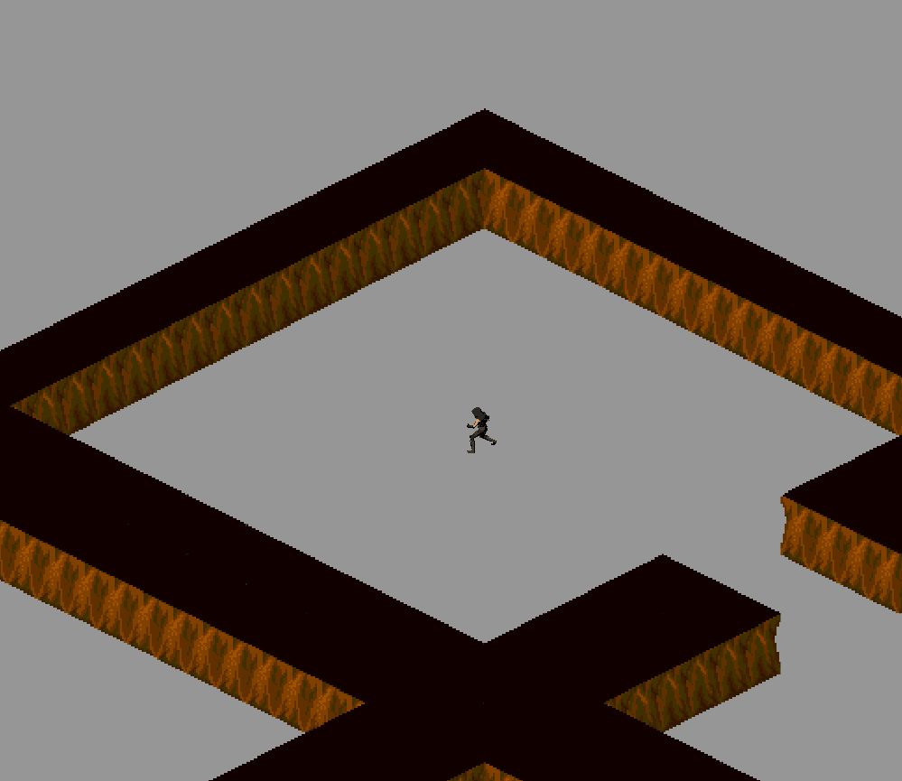

- https://clintbellanger.net/articles/isometric_math/
- The memory representation is the same as if it were a simple orthographic projection (side/top view).
- In the example the isometric tiles are 128x64 pixels. In other words, diamond-shaped, twice as wide as high.
- > The trick is to think of x and y separately.
  
  > Increasing map X by +1 tile (going "right" in map coordinates) increases both screen X and Y (going "right + down" in screen coordinates). If we measure in our example, we'll see that it increases screen.x by 64 (half our tile's width) and screen.y by 32 (half our tile's height).
- 
- > Similarly, increasing map Y by +1 tile (going "down" in map coordinates) decreases screen X and increases screen Y (going "left + down" in screen coordinates).
- So here are the functions in Clojure:
- ```clojure
  (def tile-width-half (/ 1 2))
  (def tile-height-half (/ 1 4))
  
  (defn isometric->screen [x y]
    [(* (- x y) tile-width-half)
     (* (+ x y) tile-height-half)])
  
  (defn screen->isometric [x y]
    [(/ (+ (/ x tile-width-half)
           (/ y tile-height-half))
        2)
     (/ (- (/ y tile-height-half)
           (/ x tile-width-half))
        2)])
  ```
- That seems pretty simple!
- The [play-cljc tutorial](https://github.com/oakes/play-cljc/blob/master/TUTORIAL.md) recommends learning WebGL2: https://webgl2fundamentals.org/
- Should I actually check it out? Or say fuck it because I want to just use SVG? I don't know... it might be good for me to learn it. It could be another library for my lisp ecosystem. It looks like a very good tutorial on the surface...
- It only uses the 2d entities, which is really cool. I guess isometric is technically 2.5d.
- 
- Ok so tile-soup is a library for using Tiled maps, which is a specific thing: https://www.mapeditor.org/
- It is a *level editor*.
- Tile soup looks intimidating because it has a ton of files,, but they're all small, and full of specs. Actually, it might use spec entirely, since it is a parsing library.
- Yeah it uses spec entirely.
- So like, I don't need to use this thing. I most certainly don't need it because all I want to do is create a single view... I basically just want to figure out what it does just enough to circumvent it.
- I think I should build the project locally. It still uses figwheel-main
- Nice! I have it running. That means I can debug it to my heart's content