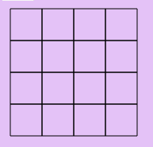

- So the first thing I want to do is make an isometric map in the style of SimCity 2000. So I'll look up some screenshots I guess. Maybe there's somewhere I can actually play the game online...
- I should probably move to Canvas instead of trying to make anything highly detailed with SVG... but wait... who says it's gonna be highly detailed?
- I was sort of thinking of modeling the graphics more closely on SimCity 2000. But I'm leaning more towards it being pixel art, but not as big of pixels as Minecraft... I really don't like that look. Or maybe it's the 3D aspect of Minecraft that I don't like... well, it's certainly both.
- Anyway, I'd kind of already decided on SVG for the interactivity benefit. I can use my method of pixelating it by producing 1x1 path strokes.
- So it's time to try to do this.
- Cool, looks like I can play SimCity 2000: https://playclassic.games/games/city-building-dos-games-online/play-simcity-2000-online/play/
- It launches in in DosBox...
- 
- Cool... so this is a pretty good thing to aim for.
- Phil Hagelberg left me a really nice comment on the community page in response to my intro post:
- > Seeing people submit games in lisps they made themselves is always one of the highlights of the jam! Love to see this particular type of creativity. Even if the game itself isn’t finished it’s still very cool to see the process. Good luck!
- Zoomed all the way out:
- 
- I won't have any terrain, it will just be a boring, flat plain (which when I played the game, always wanted anyway).
- See [Isometric Tiles Math](./Isometric%20Tiles%20Math.md)
- The SimLispy repo seems to still have the old project setup, where I was trying to load bobbi-lisp-core, so I need to update it.
- Cool, that seems to be good to go, I've got the kitty rendered
- So first... we'll just make a regular SVG grid. After that, we'll extrude it into 2.5 dimensions.
- I have a square:
- ```clojure
  (defn make-path [points]
    (str "M" (apply str (interpose " " points))))
  
  (let [points [10 10 50 10 50 50 10 50 10 10]
        _ (clear-svg)]
    (append-path (make-path points)))
  ```
- Now I need a function that outputs many squares... I suppose the cleanest way could be just to generate a sequence of grid points and render a single path.
- I have something silly now:
- ```clojure
  (defn make-path [points]
    (str "M" (apply str (interpose " " points))))
  
  (def points
    (apply concat
      (for [x (range 0 150 40) y (range 0 150 40)]
        [(+ x 10) (+ y 10)
         (+ x 50) (+ y 10)
         (+ x 50) (+ y 50)
         (+ x 10) (+ y 50)
         (+ x 10) (+ y 10)])))
  
  (let [_ (clear-svg)]
    (append-path (make-path points)))
  ```
- 
- It's drawing extra lines because it's never lifting the point, so it's like one of those brain teaser puzzles or something.
- What I should do is modify the `make-path` function to do something more specific. But we're slowly getting somewhere... though I didn't sleep much so I'm starting to get eepy
- Damn, I still haven't gone to bed yet. I haven't done any more of this, but I did realize that I definitely want to implement the APU wave visualizers, the oscilloscopes. That's what is made possible by actually implementing the music engine... without it, there's no reason for it not to just be a file except that I want to feel accomplished.
- There's no way I'm going to finish all of this. But it will be so worth it it really doesn't matter... in fact, the jam has already been a success for pushing me this far.
- ## Saturday
- Ok so there's 2 things I'd like to work on today (notice I didn't say *complete*):
	- oscilloscope views (hmm... should actually use a smaller milestone than that)
	- Isometric grid
- The isometric grid is achievable because even just the gridlines would suffice. Where I left off we weren't even drawing squares properly - hmm, what if we just start with the pen in the upper right corner, then go down, left, and up? Then we would never have to pick the pen up.
- ...Oh... it's because it's not moving across... it moves *down*.
- Hmmm, yes, it's not going in any sensible order because *for* doesn't produce them that way. So let's go with the plan of lifting up the pen.
- We can actually just call `make-path` for each square, and concatenate the strings:
- ```clojure
  (append-path "M10 10 50 10 50 50 10 50 10 10 M50 10 90 10")
  ```
- 
- Nice!
- ```clojure
  (defn make-path [points]
    (str "M" (apply str (interpose " " points))))
  
  (def points
    (apply str
      (for [x (range 0 150 40) y (range 0 150 40)]
        (make-path [(+ x 10) (+ y 50)
                    (+ x 10) (+ y 10)
                    (+ x 50) (+ y 10)
                    (+ x 50) (+ y 50)
                    (+ x 10) (+ y 50)]))))
  
  (let [_ (clear-svg)] 
    (append-path points))
  ```
- 
- That was easy! Now, let's try applying the isometric function:
- ```clojure
  (def tile-width-half (/ 1 2))
  (def tile-height-half (/ 1 4))
  
  (defn isometric->screen [x y]
    [(* (- x y) tile-width-half)
     (* (+ x y) tile-height-half)])
  
  (defn screen->isometric [x y]
    [(/ (+ (/ x tile-width-half)
           (/ y tile-height-half))
        2)
     (/ (- (/ y tile-height-half)
           (/ x tile-width-half))
        2)])
  ```
- I think, instead of passing a flat sequence of coordinates, I should pass a sequence of vectors which makes more sense, and also because `isometric->screen` takes a pair
- It works!
- ```clojure
  (defn isometric->screen [x y]
    [(* (- x y)  (/ 1 2))
     (* (+ x y)  (/ 1 4))])
  
  (defn make-path [points]
      (str "M" (apply str (interpose " " points)))))
  
  (def points
    (apply str
      (for [x (range 0 150 40) y (range 0 150 40)]
        (make-path 
          (flatten
          [(isometric->screen (+ x 170) (+ y -60))
           (isometric->screen (+ x 170) (+ y -100))
           (isometric->screen (+ x 210) (+ y -100))
           (isometric->screen (+ x 210) (+ y -60))
           (isometric->screen (+ x 170) (+ y -60))])))))
  
  (let [_ (clear-svg)]
    (append-path points))
  ```
- 
- So next... well, I suppose I want to expand it to the full screen, whatever that ends up being.
- 
- This comes out to 22 rows. I think I'll take it and run with it. Now I'm going to want to add like a floating "crust" beneath it, and color the surface green or something
- 
- Alright, now to put something under it so it's not entirely flat...
- I suppose I could do this by creating tiles with a pattern, and just repeat them in rows underneath
- Or rather, just a single row would work, like they can be vertical "strips"
- I actually managed to trace it using my own mecca-pix app which has the ability to quantize colors.
- But to position them, I need to make it so append-path can take an optional x and y coordinate
- Cool, that works. This places the first tile
- ```clojure
  (defn tile [x y]
    (for [[color path] ground-tile-1]
      (append-path path color x y)))
  
  (tile 451 440)
  ```
- But I think what I should do is use the `isometric->screen` function to place them so I can calculate it easier
- Indeed, it works! This creates the right floor:
- ```clojure
  (for [y (range -400 450 40)]
    (apply tile (isometric->screen 1330 y)))
  ```
- And this puts the left floor:
- ```clojure
  (defn tile-2 [x y]
    (for [[color path] ground-tile-2]
      (append-path path color x y)))
  
  (for [x (range 475 1300 40)]
    (apply tile-2 (isometric->screen x 1330)))
  ```
- I have a map! I also got to take advantage of another application I have called mecca-pix​, which I used to create the floor tiles (I guess that would be considered the ​crust​?). It's a thing I made that takes a bitmap image and converts it to SVG, and lets you quantize the colors so that it can be expressed in a small number of paths.
- 
- So now we need some kind of​ toolbox, and I'll start by making a button for placing roads. But before I get too far, I have to implement the interactivity.
- The way I've done this before is to add a second layer of SVG squares that is *invisible* and just acts as click/hover targets.
- I'm going to follow SimCity BuildIt's way of dealing with infrastructure, which is much simpler than SimCity 2000. Basically, the roads also carry power and water, making it so you don't have to mess with pipes or power lines. All you need to do is put your buildings along a road.
- Now, if this were my ideal city, it wouldn't have any roads... only bike paths.
- SC2k toolbox
- 
- 
- The way it's done here, you can either add roads one square at a time, or click and drag to make a stretch of road. While you are holding the mouse button down, it calculates the shortest path from the anchor point to the cursor:
- 
- Here's what the road tiles look up close
- 
- So I guess I need road tiles for each possible configuration - let me see what they are
- I guess just making a circle should be sufficient
- It only puts the black line on the *near* edge of the road. The far edge is brown, I guess to give an appearance of depth
- 
- So, I guess I should make the road button.
- Actually... I'm going to skip roads! Because it doesn't matter for the gameplay.
- Here is the factory button:
- 
- I made it into an SVG, but I think I need to make a scale parameter because I want it to be bigger - the icon is just 33 pixels
- Something very weird happens in the editor... something prevents the eval-cell command from working sometimes, but I can't figure out why, or even when it fails... could it be a function of how many lines there are? That's the only thing I can see... it works with 31 lines, but not 32
- wait... it just worked with 32... but not 33
- *sometimes* it works with 32
- Anyway... hahaha I need to get my music engine playing. What do I want to play when it starts, and how? I guess there's no way other than my Lisp code. I could take my code for Confuzion and NESify it! Great idea!
- Lol... the Confuzion song is in the SimLispy repo already! it's in game.clj. Let's see if I can get some bass going.
- Alright this... sort of works:
- ```clojure
  (defn bass1 [time]
    [{:time (+ time 0), :instrument 15, :pitch 71} {:time (+ time 1.5) :instrument 15, :pitch 71} {:time (+ time 2) :instrument 15, :pitch 71} {:time (+ time 3) :instrument 15, :pitch 73} {:time (+ time 3.5) :instrument 15, :pitch 69} {:time (+ time 4) :instrument 15, :pitch 69} {:time (+ time 5.5) :instrument 15, :pitch 69} {:time (+ time 6) :instrument 15, :pitch 69} {:time (+ time 8) :instrument 15, :pitch 64} {:time (+ time 9.5) :instrument 15, :pitch 64} {:time (+ time 10) :instrument 15, :pitch 64} {:time (+ time 12) :instrument 15, :pitch 64} {:time (+ time 13.5) :instrument 15, :pitch 64} {:time (+ time 14) :instrument 15, :pitch 64}])
  
  (defn bass2 [time]
    (map (fn [m] (update m :time #(+ % time)))
         [{:time 29.5, :instrument 15, :pitch 69} {:time 29, :instrument 15, :pitch 64} {:time 31, :instrument 15, :pitch 64} {:time 26, :instrument 15, :pitch 69} {:time 25.5, :instrument 15, :pitch 69} {:time 24, :instrument 15, :pitch 69} {:time 23, :instrument 15, :pitch 67} {:time 22.5, :instrument 15, :pitch 66} {:time 17.5, :instrument 15, :pitch 64} {:time 0, :instrument 15, :pitch 71} {:time 1.5, :instrument 15, :pitch 66} {:time 2, :instrument 15, :pitch 64} {:time 2.5, :instrument 15, :pitch 62} {:time 3.5, :instrument 15, :pitch 59} {:time 5.5, :instrument 15, :pitch 66} {:time 6, :instrument 15, :pitch 64} {:time 7, :instrument 15, :pitch 62} {:time 8, :instrument 15, :pitch 69} {:time 9.5, :instrument 15, :pitch 64} {:time 10, :instrument 15, :pitch 62} {:time 10.5, :instrument 15, :pitch 61} {:time 11.5, :instrument 15, :pitch 57} {:time 13.5, :instrument 15, :pitch 64} {:time 14, :instrument 15, :pitch 62} {:time 15, :instrument 15, :pitch 61} {:time 16, :instrument 15, :pitch 64} {:time 18.5, :instrument 15, :pitch 64} {:time 19, :instrument 15, :pitch 66} {:time 19.5, :instrument 15, :pitch 67} {:time 20.5, :instrument 15, :pitch 66} {:time 21, :instrument 15, :pitch 64} {:time 21.5, :instrument 15, :pitch 64}]))
  
  (defn bass3 [time]
    (map (fn [m] (update m :time #(+ % time)))
         [{:time 0, :instrument 15, :pitch 66} {:time 1.5, :instrument 15, :pitch 66} {:time 2, :instrument 15, :pitch 66} {:time 3, :instrument 15, :pitch 69} {:time 4, :instrument 15, :pitch 64} {:time 5.5, :instrument 15, :pitch 64} {:time 6, :instrument 15, :pitch 64} {:time 8, :instrument 15, :pitch 64} {:time 9.5, :instrument 15, :pitch 64} {:time 10, :instrument 15, :pitch 64} {:time 11, :instrument 15, :pitch 61} {:time 12, :instrument 15, :pitch 62} {:time 13.5, :instrument 15, :pitch 62} {:time 14, :instrument 15, :pitch 62} {:time 16, :instrument 15, :pitch 62} {:time 17.5, :instrument 15, :pitch 62} {:time 18, :instrument 15, :pitch 62} {:time 20, :instrument 15, :pitch 61} {:time 21.5, :instrument 15, :pitch 61} {:time 22, :instrument 15, :pitch 61} {:time 24, :instrument 15, :pitch 61} {:time 25.5, :instrument 15, :pitch 73} {:time 26.5, :instrument 15, :pitch 71} {:time 27, :instrument 15, :pitch 69} {:time 27.5, :instrument 15, :pitch 68}]))
  
  (defn bass4 [time]
    (map (fn [m] (update m :time #(+ % time)))
         [{:time 0, :instrument 15, :pitch 66} {:time 1.5, :instrument 15, :pitch 66} {:time 2, :instrument 15, :pitch 66} {:time 4, :instrument 15, :pitch 64} {:time 5.5, :instrument 15, :pitch 64} {:time 6, :instrument 15, :pitch 64} {:time 7, :instrument 15, :pitch 61} {:time 8, :instrument 15, :pitch 62} {:time 9.5, :instrument 15, :pitch 62} {:time 10, :instrument 15, :pitch 62} {:time 12, :instrument 15, :pitch 69} {:time 13.5, :instrument 15, :pitch 69} {:time 14, :instrument 15, :pitch 69}]))
  
  (defn bass5 [time]
    (map (fn [m] (update m :time #(+ % time)))
         [{:time 0, :instrument 15, :pitch 67} {:time 8, :instrument 15, :pitch 66} {:time 16, :instrument 15, :pitch 64} {:time 17, :instrument 15, :pitch 62} {:time 18, :instrument 15, :pitch 61} {:time 19, :instrument 15, :pitch 59}]))
  
  (def bass-pat-1
    (concat (bass1 0) (bass1 16) (bass2 32) (bass3 64) (bass4 92) (bass4 108) (bass5 124)))
  
  (for [{:keys [pitch time]} bass-pat-1]
    (play (tri (- pitch 26) 0.32) (/ (+ 3 time) 2.5)))
  ```
- Let me move some of this code out of this editor, and into... a new source file.
- This works great! Somehow it seems to actually load faster.
- I'm gonna do the same with the music, so all I'll need to call is
- ```clojure
  (for [{:keys [pitch time]} bass]
    (play (tri (- pitch 26) 0.32) (/ (+ 3 time) 2.5)))
  ```
- The bassline doesn't work with notes of all the same length. Which means to make this work, I need to add a length key to the bass note maps
- I changed all the instrument keys to length, since it's now up to the calling function to determine the instrument.
- I set all the lengths to 0.5, which should be an eighth note (it doesn't exactly have to make sense), and I'll lengthen the rest as needed.
- Hmm, maybe I'll change it to 0.25, that might work out better
- okay, the bassline is passable. It was really bad before I did the length thing, but now I'm ready to move on to the drums.
- All I really need for this are 2 different lengths of noise... so it shouldn't be too hard.
- ah... we don't yet have length for noise yet. need to implement it
- There's a var called `noiseBuffer` that is hardcoded to 1 second. But we need to make it work like `tri`.
- `tri` takes a note and a duration, and builds an array by hand which is passes to `audioBuffer`.
- Do I want the noise function to even take a note Yeah... I suppose so.
- How does `noise` work currently?
- It doesn't return a buffer... it plays one. Specifically `noiseBuffer`:
- ```js
  const bufferSize = ctx.sampleRate * 1;
  const noiseBuffer = new AudioBuffer({
      length: bufferSize,
      sampleRate: ctx.sampleRate,
  });
  const data = noiseBuffer.getChannelData(0)
  var noise = []
  for (let i = 0; i < bufferSize; i++) {
      x = feedback(x)
      noise.push(x)
  }
  
  for (let i = 0; i < bufferSize; i++) {
      data[i] = noise[i] / 32767 * 2 - 1;
  }
  ```
- I have it working now, but the note parameter doesn't do anything. I need to figure that out, but possibly more important is the ability to add an envelope. The confuzion snare is a rather linear taper:
- 
- I suppose I should make the envelope its own function. But actually... a preset will be fine. I'll make a function called `fade`.
- We'll loop through the channel data, and if we want the last sample to be 0, that means we would divide it by itself and subtract 1.
- Sample 1 does exactly what we want, it doesn't change the level. But sample 2 - we want to divide it by the most miniscule amount less than 1.
- Multiplying makes more sense to me. How about this:
- ```js
  data[i] = data[i] * (i * (1 - (1 / data.length)))
  ```
- Nope, this doesn't work.
- We'll calculate the multiplier as its own value. In Lisp:
- ```clojure
  (defn multiplier [i]
    (- 1 (* i (/ 1.0 480))))
  ```
- Nice! This works:
- ```js
  function fade(buf) {
      var data = buf.getChannelData(0)
      for (let i = 0; i < data.length; i++) {
          var multiplier = 1 - (i * (1 / data.length))
          data[i] = data[i] * multiplier
      }
      return audioBuffer(data)
  }
  ```
- Cool, now I can sequence this drum track
- What are the drums for confuzion? It looks like instrument 13(hat) and 3(snare), so I can just ignore the pitches, and replace the instrument keys with lengths, 0.07 for hat, and 0.5 for snare
- It works... sort of. The drums and bass play correctly together, but very badly.
- The worst problem is that it's painfully slow. I even copied the drums and bass evaluation results (just the maps) into the source code, and it still takes extremely long (maybe ~10 seconds) just to process the maps.
- The other problem is that the drums are too loud, but I'll be able to fix that relatively easily.
- For the speed issue... I already have the confuzion.json file, and my task will be to make a javascript function which can take this object and pass it to the correct functions.
- Maybe I'll bake some attenuation into the noise itself - it actually sounds good at half gain.
- I want to hear it with the leads! Let's fire up the pulse channel
- ## Pulse channel
- I think I can just use modulo to pick the right value from the pattern.
- Whoa... I actually have no idea how I'm going to calculate the frequency.
- With the triangle, I'm using an actual triangle function. I'm going to have to do something similar here.
- Unless I can figure out what formula to use where we do the modulo thing.
- our sequence is `[-1, -1, -1, -1, -1, -1, -1, 1]`, that's one cycle. So 100Hz would have 100 of them in a second.
- The wikipedia page says
- > A pulse wave can be created by subtracting a sawtooth wave from a phase-shifted version of itself.
- That sounds reasonable. We could make a sawtooth (have to figure out how duty cycle works...), and quantize it like we do for the square.
- IDK... wouldn't it be easier to do it like what I was getting at before, where it simply "picks* the right value in the sequence as a function of time (sample number)?
- `[-1, -1, -1, -1, -1, -1, -1, 1]`
- Let's say we're wanting 1 second of audio. So `bufferSize` is 48000.
- If it were 1Hz (silly, but whatevs), there would be just one pass through the sequence, so each value would be repeated 48000 / 8 times. So if the sample number is
- 0           the value will be     value 0
-
- ...
- 48000                                  1
- For some reason, this seems to work (but I have no idea how):
- ```js
  function _pulse0(note, dur) {
      const freq = midiToFreq(note)
      var bufferSize = ctx.sampleRate * dur;
      var buf = []
      for (let i = 0; i < bufferSize; i++) {
          buf.push(0.2 * pulse0[Math.floor(i / (1 / (freq / 6000))) % 8])
      }
      return audioBuffer(buf)
  }
  ```
- The 6000 figure I just found by trial and error. But it sounds in tune
- Alright! I think I'm ready to sequence the leads... I'm excited to hear how terrible it is, and maybe even post it on the NES Dev server...
- There are quite a few lead sequences. First `lead1`: it looks like it's instrument 14 and 8 and they must be the 2 organs, and 8 is shorter because it's the glissando.
- Beautiful, that's good. It sounds nice on pulse0. Lead2: this is instrument 5... oh yeah, so this is the response part. This one should be pulse2
- Ok, I have all the parts ported over, but it's like a huge pile of shit, I'm not sure how to deal with it
- ok... how the fuck do I coordinate all this
- Alright... well I've got the whole thing arranged... but it kind of sounds like complete utter dog shit
- OMG... I just figured out why the 6000 figure works... because 8 times 6000 is the sample rate! hahahahaha
- So now I suppose I should generalize it... done.
- What I need to do now is, well I'm hoping that by solving the problem of the buffers (i.e. having each note in its own buffer), it will also solve the performance problem.
- This will also make the NES more authentic sounding because it will ensure that only one note is playing at a time. Basically we want to build the buffer from a *spec*, i.e. an array of note objects
- I think I need to fix the `spit-wav` function... it *used* to work, but now it gives a `TypeError: abuffer is undefined` in the `make_download` function.
- Oh wait... it's because I wasn't passing a name! Hahahaha!
- There's still the issue of it downloading the file twice...
- Weird... it calls make_download twice because it prints "created wave file..." to the console twice... doesn't make sense...
- This answer might explain it: https://stackoverflow.com/questions/66387661/function-for-downloading-file-executing-multiple-times
- > The issue is because you've nested the click event handler for #download inside the submit event for the form. Due to this, every time you generate a number, another click handler is added to the button which in turn creates and downloads another instance of the file. To fix the problem, separate the event handlers.
- But I don't understand what "separate the event handlers" means
- Alright, so let's dive into...
- ## Audio buffers
- What I need is another set of functions that are parallel to noise, tri, and the 4 pulse functions that instead take an array of note objects.
- This might be a detour, but likely necessary... we might need a way to create a literal js object, since hashmaps are javascript maps. Well, I suppose we can just use the maps anyway, it will work fine. But just a thought I guess. If we need to support json or something that takes js objects
- I'll make a function called `tri-seq`
- It will initialize an array for the buffer.
- We loop through the notes, and for each one
- Well... do we need to sort them? I think so, though it might slow it down. I suppose we could do something else, like find the max time, add its length, and initialize a buffer filled with zeros of the proper length. Should I do that? Nah, I'll sort them.
- So the trick is, each note ....
- you know... I think it will be better to do it the other way, not by sorting it
- So we're returning the note with the greatest time. Now... we're calculating time a little bit weird, because I haven't implemented tempo properly yet. So instead of *beats* like I intended,  they're literal seconds, which the calling function is expected to give.
- So that's fine... to find the total length of the buffer, we take the note with the max time, add its time and length (which is also in seconds), and multiply by the sample rate
- The rest should be easy! We just modify the proper samples for each note. Any overlaps will result in the previous note being replaced (just the overlap, obviously)
- So I think we need to have an inner loop (the outer loop iterates through the notes) to write the note's samples.
- Why is it looping through it twice? I'm confused... it's working as intended but it's printing each value twice:
- ```js
  function tri_seq(notes) {
      const lastNote = notes.reduce(
          (prev, current) => {
            return prev.get("ʞtime") > current.get("ʞtime") ? prev : current
          }
        );
      const bufferLength = ctx.sampleRate * lastNote.get("ʞtime") + lastNote.get("ʞlength")
      // initialize buffer of proper length filled with zeros
      let buf = Array(bufferLength).fill(0)
      // loop through notes
      for (let i = 0; i < notes.length; i++) {
          // loop through the note's samples
          const start = notes[i].get("ʞtime") * ctx.sampleRate
          console.log("note", i, "has", notes[i].get("ʞlength") * ctx.sampleRate, "samples")
          /* for (let j = 0; j < notes[i].get("ʞlength") * ctx.sampleRate; j++) {
          } */
      }
  }
  ```
- I'm so confused... It repeats them with just this
- ```js
  function tri_seq(notes) {
      for (let i = 0; i < 3; i++) {
          console.log(i)
      }
  }
  ```
- In the console I see 0,1,2,0,1,2. wtf?!? why? I've never had this happen before, other than the download thing.
- This might explain the download thing... it seems that each function is called twice! Called twice!
- When did this start? Why is this the first time I've noticed?
- I suppose I can table this for the moment... but I guess I should make an issue... done.
- Got it! (not the repeat fn issue, the actual task at hand!)
- Now this works:
- ```clojure
  (play (tri-seq
    (for [{:keys [pitch length time]} bass]
      {:pitch (- pitch 26)
       :length length
       :time (/ (+ 3 time) 2.5)})))
  ```
- Wait... it's playing fucky, kind of in a funny way, though. What would cause just *some* of the notes to be wrong/missing?
- I've got it narrowed down to a sequence where the last note drops:
- ```clojure
  (play (tri-seq [
   {:pitch 45
    :length 0.5
    :time 1.2}
   {:pitch 45
    :length 0.25
    :time 1.8}
   {:pitch 45
    :length 0.5
    :time 2}
   {:pitch 47
    :length 0.25
    :time 2.4}
   {:pitch 43
    :length 0.25
    :time 2.6}
   {:pitch 43
    :length 0.5
    :time 2.8}
   {:pitch 43
    :length 0.25
    :time 3.4}
   {:pitch 43
    :length 0.5
    :time 3.6}
   {:pitch 38
    :length 0.5
    :time 4.4}]))
  ```
- It works if I change the time to `4.5`. Which seems to indicate that it's overlaps that fail. But why?
- ...but I can't reproduce it
- wait... it's not even overlapping. I must be messing up something silly...
- I narrowed it down to this:
- ```clojure
  (play (tri-seq [
   {:pitch 43
    :length 0.25
    :time 3.4}
   {:pitch 38
    :length 0.5
    :time 4.4}]))
  ```
- But it works if I move the times to `0.4` and `1.4`. Length doesn't have any effect. Neither does changing the time of the first note. It could even be absent...
- In other words, this works:
- ```clojure
  (play (tri-seq [
   {:pitch 38
    :length 0.5
    :time 4.3}]))
  ```
- But this does not:
- ```clojure
  (play (tri-seq [
   {:pitch 38
    :length 0.5
    :time 4.4}]))
  ```
- Fucking weird...
- It works if I change the time to `4.41`, but not `4.35`! `4.34` works, but `4.44` does not! Aaaaaaaaaaaaaaaaaaaaaaaaa!!!!
- What could possibly be causing notes to fail only at specific times?
- I think I might have figured it out... I need to round the start time (floor or ceil)
- Yes! Alright, that was actually not terrible!
- There's still something fucky happening on certain notes.
- Maybe I need to similarly floor the duration? No, that should be able to be anything
- hmm... it works fine if I sort the notes by time... but why would that make a difference? It should happily write them in any order... Well, at least it's possible to get a good output...
- Here are the old functions: Now I can go through and fix the rest.
- ```clojure
  (for [{:keys [pitch length time]} bass]
    (play (tri (- pitch 26) (* 0.8 length)) (/ (+ 3 time) 2.5)))
  
  (for [{:keys [length time]} drums]
    (play (fade (noise 60 length)) (/ (+ 3 time) 2.5)))
  
  (for [{:keys [pitch length time]} lead]
    (play (pulse0 (- pitch 2) length) (/ (+ 3 time) 2.5)))
  
  (for [{:keys [pitch length time]} leadA]
    (play (pulse2 (- pitch 2) length) (/ (+ 3 time) 2.5)))
  ```
- Oh... I need to create analogous functions for the other channels. And some way of controlling the envelope for the noise... for now I can just hardcode a fade and make a `drum-seq` function I guess
- This is close, but the fade is making it go towards -1 instead of zero, causing clicks
- ```js
  function drum_seq(notes) {
      const lastNote = notes.reduce(
          (prev, current) => {
            return prev.get("ʞtime") > current.get("ʞtime") ? prev : current
          }
        );
      const bufferLength = Math.ceil(ctx.sampleRate * lastNote.get("ʞtime") + lastNote.get("ʞlength"))
      // initialize buffer of proper length filled with zeros
      let buf = Array(bufferLength).fill(0)
      // loop through notes
      for (let i = 0; i < notes.length; i++) {
          // loop through the note's samples
          const start = Math.floor(notes[i].get("ʞtime") * ctx.sampleRate)
          const duration = Math.ceil(notes[i].get("ʞlength") * ctx.sampleRate)
           for (let j = 0; j < duration; j++) {
              x = feedback(x)
              var multiplier = 1 - (j * (1 / duration))
              if (j < 100) {
                  buf[start+j] = multiplier * 0.4 * x / 32767 * 2 - 1 / (500 / j)
              } else if (j > duration - 100) {
                  buf[start+j] = multiplier * 0.4 * x / 32767 * 2 - 1 / (500 / (duration - j))
               } else {
                  buf[start+j] = multiplier * 0.4 * x / 32767 * 2 - 1
              }
          }
      }
      return audioBuffer(buf)
  }
  ```
- Oh... it's because the entire noise buffer is negative... lol
- 
- Fixed it! Drums are done!
- OMG I've got 2 of the pulse channels working (which are all I want for now, 12.5% and 50%)
- Now to mix a file, I need to write a function that will take multiple buffers and sum them
- I'm listening to the 4 buffers play together, and I'm hearing what seems like clicks in the drum track
- yeah, they are there. I should be able to fix it by doing what I did with the bass, putting a micro-envelope on each note... see:
- 
- Actually that seems to mean the fade is not quite right...
- oh... it's just because it's offset, I should just not subtract it and leave it up higher
- yep, sounds perfect!
- Holy shit... It's actually doing really cool unexpected stuff like adding extra notes! Like, the hihat sounds like it's playing a really cool double time rhythm... like it actually improved the part magically!
- Evaluating this plays them beautifully:
- ```clojure
  (play (tri-seq bass))
  (play (drum-seq drums))
  (play (pulse0-seq pulse-0))
  (play (pulse2-seq pulse-2))
  ```
- Now we want to do
- ```clojure
  (def buffers
    [(tri-seq bass)
    (drum-seq drums)
    (pulse0-seq pulse-0)
    (pulse2-seq pulse-2)])
  
  (mix buffers)
  ```
- OMG it actually works!
- Oh wait... it cut off after 2:30... why? The file is the right length, but the volume cuts to zero...
- The only thing that makes sense is... uh, shit I have no clue
- It did it fine with just bass and drums. Which means, I think, that we need a smarter summation function, it must be adding them up to zero if one of the buffers runs out.
- This works:
- ```js
  function mix(buffers) {
      // make new buffer the length of longest buffer
      const len = Math.max(...buffers.map(buf => buf.length))
      const data = [...buffers.map(buf => buf.getChannelData(0))]
      let buf = []
      for (let i = 0; i < len; i++) {
          // loop through index of each buffer and add them up
          let amplitude = 0
          for (let j = 0; j < data.length; j++) {
              if (data[j].length >= i) {
                  amplitude += data[j][i]
              }
          }
          buf.push(amplitude)
      }
      return audioBuffer(buf)
  }
  ```
- Wow! So much progress! I'm actually rendering audio!
- I kind of want to fix the offset drums:
- 
- Uh, that's the whole mix, let me render just a drum hit
- 
- So first let me disable the fade and see if that's what's causing it
- 
- nope... which means.... ah, I suppose I could... yeah.
- The problem is the multiplier, which causes the *negative* values to also be lowered when they need to be raised:
- 
- So how do we make it so it truncates all values toward zero? I'm thinking absolute value, but where?
- If the sample amplitude is, say `-1`, and say we have a 1 second sample so (this seems silly but I actually need a concrete example to play around with...)
- the current multiplier:
- ```js
  var multiplier = 1 - (j * (1 / duration))
  ```
- wait... why doesn't it work? multiplying a negative number by a very small positive number indeed raises it.
- Ok... I fixed it.... it just needed a pair of parentheses
- ```js
  multiplier * (0.25 * x / 32767 * 2 - 0.25)
  ```
- wow. huh, I suppose that makes sense....
- Now my mixed output is perfect:
- 
- I want to make another song, I'm thinking of doing something simple like the megaman 2 boss theme.
- I checked out the noise channel and it looks like it's actually just snares and hats like I once thought!
- I think I'll implement the other 2 pulse waves, and... vibrato. We *really* need vibrato. I just did a deep dive to determine whether I want it to go above and below the note or just below, and settled on above and below. It took awhile to get to the bottom of it, but this is the best evidence I found: http://libres.uncg.edu/ir/uncg/f/R_MacLeod_Perceived_2009.pdf
- > Galamian (1962) asserted that performers should vibrate from the pitch and below, otherwise the intonation will be perceived as sharp. Similarly, Lucktenberg (1994) and others suggested that the ear picks out the highest point of the vibrato cycle, thus a flattening motion is recommended. In contrast, Mantel (1972) noted that cellists vibrate around the center of the pitch so that the tone the listener hears is the mean of the vibrato range.
  The results of this study seem to support Mantel's position, in the case of both cello and violin.
- But this page is getting kind of long, so I'm going to check it in (including the images) and continue with [[Lisp Game Jam page 2]]