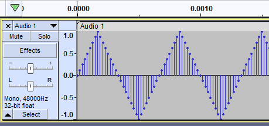
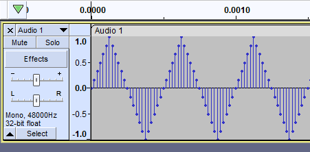
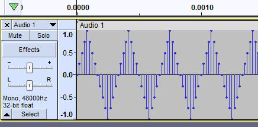
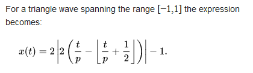
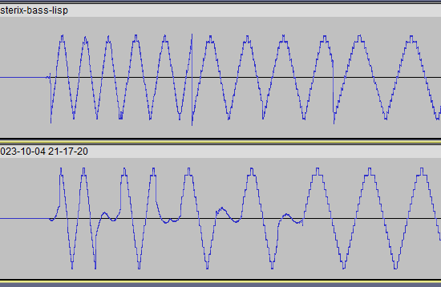
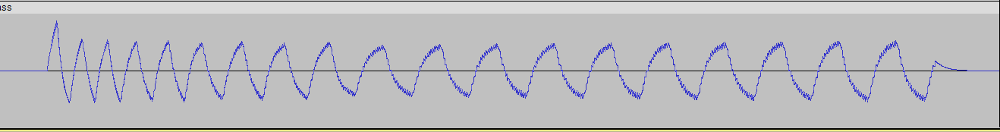
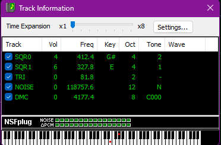

- ## Phase 1: Sample sequencer
  collapsed:: true
	- So I should start by wrapping the web audio api obviously, but the question is whether to start with playing audio files or synthesizing sound.
	- I really want to do the latter, but it would be faster to try to port my sample sequencer. I could even use my confuzion arrangement, that would be perfect. After all... trackers are sample players.
	- Since the jam does not begin until october, that gives me this month to get the audio engine working.
	- So I need to import the samples, first of all.
	- Well, before that, I'll create a repo for the audio engine.
	- This will also force me to start thinking about how to package my language to make it somewhat portable.
	- So I guess I should figure out how I would wire it up to... what? How is it even supposed to work?
	- Clojurescript works by compiling a program to javascript. But since we're interpreted, we have to like, ship the interpreter.
	- I'd like to stick with the format of the browser editor. And when the game is actually running, there could be a button to hide the editor.
	- This will also give an opportunity to create a release and publish it on npm.
	- So like... we can execute javascript already with `js-eval`. So let's see if we can initialize an AudioContext.
	- I'm tempted to make a new project called like bobbi-lisp-core and publish it.
	- Should it include the codemirror stuff? I'm actually thinking not...
	- ok so I have the code checked in. Now I need a package.json so I can release it as a library.
	- When I try to run the interpreter, it complains that there is an unknown file extension ".clj". So it may be that I can't have that in there?
	- Oh... it actually worked if I removed the fraction stuff...
	- published! https://www.npmjs.com/package/bobbi-lisp-core
	- I can't believe that worked... too bad about the fraction stuff though... but I can deal without it for making the game...
	- Now let's see if I can install it into the audio engine project.
	- ok now I need to install vite
	- ok so now I have the interpreter running in the vite app. The strange part is it can't find the `evalString` function unless I import it from `interpreter.js`:
	- ```js
	  import { evalString } from 'bobbi-lisp-core/src/interpreter'
	  ```
	- But ok...
	- I wonder if it's only working because I have the package installed globally. This shit is so foreign to me.
	- omg. I created a sample project, installed bobbi-lisp and the core library and was able to evaluate a string, all on the first try!
	- Now, if only I knew how to include the core library in the language package.
	- The only thing I can think of is to convert it to json.
	- I wonder... does nbb do something like this?
	- not that I can see. oh, well.
	- I've got the audio context initialized and it plays samples.
	- Actually it's not even using the web audio API at this point, it's just invoking the play method of the html media element. I thought it sounded shitty, there's like a nasty click. Doing it the proper way should fix that, and allow us to do all the stuff like change the playback rate and everything.
	- I'm stuck, both in trying to use the Web Audio API from my lisp, and... well trying to get it to work at all. And I'm just trying to follow the tutorial!
	- The audio-basics project calls the normal play method of the audio element, and just uses the web audio api for processing, having routed it into the signal graph. But what I think I want to do is fetch the file as an array buffer, decode it and play it as an audio buffer source.
	- ok, I've got that hooked up. I made a function called `fetchAudio()` and made a loop that populates an array with the sample buffers. Then there's the start button which connects the buffer source to the web audio graph and plays it. So now I just need to figure out how I want to process and sequence them, and how to interface this engine with my lisp.
	- I want to try to better understand how the interop works. [[js interop]]
	- I implemented the sequencing stuff. It ported over beautifully! I can't believe how easy it was, I just whipped it up and it worked on the first try.
	- Published it on npm as `bobbi-lisp-audio`
	- And it works, I was able to install it into another project! This is so cool
	- So the audio library is basically done. All it needs to do is provide the sequencer interface and it does exactly that. But the next task is to be able to write the score in Lisp rather than JavaScript, so I need to figure out how to generate the array of notes by evaluating the lisp code. Seems like it should be pretty simple, it's mostly a matter of plumbing. Can I call the interpreter, and store the result in a variable that the audio engine can access? The answer is obviously yes, but I've got to figure it out.
	- Ok so I've got the composition in the source file which is evaluated when the program starts, outputting the vector of edn maps. So far so good! Now I need to convert it to JSON...
	- Fortunately this is an extremely limited DSL so we only need to handle this one specific case.
	- ```clojure
	  (defn bass1 [time]
	    [{:time (+ time 0), :instrument 15, :pitch 71} {:time (+ time 1.5) :instrument 15, :pitch 71} {:time (+ time 2) :instrument 15, :pitch 71} {:time (+ time 3) :instrument 15, :pitch 73} {:time (+ time 3.5) :instrument 15, :pitch 69} {:time (+ time 4) :instrument 15, :pitch 69} {:time (+ time 5.5) :instrument 15, :pitch 69} {:time (+ time 6) :instrument 15, :pitch 69} {:time (+ time 8) :instrument 15, :pitch 64} {:time (+ time 9.5) :instrument 15, :pitch 64} {:time (+ time 10) :instrument 15, :pitch 64} {:time (+ time 12) :instrument 15, :pitch 64} {:time (+ time 13.5) :instrument 15, :pitch 64} {:time (+ time 14) :instrument 15, :pitch 64}])
	  
	  (first (bass1 0))
	  => 
	  {:time 0 :instrument 15 :pitch 71} 
	  ```
	- This should do the trick:
	- ```clojure
	  (defn parse-note [note]
	    (str "{instrument: " (:instrument note) ", pitch: "
	      (:pitch note) ", time: " (:time note) "}"))
	  
	  (parse-note {:time 0 :instrument 15 :pitch 71})
	  
	  (mapcat parse-note (bass1 0))
	  => 
	  "{instrument: 15, pitch: 71, time: 0}{instrument: 15, pitch: 71, time: 1.5}{instrument: 15, pitch: 71, time: 2} ...}" 
	  ```
	- Funny, isn't mapcat supposed to return a sequence, not a string? But this is actually what I want!
	- We should have needed to do `(str/join (map parse-note (bass1 0)))`
	- It's done! I compiled my confuzion cover and put it on soundcloud. The one catch is that it took like a whole minute to evaluate it with the interpreter... but I precompiled it to JSON and it loads instantly
- ## Phase 2: Synthesizer
  collapsed:: true
	- Alright. Now that I've got the audio plumbing in place, I can get on to what I'm actually more inspired about - generating soundwaves using maths!
	- I can follow the web audio tutorial that generates a buffer and fills it with white noise.
	- Got it! that was extremely easy.
	- So the next challenge will be to play something more interesting than white noise.
	- I can't think of a better thing to start with than the 16-step triangle wave!
	- Well, the square wave would be the simplest...
	- Actually, I remember trying to do this last year while I was at that coworking space. I can just take the 16-step cycle, and repeat each number a specific number of times to match the frequency, and multiply it to the target amplitude, whatever that is. Is it from -1 to 1 or something?
	- This is the white noise buffer:
	- ```js
	  const data = noiseBuffer.getChannelData(0);
	  for (let i = 0; i < bufferSize; i++) {
	    data[i] = Math.random() * 2 - 1;
	  }
	  ```
	- ` Math.random()` does what? I think it's a float from 0 to 1
	- so times 2 makes it from 0 to 2
	- minus 1 is, yep, -1 to 1 bitchezzzzz
	- What I want to do is hook this up to the Lisp interpreter, of course
	- I suppose i could simply generate the buffer in Lisp, and import it into the JavaScript engine, yo
	- I should bring in codemirror so it can have live evaluation, actually
	- fartballs, it didn't work
	- oh, well,, I guess I'll hijack the simlispy project which does work for this.
	- It still won't work. fucking die... I literally copied the entire working project over
	- I just tried the whole thing again and got the same stupid result. It can't find the reader.peek function for some reason, even though everything is literally the same as in a working project. All I'm trying to do is add a live code editor to the audio project but apparently it's too much to ask.
	- Anyway, here's the noise buffer stuff
	- ```js
	  const start = document.getElementById("start")
	  
	  const ctx = new AudioContext();
	  
	  const bufferSize = ctx.sampleRate * 1;
	  
	  const noiseBuffer = new AudioBuffer({
	    length: bufferSize,
	    sampleRate: ctx.sampleRate,
	  });
	  
	  const data = noiseBuffer.getChannelData(0);
	  for (let i = 0; i < bufferSize; i++) {
	    data[i] = Math.random() * 2 - 1;
	  }
	  
	  const noise = new AudioBufferSourceNode(ctx, {
	    buffer: noiseBuffer,
	  });
	  
	  function playNoise() {
	    noise.connect(ctx.destination);
	    noise.start();
	  }
	  
	  start.addEventListener('click', function () {
	    playNoise()
	  })
	  ```
	- I imported just my lisp interpreter and that works. Which was the thing that didn't work before. This makes no sense.
	- Alright, now it works! All I did was install the packages in a different order, smh
	- So now I want to make a function that I can evaluate in the editor that will play the buffer.
	- wtf... now it's fucked again. giving me the same stupid reader peek type error. this shit sucks
	- I was trying to define a function in the repl env. totally reasonable. Now it's fucked. Software is stupid
	- Now i can't even revert to the working state that I had before. this is awful
	- Let me see if I can hook it up in my main bobbi-lisp project
	- cool, that works. but it will only work once because I guess the node needs to be stopped
	- Oh, I see.
	- > An AudioBufferSourceNode can only be played once; after each call to start(), you have to create a new node if you want to play the same sound again.
	- Got it! So now I made just a `play` function that takes an audio buffer. So I need to also expose a function that will create a buffer from like, a vector or something
	- So I guess what I should do with the audio library is just include the entire interpreter project directly, rather than importing bobbi-lisp-core. Will it work then?
	- ok! At least it's working *right now*
	- So. The audio buffer. To compute the correct number of samples for a given length, we need to know the sample rate which is `ctx.sampleRate`. So I'll make that a var as well
	- so far so good
	- ```clojure
	  sample-rate
	  => 
	  48000 
	  ```
	- So there are that many values for a second of audio.
	- Let's say we just want to make a square wave, say, 100 hz.
	- I want to just express the square wave with 2 values, `[-1 1]`. But that's not a full cycle, it's just half of one. So perhaps `[-1 1 1 -1]`. If we had just one of those in a second, that would be 1hz.
	- For that to happen, we would need to "stretch" the cycle out by repeating each one enough times that would equal the number of samples. So 48000 / 4 times per value.
	- We can just use `[-1 1]` and call that a full cycle, why not.
	- ```clojure
	  (def square-wave [-1 1])
	  
	  (mapcat #(repeat 5 %) square-wave)
	  => (-1 -1 -1 -1 -1 1 1 1 1 1) 
	  ```
	- So if it would be 48000 / 2 times per value for 1hz, we would *divide* it by 100 to get the number of times for 100hz.
	- ```clojure
	  (def hz 100)
	  (def square-wave [-1 1])
	  
	  (/ (/ sample-rate (count square-wave)) hz)
	  => 
	  240 
	  ```
	- Seems like this ought to work:
	- ```clojure
	  (defn wave [wave freq]
	    (mapcat #(repeat (/ (/ sample-rate (count wave)) freq) %)
	      wave))
	  ```
	- So the wave function produces a single cycle. Our function that creates our audio buffer needs to calculate how many times... wait, actually we could pass it to cycle, and just `take` however many samples we need. Problem solved.
	- I think this is the idea:
	- ```js
	  function initBuffer(length) {
	      const buffer = new AudioBuffer({
	          length: length,
	          sampleRate: ctx.sampleRate,
	      });
	      return buffer
	  }
	  
	  function audioBuffer(wave, duration) {
	      const bufferSize = ctx.sampleRate * duration;
	      const data = initBuffer(duration).getChannelData(0);
	      for (let i = 0; i < bufferSize; i++) {
	          data[i] = nth(take(bufferSize, cycle(wave)), i)
	      }
	  }
	  ```
	- I got sound! Here's the complete deal:
	- ```js
	  const squareWave = [-1, 1]
	  
	  function wave(wave, freq) {
	      return wave.flatMap(x => repeat(Math.floor(ctx.sampleRate / wave.length / freq), x))
	  }
	  
	  function initBuffer(length) {
	      const buffer = new AudioBuffer({
	          length: length,
	          sampleRate: ctx.sampleRate,
	      });
	      return buffer
	  }
	  
	  function audioBuffer(wave, duration) {
	      const bufferSize = ctx.sampleRate * duration;
	      const buffer = initBuffer(bufferSize)
	      const data = buffer.getChannelData(0);
	      const samples = take(bufferSize, cycle(wave))
	      for (let i = 0; i < bufferSize; i++) {
	          data[i] = samples[i]
	      }
	      return buffer
	  }
	  
	  function playBuffer(buffer) {
	      ctx.resume()
	      const noise = new AudioBufferSourceNode(ctx, {
	          buffer: buffer,
	      });
	      noise.connect(ctx.destination);
	      noise.start();
	  }
	  
	  function sq(freq, dur) {
	      return audioBuffer(wave(squareWave, freq), dur)
	  }
	  
	  (play (sq 440 1))
	  ```
	- Now let's try the NES triangle wave
	- So each step is... I think the entire amplitude is 16 steps, which means it would go in `0.125` steps... unless... could it be 16 steps both up and down? I'm pretty sure it's not.
	- Yes, I checked the nesdev wiki
	- ```clojure
	  (concat
	    (reductions #(+ 0.125 %) -1 (range 8))
	    (reverse (reductions #(+ 0.125 %) -1 (range 8))))
	  => 
	  (-1 -0.875 -0.75 -0.625 -0.5 -0.375 -0.25 -0.125
	    0 -0.125 -0.25 -0.375 -0.5 -0.625 -0.75 -0.875) 
	  ```
	- I removed the duplicate 0 and the final -1.
	- It sounds right to me! I should sequence something, like the Asterix bassline
	- oh shit, I just remembered that it uses triangle kicks. That actually sounds pretty fun to do.
	- I remember I already sequenced part of that, in the chip-sox repo
	- This is what I had:
	- ```clojure
	  
	  (def tri-1
	    {:deg-1 [[50 64] [46 64] [42 64] [40 64] [36 8] [0 32]]
	     :deg-4 [[50 64] [46 64] [42 64] [40 64] [41 8] [0 32]]
	     :deg-5 [[58 64] [55 64] [52 64] [42 64] [43 8] [0 32]]
	     :deg-8 [[60 64] [48 8] [0 32]]
	     :deg-11 [[65 64] [53 8] [0 32]]})
	  
	  (def tri-2
	    {:deg-8 [[60 64] [48 24] [58 64] [55 64] [52 64] [42 64] [48 64] [0 32]]})
	  
	  (def intro-1
	    (concat (:deg-1 tri-1) (:deg-8 tri-1) (:deg-5 tri-1) (:deg-8 tri-1)))
	  
	  (def intro-2
	    (concat (:deg-1 tri-1) (:deg-8 tri-1) (:deg-5 tri-1) (:deg-8 tri-2)))
	  
	  (def verse-2
	    (concat (:deg-4 tri-1) (:deg-11 tri-1) (:deg-8 tri-1) (:deg-11 tri-1)))
	  ```
	- Wait, I just realized that the triangle wave values are all in the negatives, it should have twice the amplitude
	- ## noise
	- C code from Blargg:
	- ```c
	  int other_bit = loop ? 6 : 1;
	  int feedback = (n & 1) ^ (n >> other_bit & 1);
	  n = n >> 1;
	  n = n | (feedback << 14);
	  ```
	- I must be missing something. The code has much more going on than the description which it is supposedly a direct translation of:
	- The shift register is 15 bits wide, with bits numbered
	  `14 - 13 - 12 - 11 - 10 - 9 - 8 - 7 - 6 - 5 - 4 - 3 - 2 - 1 - 0`
	- When the timer clocks the shift register, the following actions occur in order:
		- 1. Feedback is calculated as the exclusive-OR of bit 0 and one other bit: bit 6 if Mode flag is set, otherwise bit 1.
		  2. The shift register is shifted right by one bit.
		  3. Bit 14, the leftmost bit, is set to the feedback calculated earlier.
	- I don't get it. What are the 2 bit-ands there for? And why are there 3 shifts when it only describes one? And what is the or there for?
	- This is the clearest javascript code I could find:
	- ```js
	  // Feedback is calculated as the exclusive-OR of bit 0
	        // and another bit: bit 6 if Mode flag is set, otherwise bit 1.
	  
	        var feedback = (this.shiftRegister & 1) ^
	                         ((this.shiftRegister >> (this.isRandom() === true ? 6 : 1)) & 1);
	  
	        this.shiftRegister = (feedback << 14) | (this.shiftRegister >> 1);
	      }
	  ```
	- lol, it looks like pretty much exactly the same. it's from https://github.com/takahirox/nes-js
	- https://stackoverflow.com/questions/65661856/how-to-do-an-8-bit-16-bit-and-32-bit-linear-feedback-shift-register-prng-in-ja
	- ```js
	  function xorshift16(x) {
	      x |= x == 0;   // if x == 0, set x = 1 instead
	      x ^= (x & 0x07ff) << 5;
	      x ^= x >> 7;
	      x ^= (x & 0x0003) << 14;
	      return x & 0xffff;
	  }
	  ```
	- It is 32767 steps, so we need to scale between -1 and 1
	- This seems to work:
	- ```js
	  function feedback(x) {
	      var f = (x & 1) ^ (x >> 1)
	      return (f << 14) | (x >> 1)
	  }
	  ```
	- no, it works for the first one but I don't know how to loop it
	- Oh wait, I think I got it. I just had to do this
	- ```js
	  function feedback(n) {
	      var f = (n & 1) ^ (n >> 1 & 1)
	      n = (f << 14) | (n >> 1)
	      return n
	  }
	  ```
- Current API is
- ```clojure
  (play (tri 110 1) 1)
  ```
- But it would probably be better to have it
- ```clojure
  (play tri 110 1 1)
  ```
- On second thought... the first way makes it possible to infer that the first `1` is the length, and the second `1` is the time it occurs. The second way might be easier to type but it's easy to forget the order. Besides, it will usually be composed by some other function anyway.
- Which brings me to the current task... well, the plumbing is pretty much done! So now the task is to show what it can do! I can simply dive right into triangle kicks, because I'll have to begin in super slow mode. Where is that Asterix bass thing again...
- ```clojure
  
  (def tri-1
    {:deg-1 [[50 64] [46 64] [42 64] [40 64] [36 8] [0 32]]
     :deg-4 [[50 64] [46 64] [42 64] [40 64] [41 8] [0 32]]
     :deg-5 [[58 64] [55 64] [52 64] [42 64] [43 8] [0 32]]
     :deg-8 [[60 64] [48 8] [0 32]]
     :deg-11 [[65 64] [53 8] [0 32]]})
  
  (def tri-2
    {:deg-8 [[60 64] [48 24] [58 64] [55 64] [52 64] [42 64] [48 64] [0 32]]})
  
  (def intro-1
    (concat (:deg-1 tri-1) (:deg-8 tri-1) (:deg-5 tri-1) (:deg-8 tri-1)))
  
  (def intro-2
    (concat (:deg-1 tri-1) (:deg-8 tri-1) (:deg-5 tri-1) (:deg-8 tri-2)))
  
  (def verse-2
    (concat (:deg-4 tri-1) (:deg-11 tri-1) (:deg-8 tri-1) (:deg-11 tri-1)))
  ```
- Ah, so there's still a bit of work to do with the pitches. Right now it has to be expressed in hertz. How do those midi number functions work again?
- Not the correct way. That converts the midi number to a playback rate.
- I'll start by porting these:
- ```js
  function addSemitone(rate) {
    return rate * Math.pow(2, 1/12)
  }
  
  function subSemitone(rate) {
    return rate * Math.pow(2, -1/12)
  }
  
  function incRate(semis) {
    return Array(semis).fill(1).reduce(addSemitone)
  }
  
  function decRate(semis) {
    return Array(semis).fill(1).reduce(subSemitone)
  }
  ```
- Wait... I think I have this in the chip sox package...
- ```clojure
  (defn midi->freq
    "Takes a MIDI number (0-127) representing a note's pitch,
    outputs its frequency in Hz (cycles per second). Middle C is 60."
    [n]
    (* 440.0 (Math/pow 2 (/ (- n 69) 12))))
  ```
- Something is weird. The function works, but something is going on with the frequency elsewhere.
- The calculation in the `wave` function must be wrong.
- We are taking the sample rate, dividing by the sequence length, and dividing by the frequency.
- $\Huge{f=\frac{1}{t}}$
- > f denotes frequency, and $T$ stands for the time it takes to complete one wave cycle measured in seconds.
- What we are doing is unique, because the number we are calculating is the number of repetitions necessary to conform to the frequency.
- Let me try to describe another example.
- The triangle wave is 32 steps long. If it had a repetition of 1 it would be incredibly fast, 48000 over 32, or 1500 cycles per second. Hmm... perhaps that is the problem! Yes, I've solved the mystery of why it seemed to be mysteriously inconsistent!
- You cannot get fine-grained control by changing the number of reps. That doesn't actually make sense! You have to adjust the length of the individual steps, silly.
- I'm not actually sure how to accomplish it.
- Just using the triangle as-is produces its frequency at note 79, 784Hz. How does that make any sense?
- If 1 second is 48000 samples, each sample is 2.0833333333333333E-5 seconds. So one 32 sample wave takes 6.666666666666666E-4 seconds. Dividing 1 by that gives a frequency of... `1500.0`. wow. So it is true. I'm having trouble accepting that though... Doesn't that mean that you'd have to skip samples?
- I generated a 1500Hz triangle wave in Audacity:
- 
- So I guess it is true? Here is 2000Hz
- 
- I had no idea that you have to remove samples at high frequencies.
- Indeed, at 3k, only half of the samples are present:
- 
- My intuition about calculating frequencies was way off. I had naively assumed that you could get any note simply by deciding how many times to repeat each value, but in fact only a limited set of tones naturally fall on even counts. For the rest, it needs to be interpolated or something.
- So I think this is where we need a *function* that will calculate the amplitude for each sample.
- 
- I suppose the way to do it is simply adjust the playback rate then.
- Really I should just make a buffer with a single cycle, and a note will repeat it at the proper rate for the proper time.
- This will be a real test for the Web Audio API, which supposedly has the ability to schedule audio accurately at the sample level.
- But what about just calculating each note? Alright... I've got to just play around with some stuff.
- Cool, I've got the playback rate accurately adjusting pitch now and it works fine. But I've got to clean up the API, and make a way of calculating duration that takes the playback rate into account. This is what currently works:
- ```clojure
  (play (tri (midi->freq 59) 1) 59)
  ```
- The note is not actually correct, in fact it's playing a D#3, around 156Hz. The first 59 is meaningless other than creating a buffer with 6 repetitions
- I'm thinking maybe I should do a more bottom-up approach to wave synthesis.
- Like I should learn how to synthesize a regular triangle wave, and then quantize it.
- Here is the triangle function in thi.ng/umbrella:
- ```js
  export const tri: StatelessOscillator = (phase, freq, amp = 1, dc = 0) =>
  	dc + amp * (Math.abs(fract(phase * freq) * 4 - 2) - 1);
  ```
- Re: bandlimiting, there's a module called [anti-alias](https://github.com/thi-ng/umbrella/blob/develop/packages/dsp/src/anti-alias.ts) that has some good links in it
	- https://en.wikipedia.org/wiki/Gibbs_phenomenon
- I'm reading this and I'm like "what the fuck are they talking about"...
- They all seem to be talking about like, generating waves additively using the Fourier series, i.e. summing up sine waves. I think that is stupid. Can we just not do it that way?
- The path that I'm already doing seems good enough to move forward with. Let's refine the API.
- The tri function should not take a frequency. But do we need to repeat the samples at all? Let's see what happens if we slow down the 1500Hz wave to the pitch of a bassline.
- I think this means just not using the `wave` function I made.
- Hmm, I think it actually sucks. It seems that when the playback rate is reduced that drastically, the signal loses integrity.
- So what I'll try to do is create a mapping of notes, each one will have a number of repetitions, and a playback rate correction value.
- So we know that l repetition creates a frequency of 1500Hz. Because it's 48000 over 32. Let's figure out the rest.
- ```clojure
   (for [n (range 1 75)]
    [n (/ 48000.0 (* 32 n))])
  ([1 1500.0] [2 750.0] [3 500.0] [4 375.0] [5 300.0] [6 250.0] [7 214.28571428571428]
   [8 187.5] [9 166.66666666666666] [10 150.0] [11 136.36363636363637] [12 125.0]
   [13 115.38461538461539] [14 107.14285714285714] [15 100.0] [16 93.75]
   [17 88.23529411764706] [18 83.33333333333333] [19 78.94736842105263]
   [20 75.0] [21 71.42857142857143] [22 68.18181818181819] [23 65.21739130434783]
   [24 62.5] [25 60.0] [26 57.69230769230769] [27 55.55555555555556]
   [28 53.57142857142857] [29 51.724137931034484] [30 50.0] [31 48.38709677419355] 
   [32 46.875] [33 45.45454545454545] [34 44.11764705882353] [35 42.857142857142854] 
   [36 41.666666666666664] [37 40.54054054054054] [38 39.473684210526315]
   [39 38.46153846153846] [40 37.5] [41 36.58536585365854] [42 35.714285714285715]
   [43 34.883720930232556] [44 34.09090909090909] [45 33.333333333333336]
   [46 32.608695652173914] [47 31.914893617021278] [48 31.25] [49 30.612244897959183]
   [50 30.0] [51 29.41176470588235] [52 28.846153846153847] [53 28.30188679245283]
   [54 27.77777777777778] [55 27.272727272727273])
  ```
- A0 is 27.5Hz so we won't bother going lower. That's MIDI number 21. This is the chart I'm going by: http://www.phys.unsw.edu.au/jw/notes.html
- So then we just need a function that will pick the right number of repetitions and the percentage of pitch shift needed to bring it into tune.
- A0 will use 55 repetitions. So we need the playback rate shift to bring 27.272 to 27.5
- This is going to be the weirdest synthesizer ever...
- ```clojure
  (/ 27.5 27.272727272727273)
  1.0083333333333333
  ```
- And that is our rate correction value.
- The other, possibly more sensible way to do this would be to simply calculate the amplitude by the time and use the closest value.
- Actually... that sounds better.... lol
- Let me try to calculate a normal triangle wave.
- This is the formula above from Wikipedia.
- ```clojure
  (defn triangle [t p]
    (let [f (Math/floor (+ (/ t p) (/ 1 2)))
          a (abs (* 2 (- (/ t p) f)))]
      (- (* 2 a) 1)))
  ```
- So to get `t`, we would divide the number of seconds (real time) by the sample rate so we know the next sample to calculate. And p is a function of the frequency, specifically 1 over f
- It seems to work... this would be a triangle wave at 220Hz:
- ```clojure
  (for [t (range 0 0.003 0.0001)]
    (triangle t (/ 1 220)))
  => 
  (-1
   -0.912
   -0.824
   -0.736
   -0.6479999999999999
   -0.5599999999999999
   -0.472
   -0.3839999999999999
   -0.2959999999999998
   -0.20799999999999974
   -0.11999999999999977
   -0.031999999999999695
   0.05600000000000027
   0.14400000000000035
   0.23200000000000043
   0.3200000000000005
   0.4080000000000006
   0.49600000000000066
   0.5840000000000005
   0.6720000000000006
   0.7600000000000005
   0.8480000000000003
   0.9360000000000002
   0.976
   0.8879999999999999
   0.8000000000000003
   0.7120000000000002
   0.6240000000000006
   0.5360000000000005
   0.44800000000000084
   0.36000000000000076) 
  ```
- Then we would just round the values to the closest one it is to one of the 16 values:
- `0.875, 0.75, 0.625, 0.5, 0.375, 0.25, 0.125, 0, -0.125, -0.25, -0.375, -0.5, -0.625, -0.75, -0.875, -1`
- We can accomplish that with round. Wait, no.
- We can do something like:
- ```clojure
  (def t [0.875, 0.75, 0.625, 0.5, 0.375, 0.25, 0.125, 0, -0.125, -0.25, -0.375, -0.5, -0.625, -0.75, -0.875, -1])
  
  (loop [n t]
    (if (<= (first n) -0.6479999999999999)
      (first n)
      (recur (rest n))))
  => 
  -0.75 
  ```
- Wait, we should actually subtract the value and go with one that's within 0.125
- Indeed, then we get a different value:
- ```clojure
  (loop [n t]
    (if (> 0.125 (abs (- (first n) -0.6479999999999999)))
      (first n)
      (recur (rest n))))
  => 
  -0.625 
  ```
- So, I should translate my triangle function into js
- I think this is good
- ```js
  function triangleWave(time, period) {
      const f = Math.floor(time / period + 1 / 2)
      const a = Math.abs(2 * time / period - f)
      return 2 * a - 1
  }
  ```
- So I believe we are going to count samples. The time will be one second divided by the sample rate (for a 1 second buffer) times i. right? The period will be 1 divided by the frequency.
- ```clojure
  (defn triangle [t p]
    (let [f (Math/floor (+ (/ t p) (/ 1 2)))
          a (abs (* 2 (- (/ t p) f)))]
      (- (* 2 a) 1)))
  
  (* 40000 (/ 1 sample-rate))
  
  (triangle 0.8333333333333333  (/ 1 110))
  ```
- So it all seems to work! I can still clean it up a bunch, it's also looping more times than necessary, it can plot and quantize in one pass.
- The pitch is correct! Don't know why it wouldn't be, but still very cool. I'm finally synthesizing music from code!
- The triangle wave I have now is hardcoded for 1 second at 220Hz. Let's parameterize that.
- It's finished, but I'm trying to sequence something but it's not coming out quite right:
- ```clojure
  (def bass1
    [[0 45] [0.25 57] [0.5 45] [0.75 57]
     [1 45] [1.25 57] [1.5 45] [1.75 57]
     [2 45] [2.25 57] [2.5 45] [2.75 57]
     [3 51] [3.25 50] [3.5 48] [3.75 50]])
  
  (def bass2
    (map #(vector (+ 4 (first %)) (last %)) bass1))
  
  (for [[time note] (concat bass1 bass2)]
    (play (tri note 0.25) time) bass1)
  ```
- The values are fine:
- ```clojure
  (concat bass1 bass2)
  => 
  ([0 45] [0.25 57] [0.5 45] [0.75 57]
   [1 45] [1.25 57] [1.5 45] [1.75 57]
   [2 45] [2.25 57] [2.5 45] [2.75 57]
   [3 51] [3.25 50] [3.5 48] [3.75 50]
   [4 45] [4.25 57] [4.5 45] [4.75 57]
   [5 45] [5.25 57] [5.5 45] [5.75 57]
   [6 45] [6.25 57] [6.5 45] [6.75 57]
   [7 51] [7.25 50] [7.5 48] [7.75 50]) 
  ```
- The problem is that the first note is being dropped.
- It plays right if I add a 0.6 second delay:
- ```clojure
  (for [[time note] (concat bass1 bass2)]
    (play (tri note 0.25) (+ 0.6 time)))
  ```
- Ah, it's because it doesn't start playing until it finishes evaluating, which actually takes that long!
- I could fix it by adding that much time to the play function. But that would make it so you couldn't play individual notes without a delay...
- Oh, and the more notes you enter the delay increases.
- Here's a 12-bar blues
- ```clojure
  (def bass1
    [[0 45] [0.25 57] [0.5 45] [0.75 57]
     [1 45] [1.25 57] [1.5 45] [1.75 57]
     [2 45] [2.25 57] [2.5 45] [2.75 57]
     [3 51] [3.25 50] [3.5 48] [3.75 50]])
  
  (def bass2
    (map #(vector (+ 4 (first %)) (last %)) bass1))
  
  (def bass3
    (map #(vector (+ 4 (first %)) (+ 5 (last %))) bass2))
  
  (def bass4
    (map #(vector (+ 4 (first %)) (last %)) bass3))
  
  (def bass5
    (map #(vector (+ 4 (first %)) (- (last %) 5)) bass4))
  
  (def bass6
    (map #(vector (+ 4 (first %)) (last %)) bass5))
  
  (def bass7
    (map #(vector (+ 4 (first %)) (+ 7 (last %))) bass6))
  
  (def bass8
    (map #(vector (+ 4 (first %)) (- (last %) 2)) bass7))
  
  (def bass9
    (map #(vector (+ 4 (first %)) (- (last %) 5)) bass8))
  
  (def bass
    (map #(vector (+ 2 (first %)) (last %))
      (concat bass1 bass2 bass3 bass4 bass5 bass6 bass7 bass8 bass9)))
  
  (for [[time note] bass]
    (play (tri note 0.25) time))
  ```
- Now I want to change the rhythm, so I need to change it to allow for different note lengths, so each vector will be a triple instead
- ```clojure
  (def bass1
    [[0 0.5 45] [0.75 0.25 45]
     [1 0.5 48] [1.5 0.5 52]
     [2.25 0.25 57] [2.5 0.25 55] [2.75 0.25 57]
     [3 0.25 51] [3.25 0.25 50] [3.5 0.25 48] [3.75 0.25 50]])
  
  (def bass2
    (map #(vector (+ 4 (first %)) (second %) (last %)) bass1))
  
  (def bass3
    (map #(vector (+ 4 (first %)) (second %) (+ 5 (last %))) bass2))
  
  (def bass4
    (map #(vector (+ 4 (first %)) (second %) (last %)) bass3))
  
  (def bass5
    (map #(vector (+ 4 (first %)) (second %) (- (last %) 5)) bass4))
  
  (def bass6
    (map #(vector (+ 4 (first %)) (second %) (last %)) bass5))
  
  (def bass7
    (map #(vector (+ 4 (first %)) (second %) (+ 7 (last %))) bass6))
  
  (def bass8
    (map #(vector (+ 4 (first %)) (second %) (- (last %) 2)) bass7))
  
  (def bass9
    (map #(vector (+ 4 (first %)) (second %) (- (last %) 5)) bass8))
  
  (def bass10
    (map #(vector (+ 4 (first %)) (second %) (last %)) bass9))
  
  (def bass
    (map #(vector (+ 2 (first %)) (second %) (last %))
      (concat bass1 bass2 bass3 bass4 bass5 bass6 bass7 bass8 bass9 bass10)))
  
  (def b
    (for [[time duration note] bass]
      [time duration note]))
  
  (map #(play (tri (last %) (second %)) (first %)) b)
  ```
- That's a lot better!
- lol, we can shorten it to just this
- ```clojure
  (def bass1
    [[0 0.5 45] [0.75 0.25 45] [1 0.5 48] [1.5 0.5 52]
     [2.25 0.25 57] [2.5 0.25 55] [2.75 0.25 57]
     [3 0.25 51] [3.25 0.25 50] [3.5 0.25 48] [3.75 0.25 50]])
  
  (def bass
    (let [intervals [0 0 5 5 0 0 7 5 0 0]]
      (apply concat
        (for [t (range (count intervals))]
          (map #(vector (+ 3 (* t 4) (first %))
                        (second %) (+ (nth intervals t) (last %))) bass1)))))
  
  (map #(play (tri (last %)(second %)) (first %)) bass)
  ```
- That's great! That's the most compact I've been able to get it so far.
- I want to be able to export a wav file. This looks good: https://github.com/thi-ng/umbrella/blob/develop/packages/dsp-io-wav/src/write.ts
- Let's see if I can bring this in along with its deps
- Hmm, I could actually just install it...
- ...or not. It won't let me
- god dammit, this is annoying. I might as well just use it as a guide and do it myself
- oh interesting. I searched the error and found out you need to do it with CMD and it worked
- However, I don't know what kind of data the function expects.
- > Takes a {@link WavSpec} and iterable of normalized float samples,
   creates WAV format header, converts samples to specified bit depth
   and returns `Uint8Array` of complete WAV file, ready for export.
- wtf is a WavSpec?
- oh, that's for making the header
- Oh, hahaha it does work. I found a blog and took the code, and thought it wasn't working because for some reason I was expecting it to be in the project root, not my download folder
- For some reason it's downloading it twice, lol
- Then there's the (big) elephant in the room, like how do we get audio from like 1000 buffers all into one. We obviously need some other way of rendering it
- We might use the MediaRecorder interface: https://developer.mozilla.org/en-US/docs/Web/API/MediaRecorder#example
- I can render a buffer, whoopdidoo. But I need to like, create a new buffer by taking the output of the audio graph, or... can you append buffers together? That might be the way to render a file without actually playing it, which is what we want.
- That might be a better way to go anyhow.
- Triangle kicks!
- ```clojure
  
  (def tri-1
    {:deg-1 [[50 64] [46 64] [42 64] [40 64] [36 8] [0 32]]
     :deg-4 [[50 64] [46 64] [42 64] [40 64] [41 8] [0 32]]
     :deg-5 [[58 64] [55 64] [52 64] [42 64] [43 8] [0 32]]
     :deg-8 [[60 64] [48 8] [0 32]]
     :deg-11 [[65 64] [53 8] [0 32]]})
  
  (def tri-2
    {:deg-8 [[60 64] [48 24] [58 64] [55 64] [52 64] [42 64] [48 64] [0 32]]})
  
  (def intro-1
    (concat (:deg-1 tri-1) (:deg-8 tri-1) (:deg-5 tri-1) (:deg-8 tri-1)))
  
  (def intro-2
    (concat (:deg-1 tri-1) (:deg-8 tri-1) (:deg-5 tri-1) (:deg-8 tri-2)))
  
  (def verse-2
    (concat (:deg-4 tri-1) (:deg-11 tri-1) (:deg-8 tri-1) (:deg-11 tri-1)))
  ```
- Off to a decent start:
- ```clojure
  (def bass1
    [[0 0.25 50] [0.25 0.25 46] [0.5 0.25 42] [0.75 0.25 40] [1 2.4 36]
     [4 0.25 60] [4.25 3.1 48]
     [7.8 0.25 58] [8.05 0.25 55] [8.3 0.25 52] [8.55 0.25 42] [8.8 2.5 43]
     [11.8 0.25 60] [12.05 3 48]])
  
  (map #(play (tri (last %)(second %)) (+ 1 (first %))) bass1)
  ```
- It's pretty good, besides being like 10% the proper tempo. I checked in Audacity by comparing to the slowed down original.
- It actually sounds sort of close at 12x the speed:
- ```clojure
  (map #(play (tri (last %) (/ (second %) 12)) (+ 1 (/ (first %) 12))) bass1)
  ```
- Here it is looped:
- ```clojure
  (def bass-notes
    [[0 0.25 50] [0.25 0.25 46] [0.5 0.25 42] [0.75 0.25 40] [1 2.4 36]
     [4 0.25 60] [4.25 3.1 48]
     [7.8 0.25 58] [8.05 0.25 55] [8.3 0.25 52] [8.55 0.25 42] [8.8 2.5 43]
     [11.8 0.25 60] [12.05 3 48]])
  
  (concat
    (for [t (range 0 7 1.3)]
      (map #(play (tri (last %) (/ (second %) 12)) (+ t 1 (/ (first %) 12))) bass-notes))
  
    (for [t (range 7.8 9.5 1.3)]
      (map #(play (tri (+ 5 (last %)) (/ (second %) 12)) (+ t 1 (/ (first %) 12))) bass-notes))
    
    (for [t (range 10.4 12.5 1.3)]
      (map #(play (tri (+ 7 (last %)) (/ (second %) 12)) (+ t 1 (/ (first %) 12))) bass-notes))
    
    (for [t (range 13 15.5 1.3)]
      (map #(play (tri (+ 0 (last %)) (/ (second %) 12)) (+ t 1 (/ (first %) 12))) bass-notes))
    
    (for [t (range 15.6 16.6 1.3)]
      (map #(play (tri (+ 8 (last %)) (/ (second %) 12)) (+ t 1 (/ (first %) 12))) bass-notes))
    
    (for [t (range 16.9 17.8 1.3)]
      (map #(play (tri (+ 7 (last %)) (/ (second %) 12)) (+ t 1 (/ (first %) 12))) bass-notes))
    
    (for [t (range 18.2 19.8 1.3)]
      (map #(play (tri (+ 0 (last %)) (/ (second %) 12)) (+ t 1 (/ (first %) 12))) bass-notes)))
  ```
- It just... sounds rather scratchy, because there's a little click at the start of each note. If I could fix that it would be great. All I need to do is make the volume ramp up a little.
- ...unless it's a thing that happens when the buffer starts... well either way
- What if it's simply because the buffer starts with the wave at the top (`1`), and all I need to do is apply a phase shift?
- As Felipe mentioned on the REPL forum, the phase shift would still possibly leave clicks at the end of the note, so it might make more sense to add an envelope
- I think I want to condense the code I currently have for the triangle kicks above.
- Each iteration needs to take a start/end value for the range.
- Here's how I did the other one:
- ```clojure
  (def bass1
    [[0 0.5 45] [0.75 0.25 45] [1 0.5 48] [1.5 0.5 52]
     [2.25 0.25 57] [2.5 0.25 55] [2.75 0.25 57]
     [3 0.25 51] [3.25 0.25 50] [3.5 0.25 48] [3.75 0.25 50]])
  
  (def bass
    (let [intervals [0 0 5 5 0 0 7 5 0 0]]
      (apply concat
        (for [t (range (count intervals))]
          (map #(vector (+ 3 (* t 4) (first %))
                        (second %) (+ (nth intervals t) (last %))) bass1)))))
  
  (map #(play (tri (last %)(second %)) (first %)) bass)
  ```
- It just generates a bunch of vectors. This one is more involved, though because each one is a range...
- got it!
- ```clojure
  (def bass-notes
    [[0 0.25 50] [0.25 0.25 46] [0.5 0.25 42] [0.75 0.25 40] [1 2.4 36]
     [4 0.25 60] [4.25 3.1 48]
     [7.8 0.25 58] [8.05 0.25 55] [8.3 0.25 52] [8.55 0.25 42] [8.8 2.5 43]
     [11.8 0.25 60] [12.05 3 48]])
  
  (def triangle-kicks
    (apply concat
      (for [[note start end] [[0 0 7] [5 7.8 9.5] [7 10.4 12.5] [0 13 15.5] [8 15.6 16.6] [7 16.9 17.8] [0 18.2 19.8]]]
        (apply concat
          (for [t (range start end 1.3)]
            (map #(vector (+ note (last %)) (/ (second %) 12) (+ t 2 (/ (first %) 12))) bass-notes))))))
  
  (map #(play (tri (first %) (second %)) (last %)) triangle-kicks)
  ```
- Something is making the triangle waves output twice. I first noticed it when using `spit-wav`. But it also does it when just evaluating `(tri 52 1)`. I can tell because I put a console.log in there to monitor the samples.
- Anyway... let's say I want to apply a volume envelope, i.e. a quick fade-in.
- The first sample will be -0.875, and we want it to be 0. What calculation would we apply?
- We want a function that will provide maximum attenuation on sample 1, slightly less on sample 2, etc.
- The sign will be unchanged, it will just subtract from the absolute value or something.
- I could hardcode them.
- Na... it will be a percentage. sample 1 attenuates 100%. Sample 2 99%, or whatever works
- If I want to try just the phase shift... the wikipedia article happens to give a formula in javascript:
- ```js
  4*a/p * Math.abs((((x-p/4)%p)+p)%p - p/2) - a
  ```
- I plugged it in, but it makes a sawtooth! wtf
- If we divide the target amplitude by, say, `100` divided by the sample number that might work. But only do that for samples below a certain point
- It's sort of working. But I listened to the original to compare and immediately realized it's too slow... so I thought I'd change it but realized that my way of doing it by start/end range is wonky. I should do it like the other one.
- This is all fucked, but could be hammered into place:
- ```clojure
  (def triangle-kicks
    (apply concat
      (for [[note start end] [[0 0 6] [5 6.7 8.5] [7 8.9 10.5] [0 11.15 13] [8 13.4 14] [7 14.5 15] [0 15.6 17]]]
        (apply concat
          (for [t (range start end 1.12)]
            (map #(vector (+ note (last %)) (/ (second %) 14) (+ t 2 (/ (first %) 14))) bass-notes))))))
  ```
- But what about the end of the note?
- Actually we could handle it in a similar fashion.
- Done! This is the waveform compared to no envelope:
- 
- It's interesting to see the original wave - it's completely seamless
- 
- Here's the function that I ended up with - I'm very happy with it, I think it has even more attitude than the NES:
- ```js
  function tri(note, dur) {
      const freq = midiToFreq(note)
      let buf = []
      for (let i = 0; i < ctx.sampleRate * dur; i++) {
          var q = quantizeTri(triangleWave(1 / ctx.sampleRate * i, 1 / freq))
          if (i < 150) {
              buf.push(q / (500 / i))
          } else if (i > (ctx.sampleRate * dur) - 200) {
              buf.push(q / (500 / (ctx.sampleRate * dur - i)))
          } else {
              buf.push(q)
          }
          
      }
      return audioBuffer(buf, dur)
  }
  ```
- So, if I want to output everything playing to a file (yes!), the story seems to be pretty funny:
- > JavaScriptNode, later renamed to ScriptProcessorNode, has been deprecated in favor of AudioWorkletNode. There is an example on the AudioWorkletProcessor MDN page.
- That example doesn't seem that relevant, actually. but this one looks better, the MediaStreamAudioDestinationNode. I think that's what I saw before. Wait, that was https://developer.mozilla.org/en-US/docs/Web/API/MediaRecorder#example
- The first one seems like what I want: https://developer.mozilla.org/en-US/docs/Web/API/AudioContext/createMediaStreamDestination#examples
- > In the following simple example, we create a MediaStreamAudioDestinationNode, an OscillatorNode and a MediaRecorder (the example will therefore only work in Firefox and Chrome at this time.) The MediaRecorder is set up to record information from the MediaStreamDestinationNode.
  
  > When the button is clicked, the oscillator starts, and the MediaRecorder is started. When the button is stopped, the oscillator and MediaRecorder both stop. Stopping the MediaRecorder causes the dataavailable event to fire, and the event data is pushed into the chunks array. After that, the stop event fires, a new blob is made of type opus — which contains the data in the chunks array, and a new window (tab) is then opened that points to a URL created from the blob.
  
  > From here, you can play and save the opus file.
- Here is the whole example:
- ```html
  <!doctype html>
  <html lang="en-US">
    <head>
      <meta charset="UTF-8" />
      <title>createMediaStreamDestination() demo</title>
    </head>
    <body>
      <h1>createMediaStreamDestination() demo</h1>
  
      <p>Encoding a pure sine wave to an Opus file</p>
      <button>Make sine wave</button>
      <audio controls></audio>
      <script>
        const b = document.querySelector("button");
        let clicked = false;
        const chunks = [];
        const ac = new AudioContext();
        const osc = ac.createOscillator();
        const dest = ac.createMediaStreamDestination();
        const mediaRecorder = new MediaRecorder(dest.stream);
        osc.connect(dest);
  
        b.addEventListener("click", (e) => {
          if (!clicked) {
            mediaRecorder.start();
            osc.start(0);
            e.target.textContent = "Stop recording";
            clicked = true;
          } else {
            mediaRecorder.stop();
            osc.stop(0);
            e.target.disabled = true;
          }
        });
  
        mediaRecorder.ondataavailable = (evt) => {
          // Push each chunk (blobs) in an array
          chunks.push(evt.data);
        };
  
        mediaRecorder.onstop = (evt) => {
          // Make blob out of our blobs, and open it.
          const blob = new Blob(chunks, { type: "audio/ogg; codecs=opus" });
          document.querySelector("audio").src = URL.createObjectURL(blob);
        };
      </script>
    </body>
  </html>
  ```
- So we probably need to stick something in the `playBuffer` function, because that is what connects the AudioBufferSourceNode to the destination.
- This SO answer has a simpler usage: https://stackoverflow.com/questions/55686982/how-to-record-web-browser-audio-output-not-microphone-audio
- But like... how do we even know when the recording should stop?
- I'm increasingly thinking that I need to go the route of concatenating buffers. But not actually appending them haphazardly... each one shall have a specified range. I suppose they could even overlap, which would mix them together? I suppose the buffers could simply be summed.
- Because... just looking ahead slightly, the next thing we're going to want to do is mix multiple parts together.
- We also need to hook up our pulse waves. And the pitched noise.
- Songs that I find especially inspiring, that would be fun to try out:
	- Gunsmoke
	- Ninja Gaiden
	- Castlevania
- I should really just focus on Asterix because I've already selected it and analyzed it some. But I could benefit from some kind of emulator that will output which channels/notes are being activated if one exists. I kind of seem to remember one... unless I'm thinking of the SID player...
- Wow! NSFPlay has exactly what I want! It has a *keyboard* dialog which displays all the track information:
- 
- Time expansion slows it way the fuck down without making it sound weird... it's even better than the chipplayerjs.
- As good as it is, it's still not abundantly clear which noise pitches are being used for the drums, which is what I really want to know. But I still have to implement them anyway.
- So how do I want to implement the noise pitches?
- The timer period is set to entry P of the following:
- `4, 8, 16, 32, 64, 96, 128, 160, 202, 254, 380, 508, 762, 1016, 2034, 4068`
- > The period determines how many CPU cycles happen between shift register clocks.
- So I suppose that translates to something like playback rate. I wonder how it would sound to just use the playbackrate thing on the buffer
- Raising the rate doesn't appear to have any effect besides making it shorter. But lowering it does, it definitely makes it deeper. So how much of a percentage would be 4068? If 4 is actually the highest one, does that mean it would be slowed down... what? I actually have no idea
- The clock rate of the cpu is ~1789772 Hz. So you would divide that by the period in the table to get the actual sample rate. So 4 is 447443. So would that mean it's 10 times our normal sample rate?
- `[8 223721.5] [16 111860.75] [32 55930.375] [64 27965.1875] [96 18643.458] [128 13982.5] [160 11186.07] [202 8860.2574] [254 7046.3464] [380 4709.926] [508 3523.1732] [762 2348.782] [1016 1761.586] [2034 879.927] [4068 439.96361]`
- So I suppose it makes sense to actually set the sample rate to those values, and then adjust the length of the buffer to match the target duration. Then I think that would be analogous to the way the hardware does it.
- It won't let me set the sample rate that low. 8000 is the minimum.
- I found a video that demonstrates the APU sounds and ripped out just the 16 noise pitches. It's funny how shitty they sound, really. The first one is barely even noise, it's kind of like... a fart
- I'm wondering if the noise pattern is correct, actually.
- I recorded a video of the first few drum hits so I can slow it down frame by frame. First the "kick", which sounds like a slightly meatier hi-hat:
	- Vol = 4, Freq = 1, key = G#, Oct = 13   (1 frame)
	- Vol = 3, Freq = 1, key = G#, Oct = 13   (1 frame)
	- Vol = 10, Freq = 6, key = A, Oct = 9   (4 frames)
	- Vol = 7, Freq = 2, key = A#, Oct = 12   (3 frames)
	- Vol = 4, Freq = 1, key = G#, Oct = 13   (5 frames)
	- Vol = 3, Freq = 1, key = G#, Oct = 13   (4 frames)
	- Vol = 2, Freq = 0, key = G#, Oct = 14   (4 frames)
- Hi-hat:
	- Vol = 4, Freq = 3, key = A, Oct = 11   (4 frames)
	- Vol = 3, Freq = 2, key = A#, Oct = 12    (4 frames)
	- Vol = 2, Freq = 0, key = G#, Oct = 14    (4 frames)
	- Vol = 1, Freq = 0, key = G#, Oct = 14    (4 frames)
- Snare:
	- Vol = 11, Freq = 8, key = C#, Oct = 9    (4 frames)
	- Vol = 9, Freq = 6, key = A, Oct = 9    (5 frames)
	- Vol = 8, Freq = 6, key = A, Oct = 9    (3 frames)
	- Vol = 7, Freq = 6, key = A, Oct = 9    (3 frames)
	- Vol = 6, Freq = 6, key = A, Oct = 9    (5 frames)
	- Vol = 4, Freq = 5, key = D, Oct = 10    (4 frames)
	- Vol = 3, Freq = 5, key = D, Oct = 10    (5 frames)
	- Vol = 2, Freq = 5, key = D, Oct = 10    (3 frames)
	- Vol = 1, Freq = 5, key = D, Oct = 10    (3 frames)
- Now, that is with the "display the frequency registers" box ticked. Which might explain why the freq goes *down* while oct goes *up*. Now I want to see what happens with it unticked, I think then it shows the actual frequency in Hz.
- 0 = 415651.8
- 1 = 207825.9
- 2 = 118757.6
- 3 = 55420.2
- 5 = 18893.3
- 6 = 14089.9
- 8 = 8843.7
- Interestingly, the second time it didn't register the 2 single-frame values at the beginning of the "kick". It goes right to the volume 10
- I'm thinking of diving into the polyblep algorithms and such just for the educational value, even though I don't necessarily need to use them, at least not now. But I think I'm going to create a new page for this, because this one is getting pretty long, and upload it to the repo as design notes.
- [[bobbi-lisp audio library 2]]