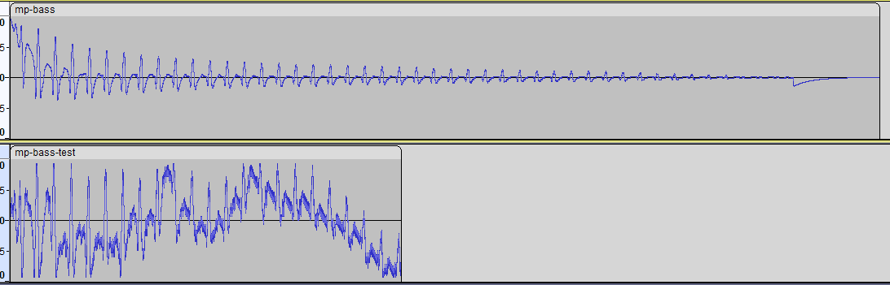

- Ok, so I was being silly and demodulating my DPCM at 44.1KHz, instead of 33143.9 Hz
- But I'm not sure if that's the only issue!
- See:
- 
- The thing is... these 2 are the *same note*.
- Could it be that simply decoding it at the wrong rate could be resulting in not just a change of pitch, but a time distortion, i.e. a loss of information
- Anyway,
- ## Diagnostics
- A couple of ideas that came to me while in the bathtub. One rather obvious...
	- to compare my resulting PCM values with the wav file, and one not so obvious:
	- To check out the NESJs NSF player. I made an NSF of just a single note being played, so I could load it up and trace the execution. That sounds kind of cool, actually... so we could see exactly which functions are used in the demodulation
	- Come to think of it... why am I only thinking of this now? I've tried implementing an NSF player before, but I wasn't even following this one... let's try this again, over in [[NSF Player]]