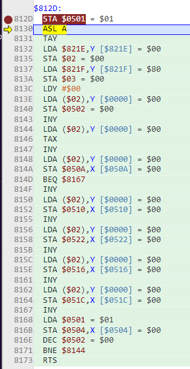
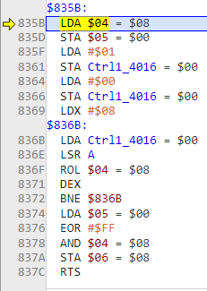

- So there's a couple of weird things I'm stuck on:
	- Why can't I seem to remove the controller code in the regular rom example
	- Why isn't the NSF version even reading the song data properly
- If I start the rom, set a breakpoint at `sound_load:`, and press the key to trigger the thing, I can step through it
- What I want to do is just load the song number manually, and remove the controller stuff but that makes it keep restarting and I need to figure out why
- Here we are loading the sound
- 
- huh. then it goes to nmi and back to the controller reading
- 
- This is where it takes the last frame's reading ($08) and stores it as `joypad1_old`
- Then at `rol` `joypad1` becomes $10
- I guess the whole point is for `joypad1_pressed` to become $08, representing the off-to-on transition
- so then we return from the second `read_joypad` and lda joypad1_pressed
- ## Trying no controller
- It seems like it's constantly loading the song when it should just do it once.
- omg I did it!
- I just had to remove sound_load from NMI and instead just do it once. Yes!
- Now maybe it will be easier to make the NSF... although it seemed to be giving me a unique mysterious problem...
- Yeah, still not loading song data correctly. At least now it's simpler so I can keep playing with it
- omg... I might have figured it out, it needs the other song headers for some reason
- Yes! It works! Holy shit!
- It's still only eighth notes or whatever.
- Now I can go on to [[Nerdy Nights Sound: Part 6: Tempo, Note Lengths, Buffering and Rests]]