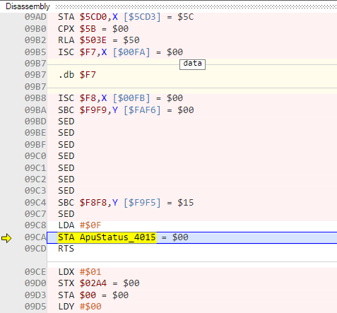
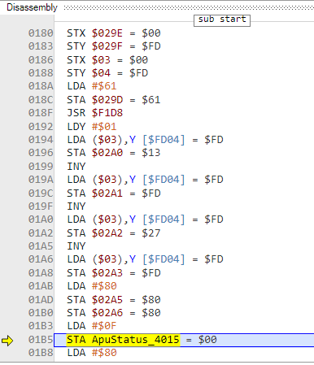
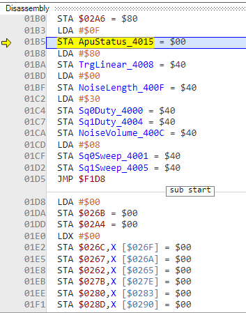
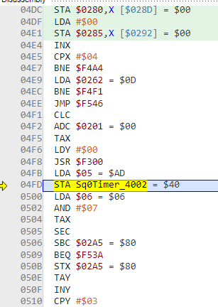
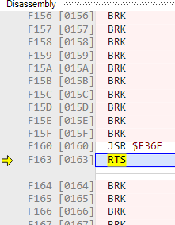

- Projects to look at:
	- [Pently](https://github.com/pinobatch/pently/blob/master/docs/bytecode.md)
	- [bhop](https://github.com/zeta0134/bhop/blob/master/bhop.s)
		- From Zeta:
		- > you probably want to start with tick_registers (which actually does the 2A03 APU specific parts) and work backwards from there
	- [FamiStudio sound engine](https://github.com/BleuBleu/FamiStudio/tree/master/SoundEngine)
		- Mathiew from FS:
		- > famitone and the derivative (3,4,5) by doug are also good starting points
		- I should include those below
	- Famitone2 - The one the FamiStudio driver is based on. Looks like no GitHub, but the code is available from [Shiru](https://shiru.untergrund.net/code.shtml)
- Pently supposedly includes an entire driver written in pseudocode... ah, that's here: https://github.com/pinobatch/pently/blob/master/docs/pseudocode.txt
- What I feel like I want to do is make a minimal NSF that would just play x note on y wave for n frames
- Let's... look at the disassembly of a minimal NSF and start cutting things out or something...
- The problem is there is no "minimal NSF" because anything that makes one includes an entire driver. But I have to start somewhere.
- ## Minimal pulse1 track
	- I loaded this up in Mesen and set a breakpoint at `$4000`-`$4017`, the entire APU
	- 09CA - STA ApuStatus_4015 = $00
	- 
	- 01B5 - uh... same
	- 
	- 
	- Then it goes back up to 09CA, this time storing $08.
	- 
	- 04FD - STA Sq0Timer_40022 = $40
	- Only now does the graph come on indicating sound is playing.
	- 
	- 0537 - STX Sq0Length_4003 = $40
	- Ok and we're back from the play routine (F160)
	- 
	-
- Ah. I just remembered about the Nerdy Nights sound tutorial, which goes through building a minimal sound engine which is exactly what I'm looking for, not this fucking gigantic bullshit, lol
- The tutorial shows just how to do a stupid beep, which is what I want.
- I guess I could...
- Well, I'm going to need to go back to the famicom.party workflow and refresh on how to generate a rom, then modify it to make an NSF.
- This will probably help: https://github.com/JamesSheppardd/Nerdy-Nights-ca65-Translation
- Perfect! I'll probably have a rom with working sound that makes sense in no time
- Oh wait... this isn't the audio one.... dang.
- I found Glacie's audio hello world. Also, Pino said
- > To play a single note, it's enough to poke $4015, $4000, $4001, $4002, and $4003
- ```
  ; simple code for testing audio, since the NES can't easily print text. this is basically the 2A03
  ; equivalent to a C "Hello, World" program 
  lda #$01    ; square 1
  sta $4015
  lda #$08    ; period low
  sta $4002
  lda #$02    ; period high
  sta $4003
  lda #$bf    ; volume
  sta $4000
  ```
- I just realized that I'm going to be writing an assembler, which is a funny thought
- I offered to help with the [[Nerdy Nights sound tutorial]], i.e. getting it onto the wiki. I found a port on github that uses ca65: https://github.com/ddribin/nerdy-nights
- I think I might just need the first couple of lessons to get a working NSF. Let's see about how I can do that.
- I suppose I'd do something like this, which is for writing the wav files:
- ```js
  export function make_download(name, abuffer) {
      var new_file = URL.createObjectURL(bufferToWave(abuffer, abuffer.length));
      var downloadAnchorNode = document.createElement('a');
      downloadAnchorNode.setAttribute("href", new_file);
      downloadAnchorNode.setAttribute("download", name);
      document.body.appendChild(downloadAnchorNode); // required for firefox
      downloadAnchorNode.click();
      downloadAnchorNode.remove();
  }
  ```
- You know... I bet it's double-downloading because of the pretty printer, I wonder if I disconnect it...
- Then what I can do is... just see if I can take the NSF input bytes and spit it back into a new file
- Never do I actually need to write the nsf, though. That is, until I want to actually export a song.
- What *will* happen, at least during this test, is calling the `loadNsf` function with our assembled code.
- As far as learning to create assembled code, I wonder if ca65 could work for that?
- Writing the header is probably going to be the toughest part tbh
- I found a relevant discussion here: https://forums.nesdev.org/viewtopic.php?t=10544
- The NSF it builds is much more complex than I want though... still it's helping a lot.
- ```
  .segment "HEADER"
      .byte "NESM",$1a
      .byte 1     ; version
      .byte 1    ; number of songs
      .byte 1     ; starting song
  ```
- Then we have the load address, init and play address
- How are they located? I think with labels
- ```
  .segment "CODE"
  .proc initaddr
  	stx savedX
  	sta savedA
  
  	lda #<musedata
  	ldx #>musedata
  	jsr MUSE_init
  	
  	lda #15
  	jsr MUSE_setVolume
  	;; X=1 if PAL, 0 if NTSC
  	lda savedX
  	eor #1
  	asl
  	asl
  	asl
  	asl
  	;; now A=0 if PAL, 16 if NTSC
  	jsr MUSE_setFlags
  	;; A=desired song number
  	lda savedA
  	jsr MUSE_startMusic
  	rts
  .endproc
  ```
- OMG it works! I am genuinely shocked. I checked in the code... I think the only weird thing about it is that the music data is at $8000 which means there's just a shitload of padding.
- But the NSF from FamiStudio puts it at $F000...
- I still have no idea how ca65 works, with the config and all. But it's not such a huge deal, because this was just an experiment. Our actual thing is not going to use ca65. But I have to be pretty familiar with how instructions are assembled
- I see, the music data is not actually at $8000 in the ROM, that's when it gets copied into RAM or some shit.
- The file ends with the bytes 19 80 00 80 00 00
- Oh wait... the file is actually 32896 bytes ($8000), which is totally unnecessary
- Yet the load address must be at least $8000
- FamiStudio minimal NSF is only 4224 bytes... and uses banks
- Oh! I figured it out :)
- I got it down to 160 bytes, which makes much more sense for 1 note.
- Alright, so that's the NSF version of the first lesson. Let's see if we can do the second one
- Done! Wow, this is easier than I thought
- Well, now it gets more complicated because of the included files. But what if it still works the same? It's the same assembler and linker, after all
- Actually, this has controller code, and video stuff because it does other shit
- Other than the interactive stuff, it doesn't add anything new other than playing arbitrary notes. Let's go on to the next one, which I think plays a scale or something.
- Let's analyze this in the main lesson page, [[Nerdy Nights Sound: Part 4: sound engine skeleton]]