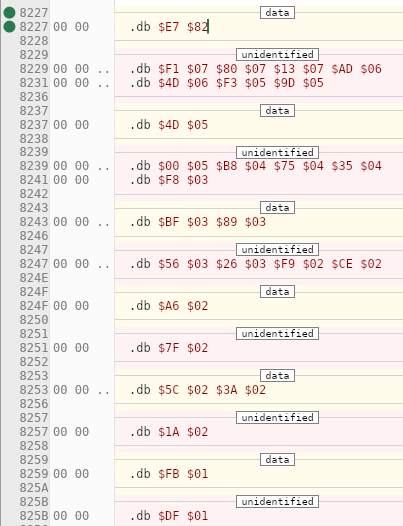
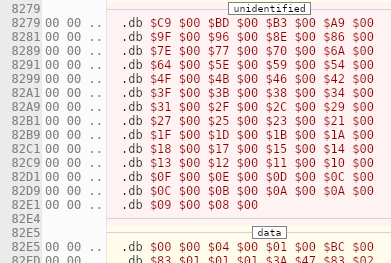

- So we now have the complete driver. Go me! Now the fun part begins, generating it not from ca65 but from the program itself!
- I did this before a few pages back, for a driver a few versions back, where I went through the binary and figured out what assembly it came from.
- ## Header
- Obviously the first thing will be to generate a valid header
- Huh, I just realized that we're not listing the length of the program data, which is part of the spec but apparently not necessary to run it.
- I guess I'll go ahead and fire up the program and start generating some bytes! Let's go!
- I guess I'll put this in the nsf module?
- So what's first? Shit, here's the whole header:
- ```
  00000000 4E 45 53 4D:1A 01 01 01|00 80 00 80:07 80 48 65
  00000010 61 64 65 72:73 00 00 00|00 00 00 00:00 00 00 00
  00000020 00 00 00 00:00 00 00 00|00 00 00 00:00 00 42 6F
  00000030 62 62 69 20:54 6F 77 65|72 73 00 00:00 00 00 00
  00000040 00 00 00 00:00 00 00 00|00 00 00 00:00 00 32 30
  00000050 32 34 20 42:6F 62 62 69|20 54 6F 77:65 72 73 00
  00000060 00 00 00 00:00 00 00 00|00 00 00 00:00 00 FF 40
  00000070 00 00 00 00:00 00 00 00|1D 4E 03
  ```
- It starts with the format string:
- ```js
  const nsfFormat = [0x4e, 0x45, 0x53, 0x4d, 0x1a]
  ```
- Cool, we're rollin'!
- ```js
  const version = 1
  let totalSongs = 1
  let startingSong = 1
  const loadAdr = [0x00, 0x80]
  const initAdr = [0x00, 0x80]
  const playAdr = [0x09, 0x80]
  ```
- Now for the name, artist and copyright, we need to do like the assembler macro does and zero-pad it. So we'll make it a function. What do we use... charCodeAt?
- This seems to work:
- ```js
  function pad32(string) {
    let name = []
    for (let i = 0; i < 32; i++) {
      if (i < string.length) {
          name.push(string.charCodeAt(i))
      } else {
        name.push(0)
      }
    }
    return name
  }
  ```
- Play speed:
- ```js
  let ntscSpeed = [0xff, 0x40]
  let banking = [0,0,0,0,0,0,0,0]
  let palSpeed = [0x1d, 0x4e]
  let playMode = 3
  let expansionAudio = 0
  let prgLength = 0
  ```
- Cool! That's the header. Now to compose it. I can init the meta with "Untitled" or some shit
- Alright! That's committed. What's next?
- Ah, it's right in [[NSF export]]. Let's just refer to there.
- ```
  00000080 20 0B 80 20:39 80 60 20|88 80 60
  ```
- ## init
- ```
  00000080            :           |         A9:0F 8D 15 40
  00000090 A9 00 8D 00:02 A9 FF 8D|03 02 8D 04:02
  
  ```
- ## se_silence
- ```
  00000090            :           |           :   A9 30 8D
  000000A0 05 02 8D 09:02 8D 11 02|A9 80 8D 0D:02 60
  ```
- So far we've got:
- ```js
  const load = [0x20, 0x0B, 0x80, 0x20, 0x39, 0x80, 0x60, 0x20, 0x88, 0x80, 0x60];
  const init = [0xA9, 0x0F, 0x8D, 0x15, 0x40, 0xA9, 0x00, 0x8D, 0x00, 0x02,
      0xA9, 0xFF, 0x8D, 0x03, 0x02, 0x8D, 0x04, 0x02];
  const silence = [0xA9, 0x30, 0x8D, 0x05, 0x02, 0x8D, 0x09, 0x02,
      0x8D, 0x11, 0x02, 0xA9, 0x80, 0x8D, 0x0D, 0x02, 0x60];
  ```
- Nice!
- Then we do `sound_load` but there's this bit in between, currently showing unidentified:
- ```
  000000A0            :           |           :      A9 00
  000000B0 8D 15 40 A9:01 8D 00 02|60
  ```
- ## sound_load
- ```
  000000B0            :           |   8D 01 02:0A A8 B9 27
  000000C0 82 85 00 B9:28 82 85 01|A0 00 B1 00:8D 02 02 C8
  000000D0 B1 00 AA C8:B1 00 9D 1B|02 F0 20 C8:B1 00 9D 21
  000000E0 02 C8 B1 00:9D 33 02 C8|B1 00 9D 27:02 C8 B1 00
  000000F0 9D 2D 02 A9:01 9D 45 02|9D 4B 02 C8:AD 01 02 9D
  00000100 15 02 CE 02:02 D0 C9 60
  ```
- ## sound_play_frame
- ```
  00000100            :           |AD 00 02 D0:25 20 1D 80
  00000110 A2 00 BD 1B:02 29 01 F0|11 DE 45 02:D0 09 BD 4B
  00000120 02 9D 45 02:20 B3 80 20|8D 81 E8 E0:06 D0 E3 20
  00000130 C2 81 60
  ```
- ## se_fetch_byte
- ```
  00000130          BD:27 02 85 00|BD 2D 02 85:01 A0 00 B1
  00000140 00 10 68 C9:E0 90 23 C9|F0 90 32 C9:F4 90 42 BD
  00000150 1B 02 29 FE:9D 1B 02 BD|21 02 C9 02:F0 04 A9 30
  00000160 D0 02 A9 80:9D 33 02 4C|52 81 29 7F:8C 01 02 A8
  00000170 9D 4B 02 9D:45 02 AC 01|02 C8 4C BF:80 29 0F 8D
  00000180 02 02 BD 33:02 29 F0 0D|02 02 9D 33:02 C8 4C BF
  00000190 80 29 03 2A:2A 2A 2A 2A|2A 8D 02 02:BD 33 02 29
  000001A0 3F 0D 02 02:9D 33 02 C8|4C BF 80 8D:02 02 BD 21
  000001B0 02 C9 03 D0:03 20 61 81|AD 02 02 8C:01 02 0A A8
  000001C0 B9 29 82 9D:39 02 B9 2A|82 9D 3F 02:AC 01 02 20
  000001D0 77 81 C8 98:18 7D 27 02|9D 27 02 90:03 FE 2D 02
  000001E0 60
  ```
- Then another mystery routine (momentarily):
- ```
  000001E0    AD 02 02:29 10 F0 08|AD 02 02 09:80 8D 02 02
  000001F0 AD 02 02 9D:39 02 60
  ```
- It's the noise one!
- ### se_check_rest
- ```
  000001F0            :         B1|00 C9 5E D0:07 BD 1B 02
  00000200 09 02 D0 05:BD 1B 02 29|FD 9D 1B 02:60
  ```
- ### se_set_temp_ports
- ```
  00000200            :           |           :   BD 21 02
  00000210 0A 0A A8 BD:33 02 99 05|02 A9 08 99:06 02 BD 39
  00000220 02 99 07 02:BD 3F 02 99|08 02 BD 1B:02 29 02 F0
  00000230 10 BD 21 02:C9 02 F0 04|A9 30 D0 02:A9 80 99 05
  00000240 02 60
  ```
- ### se_set_apu
- ```
  00000240       AD 05:02 8D 00 40|AD 06 02 8D:01 40 AD 07
  00000250 02 8D 02 40:AD 08 02 CD|03 02 F0 06:8D 03 40 8D
  00000260 03 02 AD 09:02 8D 04 40|AD 0A 02 8D:05 40 AD 0B
  00000270 02 8D 06 40:AD 0C 02 CD|04 02 F0 06:8D 07 40 8D
  00000280 04 02 AD 0D:02 8D 08 40|AD 0F 02 8D:0A 40 AD 10
  00000290 02 8D 0B 40:AD 11 02 8D|0C 40 AD 13:02 8D 0E 40
  000002A0 AD 14 02 8D:0F 40 60
  ```
- ## It's done!
- Basically all that's left now is to plug in the music data and update the stream pointers!
- I might want to break up`fetchByte` into separate subroutines. Not only is it the longest one, but that's right where the uh... byte fetching is taking place which we will need to be focusing on to point to the user's data.
- Actually at the time fetch byte is called, the pointer locations have already been loaded into the variables stream_ptr_lo and stream_ptr_hi. That happens in soundLoad, which looks up the pointers in `song_headers`, which is at `$8227`.
- I believe we can be confident that that number will remain the same. It is stored in the variable `sound_ptr`, which is just 2 bytes in the zero page.
- This sound_ptr is used with indirect indexing. We read:
	- Stream number
		- Stream number acts as our variable index
	- Status byte. 1=enable, 0=disable
		- stored in `stream_status` variable
	- Channel number
		- stored in `stream_channel` variable
	- Initial duty and volume settings
		- stored in `stream_vol_duty` variable
	- Pointer to stream data. Little endian
		- Stored in `stream_ptr_lo` and `stream_ptr_hi`
- That is `sound_load`.
- I guess let's make a page for [[generating music data]]
- It just occurs to me though, that we should probably first try to actually assemble our driver with the current music, then try to change it. We're not done here yet.
- Should we have a new page? Yes, how's about [[installing assembled NSF driver]]
- ## Music data
- We still have considerable work pulling apart the note data streams.
- Mesen shows it as a curious combination of data and unidentified blocks::
- 
- Here is the entire rest of the file, from the point we left off above (set_apu)
- ```
  000002A0            :         E7|82 F1 07 80:07 13 07 AD
  000002B0 06 4D 06 F3:05 9D 05 4D|05 00 05 B8:04 75 04 35
  000002C0 04 F8 03 BF:03 89 03 56|03 26 03 F9:02 CE 02 A6
  000002D0 02 7F 02 5C:02 3A 02 1A|02 FB 01 DF:01 C4 01 AB
  000002E0 01 93 01 7C:01 67 01 51|01 3F 01 2D:01 1C 01 0C
  000002F0 01 FD 00 EF:00 E2 00 D2|00 C9 00 BD:00 B3 00 A9
  00000300 00 9F 00 96:00 8E 00 86|00 7E 00 77:00 70 00 6A
  00000310 00 64 00 5E:00 59 00 54|00 4F 00 4B:00 46 00 42
  00000320 00 3F 00 3B:00 38 00 34|00 31 00 2F:00 2C 00 29
  00000330 00 27 00 25:00 23 00 21|00 1F 00 1D:00 1B 00 1A
  00000340 00 18 00 17:00 15 00 14|00 13 00 12:00 11 00 10
  00000350 00 0F 00 0E:00 0D 00 0C|00 0C 00 0B:00 0A 00 0A
  00000360 00 09 00 08:00 00 00 04|00 01 00 BC:00 83 01 01
  00000370 01 3A 47 83:02 01 02 81|88 83 03 01:03 1E A6 83
  00000380 A8 1F 9E F0:22 F1 94 21|F2 1F F3 1E:F0 1F F1 21
  00000390 F2 DF F3 5E:A8 5E 21 F0|9E 24 F1 94:22 F2 21 F3
  000003A0 9C 1F F0 21:F1 22 DF 5E|A8 5E E5 22:9E 26 94 24
  000003B0 22 9E 24 26:27 94 26 24|EF 26 F0 24:22 21 1E 1F
  000003C0 21 22 21 1F:DA 5E FF 94|13 5E 1A 5E:1A 5E 1A 5E
  000003D0 0E 5E 15 5E:15 5E 15 5E|15 5E 18 5E:18 5E 18 5E
  000003E0 0E 5E 13 5E:13 5E 13 5E|E5 13 5E 1A:5E 1A 5E 1A
  000003F0 5E 1A 5E 18:5E 16 5E 15|5E EF 94 13:5E 1A 5E 18
  00000400 5E 15 5E 13:5E DA 5E FF|A8 1F 22 1A:1E 21 24 1A
  00000410 1F 22 26 9E:24 26 A8 27|94 1F 21 22:24 1A 1B 1D
  00000420 1E 18 1F DA:5E FF 90 0D|5E 07 5E 0D:FF
  ```
- Good news is, we can see that the music data streams are actually the very last thing, including the final $FF to mark the end of the noise stream.
- So I guess what we can do is work backwards! I'll put them in order as I go for convenience.
-
- ### `song1_square1`
- ```js
  const data = [
  	// Offset 0x00000380 to 0x000003C6
  	0xA8, 0x1F, 0x9E, 0xF0, 0x22, 0xF1, 0x94, 0x21, 0xF2, 0x1F, 0xF3, 0x1E,
  	0xF0, 0x1F, 0xF1, 0x21, 0xF2, 0xDF, 0xF3, 0x5E, 0xA8, 0x5E, 0x21, 0xF0,
  	0x9E, 0x24, 0xF1, 0x94, 0x22, 0xF2, 0x21, 0xF3, 0x9C, 0x1F, 0xF0, 0x21,
  	0xF1, 0x22, 0xDF, 0x5E, 0xA8, 0x5E, 0xE5, 0x22, 0x9E, 0x26, 0x94, 0x24,
  	0x22, 0x9E, 0x24, 0x26, 0x27, 0x94, 0x26, 0x24, 0xEF, 0x26, 0xF0, 0x24,
  	0x22, 0x21, 0x1E, 0x1F, 0x21, 0x22, 0x21, 0x1F, 0xDA, 0x5E, 0xFF
  ];
  
  ```
- ### `song1_square2`
- ```js
  const data = [
  	// Offset 0x000003C7 to 0x00000407
  	0x94, 0x13, 0x5E, 0x1A, 0x5E, 0x1A, 0x5E, 0x1A, 0x5E, 0x0E, 0x5E, 0x15,
  	0x5E, 0x15, 0x5E, 0x15, 0x5E, 0x15, 0x5E, 0x18, 0x5E, 0x18, 0x5E, 0x18,
  	0x5E, 0x0E, 0x5E, 0x13, 0x5E, 0x13, 0x5E, 0x13, 0x5E, 0xE5, 0x13, 0x5E,
  	0x1A, 0x5E, 0x1A, 0x5E, 0x1A, 0x5E, 0x1A, 0x5E, 0x18, 0x5E, 0x16, 0x5E,
  	0x15, 0x5E, 0xEF, 0x94, 0x13, 0x5E, 0x1A, 0x5E, 0x18, 0x5E, 0x15, 0x5E,
  	0x13, 0x5E, 0xDA, 0x5E, 0xFF
  ];
  
  ```
- ### `song1_tri`
- ```js
  const data = [
  	// Offset 0x00000408 to 0x00000425
  	0xA8, 0x1F, 0x22, 0x1A, 0x1E, 0x21, 0x24, 0x1A, 0x1F, 0x22, 0x26, 0x9E,
  	0x24, 0x26, 0xA8, 0x27, 0x94, 0x1F, 0x21, 0x22, 0x24, 0x1A, 0x1B, 0x1D,
  	0x1E, 0x18, 0x1F, 0xDA, 0x5E, 0xFF
  ];
  
  ```
- ### `song1_noise`
- ```js
  const data = [
  	// Offset 0x00000426 to 0x0000042C
  	0x90, 0x0D, 0x5E, 0x07, 0x5E, 0x0D, 0xFF
  ];
  ```
- That still leaves a rather disturbingly large chunk of unidentified shit
- Oh... we still have the header
- ## Song header
- This starts at CPU 82E5.
- Oh damn, the header is just this:
- ```js
  const data = [
  	// Offset 0x00000367 to 0x0000037F
  	0x04, 0x00, 0x01, 0x00, 0xBC, 0x00, 0x83, 0x01, 0x01, 0x01, 0x3A, 0x47,
  	0x83, 0x02, 0x01, 0x02, 0x81, 0x88, 0x83, 0x03, 0x01, 0x03, 0x1E, 0xA6,
  	0x83
  ];
  
  ```
- This chunk is before that:
- 
- ```js
  const data = [
  	// Offset 0x000002F9 to 0x00000366
  	0xC9, 0x00, 0xBD, 0x00, 0xB3, 0x00, 0xA9, 0x00, 0x9F, 0x00, 0x96, 0x00,
  	0x8E, 0x00, 0x86, 0x00, 0x7E, 0x00, 0x77, 0x00, 0x70, 0x00, 0x6A, 0x00,
  	0x64, 0x00, 0x5E, 0x00, 0x59, 0x00, 0x54, 0x00, 0x4F, 0x00, 0x4B, 0x00,
  	0x46, 0x00, 0x42, 0x00, 0x3F, 0x00, 0x3B, 0x00, 0x38, 0x00, 0x34, 0x00,
  	0x31, 0x00, 0x2F, 0x00, 0x2C, 0x00, 0x29, 0x00, 0x27, 0x00, 0x25, 0x00,
  	0x23, 0x00, 0x21, 0x00, 0x1F, 0x00, 0x1D, 0x00, 0x1B, 0x00, 0x1A, 0x00,
  	0x18, 0x00, 0x17, 0x00, 0x15, 0x00, 0x14, 0x00, 0x13, 0x00, 0x12, 0x00,
  	0x11, 0x00, 0x10, 0x00, 0x0F, 0x00, 0x0E, 0x00, 0x0D, 0x00, 0x0C, 0x00,
  	0x0C, 0x00, 0x0B, 0x00, 0x0A, 0x00, 0x0A, 0x00, 0x09, 0x00, 0x08, 0x00,
  	0x00, 0x00
  ];
  ```
- Have no idea what it is. Could it be like... pointers? Each byte is alternated with a 0
- And finally the mixed data/unidentified chunks:
- ```js
  const data = [
  	// Offset 0x000002A7 to 0x000002F8
  	0xE7, 0x82, 0xF1, 0x07, 0x80, 0x07, 0x13, 0x07, 0xAD, 0x06, 0x4D, 0x06,
  	0xF3, 0x05, 0x9D, 0x05, 0x4D, 0x05, 0x00, 0x05, 0xB8, 0x04, 0x75, 0x04,
  	0x35, 0x04, 0xF8, 0x03, 0xBF, 0x03, 0x89, 0x03, 0x56, 0x03, 0x26, 0x03,
  	0xF9, 0x02, 0xCE, 0x02, 0xA6, 0x02, 0x7F, 0x02, 0x5C, 0x02, 0x3A, 0x02,
  	0x1A, 0x02, 0xFB, 0x01, 0xDF, 0x01, 0xC4, 0x01, 0xAB, 0x01, 0x93, 0x01,
  	0x7C, 0x01, 0x67, 0x01, 0x51, 0x01, 0x3F, 0x01, 0x2D, 0x01, 0x1C, 0x01,
  	0x0C, 0x01, 0xFD, 0x00, 0xEF, 0x00, 0xE2, 0x00, 0xD2, 0x00
  ];
  ```
- Alright... at least that's everything. Let's try to put it together...
- Got it! And most of the unidentified chunks are the note table!