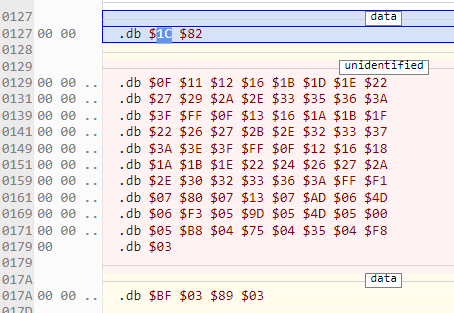

- I'll start with just a single-bank version, since I'm not supporting DPCM just yet.
- Here's the current config file:
- ```
  MEMORY {
      # First, the parts that are specified in the image, in the order they're needed:
  
      # NSF Cartridge Header
      HEADER: start = $0, size = $80, file = %O, fill = yes;
  
      ROM: start=$8000, size=$0430, fill=yes, fillval=$ff;
  
      # Then, RAM definitions:
      ZP: start = $0, size = $100, type = rw, define = yes;
  
      # standard 2k SRAM (-zeropage)
      SRAM: start = $0200, size = $0600, define = yes;
  }
  
  SEGMENTS {
      HEADER:   load = HEADER,          type = ro;
      CODE:     load = ROM,             type = ro,  define = yes, align=256;
      ZEROPAGE: load = ZP,              type = zp;
      SRAM1:    load = SRAM,            type = bss, define = yes;
  }
  
  ```
- I think I got it. All I had to do was add a songdata segment:
- ```
  MEMORY {
      # First, the parts that are specified in the image, in the order they're needed:
  
      # NSF Cartridge Header
      HEADER: start = $0, size = $80, file = %O, fill = yes;
  
      ROM0: start = $8000, size = $8000, file = %O, define = yes;
  
      # Then, RAM definitions:
      ZP: start = $0, size = $100, type = rw, define = yes;
  
      # standard 2k SRAM (-zeropage)
      SRAM: start = $0200, size = $0600, define = yes;
  }
  
  SEGMENTS {
      HEADER:   load = HEADER,          type = ro;
      CODE:     load = ROM0,            type = ro,  define = yes, align=256;
      DATA:     load = ROM0,            type = ro,  define = yes, align=256;
      SRAM1:    load = SRAM,            type = bss, define = yes;
      ZEROPAGE: load = ZP,              type = zp;
  }
  ```
- Then in the music data I just put `.segment    "songdata"`
- oh no... it actually doesn't work...
- oh! I just had to put `.code` after the .segment part
- huh... I suppose then it isn't actually segmenting it...
- yeah... that's not right
- I guess it's the ld65 docs I need to read, which includes info about the configuration files: https://cc65.github.io/doc/ld65.html#s5
- oh... I think I got it! I'll just edit the snippet above to the config that worked
- The trick was to do `DATA:     load = ROM0, `
- ## Build it ourselves?
- I feel like the end game is to use our own internal assembler in the application. We build the header, which has the metadata and prg info, stick in the driver with appropriate addresses for the music data streams, and the data streams.
- To get a sense of how this should work, let's start with the simplest version of the NSF driver.
- I have it in the nsf-sound-driver project in a branch called headers2. The NSF is only 896 bytes
- Here is the header, the first segment of 0x80 bytes:
- ```js
  const data = [
  	// Offset 0x00000000 to 0x0000007F
  	0x4E, 0x45, 0x53, 0x4D, 0x1A, 0x01, 0x01, 0x01, 0x00, 0x80, 0x00, 0x80,
  	0x07, 0x80, 0x48, 0x65, 0x61, 0x64, 0x65, 0x72, 0x73, 0x00, 0x00, 0x00,
  	0x00, 0x00, 0x00, 0x00, 0x00, 0x00, 0x00, 0x00, 0x00, 0x00, 0x00, 0x00,
  	0x00, 0x00, 0x00, 0x00, 0x00, 0x00, 0x00, 0x00, 0x00, 0x00, 0x42, 0x6F,
  	0x62, 0x62, 0x69, 0x20, 0x54, 0x6F, 0x77, 0x65, 0x72, 0x73, 0x00, 0x00,
  	0x00, 0x00, 0x00, 0x00, 0x00, 0x00, 0x00, 0x00, 0x00, 0x00, 0x00, 0x00,
  	0x00, 0x00, 0x00, 0x00, 0x00, 0x00, 0x32, 0x30, 0x32, 0x34, 0x20, 0x42,
  	0x6F, 0x62, 0x62, 0x69, 0x20, 0x54, 0x6F, 0x77, 0x65, 0x72, 0x73, 0x00,
  	0x00, 0x00, 0x00, 0x00, 0x00, 0x00, 0x00, 0x00, 0x00, 0x00, 0x00, 0x00,
  	0x00, 0x00, 0xFF, 0x40, 0x00, 0x00, 0x00, 0x00, 0x00, 0x00, 0x00, 0x00,
  	0x1D, 0x4E, 0x03, 0x00, 0x00, 0x00, 0x00, 0x00
  ];
  
  ```
- I also generated a map file which shows the rest of the layout.
- The zero page is only 2 bytes, for `sound_ptr`.
- The part that's confusing is that the segment start addresses are not what they actually are in the file. I guess the file is irrelevant - what matters is where the code will be located once it is copied into memory. The CODE segment starts at $8000 which is both the LOAD and INIT address
- The song header is located at $29C in the file, which is 821C in memory.
- ## init
- Let's try to find the init code:
- ```z80
  sound_init:
  	;; Enable Square 1, Square 2, Triangle and Noise channels
  	lda	#$0f
  	sta	$4015
  
  	lda	#$00
  	sta	sound_disable_flag ; Clear disable flag
  	sta	sound_frame_counter
  ```
- I think that's this:
- ```js
  const data = [
  	// Offset 0x0000008B to 0x00000097
  	0xA9, 0x0F, 0x8D, 0x15, 0x40, 0xA9, 0x00, 0x8D, 0x00, 0x02, 0x8D, 0x03,
  	0x02
  ];
  
  ```
- This is what's in between:
- ```js
  const data = [
  	// Offset 0x00000080 to 0x0000008A
  	0x20, 0x0B, 0x80, 0x20, 0x34, 0x80, 0x60, 0x20, 0x7D, 0x80, 0x60
  ];
  
  ```
- Oh... 20 is JSR. And $807D must be sound_init.
- IDK I'm already confused, because I'm looking at the Mesen disassembly and apparently the sound init code is this, the next part:
- ```js
  const data = [
  	// Offset 0x00000098 to 0x000000A8
  	0xA9, 0x30, 0x8D, 0x00, 0x40, 0x8D, 0x04, 0x40, 0x8D, 0x0C, 0x40, 0xA9,
  	0x80, 0x8D, 0x08, 0x40, 0x60
  ];
  
  ```
- This is all jumbled, everything is out of order
- So we do sound init and then sound load.
- ## Debugging in Mesen
- I just hit reset again, and it's at address 0. Bytecode is 20 0B 80
- ```
  00000080 20 0B 80
  ```
- That's right, we're immediately after the header at the motherfucking load address.
- ### Load/init
- `JSR $800B`
- Then we jump to  000B:
- ```
  00000080            :           |         A9:0F 8D 15 40
  00000090 A9 00 8D 00:02 8D 03 02
  ```
- That's sound_init. And we continue to se_silence:
- ### se_silence
- ```
  00000090            :           |A9 30 8D 00:40 8D 04 40
  000000A0 8D 0C 40 A9:80 8D 08 40|60
  ```
- ```z80
  se_silence:	
  	lda	#$30
  	sta	$4000		; Set Square 1 volume to 0
  	sta	$4004		; Set Square 2 volumne to 0
  	sta	$400c		; Set Noice volume to 0
  	lda	#$80
  	sta	$4008		; Silence Triangle
  	
  	rts
  ```
- So we return to 0003 in the rom:
- ```
  00000080          20:34 80
  ```
- `JSR $8034`
- ### sound_load
- That sends us to $8034 (obviously). This is sound_load:
- ```
  000000B0            :A9 00 8D 01|02 0A A8 B9:27 81 85 00
  000000C0 B9 28 81 85:01 A0 00 B1|00 8D 02 02:C8 B1 00 AA
  000000D0 C8 B1 00 9D:0A 02 F0 18|C8 B1 00 9D:10 02 C8 B1
  000000E0 00 9D 22 02:C8 B1 00 9D|16 02 C8 B1:00 9D 1C 02
  000000F0 C8 AD 01 02:9D 04 02 CE|02 02 D0 D1:60
  ```
- I won't paste the assembly here because it's actually a *lot* of code! Which is cool because it shows how concise it is in the bytecode.
- So this is what sets up the pointer to the song header and initializes the sound data streams
- So then we jump to... The play address? `jsr	sound_play_frame` should be next. I have to set a breakpoint to actually get it to stop there though.
- ### sound_play_frame
- Conveniently, this is the very next code in our rom, at 007D, or 00FD in the actual file:
- ```hex
  000000F0            :           |           :   AD 00 02
  00000100 D0 26 EE 03:02 AD 03 02|C9 0C D0 1C:20 18 80 A2
  00000110 00 BD 0A 02:29 01 F0 06|20 A9 80 20:02 81 E8 E0
  00000120 06 D0 EE A9:00 8D 03 02|60
  ```
- Here we either do nothing if no note is queued up (i.e. tempo), or eventually go to fetch a byte.
-
- ### se_fetch_byte
- se_fetch_byte is at 80A9 Cpu address, 00A9 ROM address, or 0129 in the file.
- ```
  00000120            :           |   BD 16 02:85 00 BD 1C
  00000130 02 85 01 A0:00 B1 00 10|26 C9 A0 90:1F C9 FF D0
  00000140 40 BD 0A 02:29 FE 9D 0A|02 BD 10 02:C9 02 F0 04
  00000150 A9 30 D0 02:A9 80 9D 22|02 4C F3 80:4C F3 80 8C
  00000160 01 02 0A A8:B9 60 81 9D|28 02 B9 61:81 9D 2E 02
  00000170 AC 01 02 C8:98 18 7D 16|02 9D 16 02:90 03 FE 1C
  00000180 02 60
  ```
- At this point we're about halfway through the code, and I think all bytes have been accounted for. That is, it seems that the bytes are arranged in the file quite logically to appear in the order they are used. And now the addressing system is starting to make a little bit of sense. The ROM address is the same as the file address minus (or plus?) the header.
- So fetch byte is kind of interesting, it's where we branch depending on whether we're at a note or a length or an opcode. So this is the segment which contains the sound pointer locations.
- Ok, back to where we jumped to fetch the byte in sound_play_frame, now we se_set_apu
- ### se_set_apu
- And same thing, it's the next code in the file:
- ```
  00000180       BD 10:02 0A 0A A8|BD 22 02 99:00 40 BD 28
  00000190 02 99 02 40:BD 2E 02 99|03 40 BD 10:02 C9 02 B0
  000001A0 05 A9 08 99:01 40 60
  ```
- Ok then we RTS to... where? sound_play_frame. Then we eventually return from that, and we're back to the beginning.
- ## What's the rest?
- The rest of the rom must be music data and other things like the note table.
- I wonder if this section here could be variable definitions? It's the only piece I haven't accounted for:
- ```
  000001A0            :         1C|82 0F 11 12:16 1B 1D 1E
  000001B0 22 27 29 2A:2E 33 35 36|3A 3F FF 0F:13 16 1A 1B
  000001C0 1F 22 26 27:2B 2E 32 33|37 3A 3E 3F:FF 0F 12 16
  000001D0 18 1A 1B 1E:22 24 26 27|2A 2E 30 32:33 36 3A
  
  ```
- ### Note table
- ```
  000001E0 F1 07 80 07:13 07 AD 06|4D 06 F3 05:9D 05 4D 05
  000001F0 00 05 B8 04:75 04 35 04|F8 03 BF 03:89 03 56 03
  00000200 26 03 F9 02:CE 02 A6 02|7F 02 5C 02:3A 02 1A 02
  00000210 FB 01 DF 01:C4 01 AB 01|93 01 7C 01:67 01 51 01
  00000220 3F 01 2D 01:1C 01 0C 01|FD 00 EF 00:E2 00 D2 00
  00000230 C9 00 BD 00:B3 00 A9 00|9F 00 96 00:8E 00 86 00
  00000240 7E 00 77 00:70 00 6A 00|64 00 5E 00:59 00 54 00
  00000250 4F 00 4B 00:46 00 42 00|3F 00 3B 00:38 00 34 00
  00000260 31 00 2F 00:2C 00 29 00|27 00 25 00:23 00 21 00
  00000270 1F 00 1D 00:1B 00 1A 00|18 00 17 00:15 00 14 00
  00000280 13 00 12 00:11 00 10 00|0F 00 0E 00:0D 00 0C 00
  00000290 0C 00 0B 00:0A 00 0A 00|09 00 08 00
  
  ```
- ### Song data
- ```
  00000290            :           |           :04 00 01 00
  000002A0 77 31 82 01:01 01 B7 52|82 02 01 02:81 73 82 03
  000002B0 00 0E 11 14:17 1A 1D 20|23 26 29 2C:2F 32 35 38
  000002C0 3B 0D 10 13:16 19 1C 1F|22 25 28 2B:2E 31 34 37
  000002D0 3A FF 2F 2C:29 2F 2C 29|26 2C 29 26:23 29 26 23
  000002E0 20 26 2E 2B:28 2E 2B 28|25 2B 28 25:22 28 25 22
  000002F0 1F 25 FF 38:35 32 35 32|2F 32 2F 2C:2F 2C 29 2C
  00000300 29 26 23 37:34 31 34 31|2E 31 2E 2B:2E 2B 28 2B
  00000310 28 25 22
  
  ```
- There's still the note constants which were just `$00-$5D` but uh... they probably don't take up space, they're just replaced during assembly with the values.
- So yeah, that last bit of space could very well be our reserved flags and stuff... you know, this stuff:
- ```
  	.segment "SRAM1"
  
  ;;; A flag that keeps track of whether or the sound engine is disabled or not.
  sound_disable_flag:	.res	1
  sound_temp1:		.res	1
  sound_temp2:		.res	1
  
  ;;; A primitive counter used to time notes in this demo
  sound_frame_counter:	.res	1
  
  ;;; Reserve 6 bytes, one for each stream
  	
  stream_curr_sound:	.res	6 ; Current song/fx loaded
  ;;; Status byte. Bit 0 (1: stream enabled, 0: stream disabled)
  stream_status:		.res	6
  stream_channel:		.res	6 ; What channel is this stream playing on?
  stream_ptr_lo:		.res	6 ; Low byte of pointer to data stream
  stream_ptr_hi:		.res	6 ; High byte of pointer to data stream
  stream_vol_duty:	.res	6 ; Stream volume/duty settings
  stream_note_lo:		.res	6 ; Low 8 bits of period for current note
  stream_note_hi:		.res	6 ; High 3 bites of period for current note
  ```
- Oh... you know the map file will show where the sram is, right... hmm, no it only shows it in cpu addresses.
- Huh, I suppose that doesn't actually take up space in the rom either...
- maybe I can do a search...
- Found it...
- 
- Half of that is the note table.
- Alright, so I deconstructed that pretty well. Now, I need to go up one more level, to add note lengths and rests. Tempo... I want to leave out, and instead do our number of ticks method. This might be a bit of work, but that's what we do... let's make this [[NSF export take 2]]