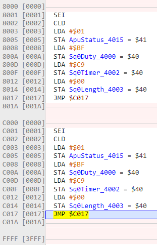

- Starts with APU overview, which is on the wiki along with "Square 1", but then it stops there.
- ## Square 1 Channel
- This chapter actually shows how to make a beep, and includes a full project folder
- I assembled the rom and it works. This is the entire code:
- ```
      .inesprg 1 ;1x 16kb PRG code
      .ineschr 0 ;0x 8kb CHR data
      .inesmap 0 ; mapper 0 = NROM, no bank swapping
      .inesmir 1 ;background mirroring (vertical mirroring = horizontal scrolling)
  
  
  ;----- first 8k bank of PRG-ROM    
      .bank 0
      .org $C000
      
  irq:
  nmi:
      rti
  
  reset:
      sei
      cld
      
      lda #%00000001
      sta $4015 ;enable Square 1
      
      ;square 1
      lda #%10111111 ;Duty 10, Length Counter Disabled, Saw Envelopes disabled, Volume F
      sta $4000
      
      lda #$C9    ;0C9 is a C# in NTSC mode
      sta $4002   ;low 8 bits of period
      lda #$00
      sta $4003   ;high 3 bits of period
      
  forever:
      jmp forever
      
  ;----- second 8k bank of PRG-ROM    
      .bank 1
      .org $E000
  ;---- vectors
      .org $FFFA     ;first of the three vectors starts here
      .dw nmi        ;when an NMI happens (once per frame if enabled) the 
                     ;processor will jump to the label NMI:
      .dw reset      ;when the processor first turns on or is reset, it will jump
                     ;to the label reset:
      .dw irq        ;external interrupt IRQ is not used in this tutorial
  ```
- Ok so here we go! If I can even get this working for cc65, it will be a worthy accomplishment.
- working:
- 
- It's uh, not even resetting
- Ok, I think I got it, checked in the first lesson!
- What's next? Well actually, I should translate the actual tutorial, not just the code.
- Actually there isn't much explanation, and what's there is still relevant. Let's go on to [[Nerdy Nights Sound: Part 2: Square 2 and Triangle Basics]]