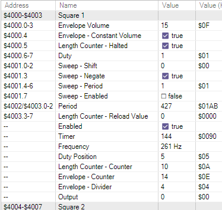

- This one is more complicated because there are multiple source files, and I need to refresh my memory how they are linked.
- Oh holy shit, I got it! I'll just need to modify the Makefile because it was much more complicated
- done, and checked in.
- [[Nerdy Nights Sound: Part 5: Sound Data, Pointer Tables, Headers]]
- ## NSF version
- This ROM displays info on the screen, takes controller input and plays a scale when A is pressed.
- There are also several files. The first one included is sound_engine.h:
- ```
  	.import		sound_init
  	.import 	sound_disable
  	.import		sound_load
  	.import 	sound_play_frame
  
  	.importzp 	sound_disable_flag
  	.importzp	sfx_playing
  
  ; Local Variables: 
  ; mode: asm
  ; End: 
  ```
- This seems to import symbols which are exported from sound_engine.asm. Seems like the opposite of C, where the .h file has the imported stuff
- sound_engine.asm explicitly includes "note_table.h" and "sound_data.h"
- I've got it so it builds without errors, but just doesn't play anything because it hasn't been told to.
- I need to familiarize myself with the sound engine execution. So I'll watch it in the debugger.
- I think what we need to do is take what is in NMI and put it at the play address.
- This is the `sound_play_frame` routine.
- I'm making a version of the regular rom with the ppu stuff stripped out for simplicity.
- Nice! I've got it trimmed down perfectly. Now I can see what's going on.
- There are very specific instructions for initializing a tune, which I need to have adequately internalized so I'll list them here. I don't actually know how the more basic example works without doing this stuff.
- You know... I just realized that I'm *ripping* an NSF from a ROM at this point, so if I'm still stuck, the ripping guide might help!
- ...or not. I just read through it, and it doesn't really say much about the differences between the NSF and a ROM wrt NMI or anything. Kind of implies it's the same
- ## Initializing a tune
- The desired song number is loaded into the accumulator register A, and the X register is set to specify specify PAL (X=1) or NTSC (X=0).
- Valid song numbers are 0 to one less than the number of songs (specified at $006 in the header). The first selected song is in the header at $007. The NSF player should display to the user song numbers from 1 up to and including the number of songs, and these should correspond to the same number - 1 loaded into register A. Note that when choosing the first song from the value in $007, subtract 1 from it before loading that value into register A.
- 1. Write $00 to all RAM at $0000-$07FF and $6000-$7FFF.
  2. Initialize the sound registers by writing $00 to $4000-$4013, and $00 then $0F to $4015.
  > This sounds weird, but it's supposedly necessary to clear all the length counters by writing 0 to $4015 as well. [source](https://www.nesdev.org/w/index.php?title=NSF&diff=8768&oldid=8767)
- Actually this is mostly for NSF players. I need to come in for a landing even if it means figuring out how to ask for help.
- ## Why no worky?
- I have a working ROM, the sound engine skeleton from Nerdy Nights but stripped down to only the audio routines, I've taken out everything having to do with the PPU and controller and it just plays a scale once when it loads.
- It's when I try to get a working NSF where it fails.
- I think I'll put it all in one file for ease of sharing.
- Hmm, now I can't get that to assemble, it's giving me a Range error
- Gah. Let's go back to the actual tutorial, I guess, because I'm beyond stumped
- I'm trying to simplify it further, so that the init routine is actually just one routine, because we don't need a separate load and init like in the tutorial. But I need to familiarize myself better with what is *supposed* to happen.
- Alright...
- ```
  SEI
  CLD
  ldx	#$ff
  TXS
  INX
  
  ;; here the original jumps to the sound_init subroutine
  
  LDA #$0F
  STA 4015
  
  LDA #$30
  STA 4000
  STA 4004
  STA 400C
  
  LDA #$80
  STA 4008
  
  LDA #$00
  STA $02
  STA $04
  STA $05
  STA $03
  RTS
  
  ;; Now the sound_load subroutine
  
  LDA #$01
  STA $04
  
  LDA #$00
  STA $05
  STA $03
  RTS
  
  LDA #$88
  STA $2000
  INC $06
  
  LDA #$06              ;;  loops  (sleeping)
  BNE $817F             ;;  here waiting for NMI
  
  ;; sound_play_frame
  
  lda $02     ;; sound_disable_flag
  bne $8078   ; don't advance if disabled
  lda $04    ;; sfx_playing
  beq $8078   ;; don't advance if not playing
  INC sound frame counter
  lda sound frame counter
  cmp	#$08    ;; tempo control
  bne $8078 
  
  @note:
  ASL A
  TAY
  lda	note_table, y ; Read the low byte of our period from the table
  sta	$4002
  lda	note_table+1, y	; Read the high byte of our period from the table
  sta	$4003
  lda	#$7f		; Duty cycle 01, volume F
  lda	#$08		; Set negate flag so low Square notes aren't silenced
  sta	$4001
  
  ;; Move our index to the next byte position in the data stream
  inc	sfx_index
  ;; Reset frame counter so we can start counting to 8 again
  lda	#$00
  sta	sound_frame_counter
  RTS
  ```
- 
- Persune fixed it! Wow, she is awesome. All I had to do was remove the reset routine, because the player is supposed to handle that. She knew right away.