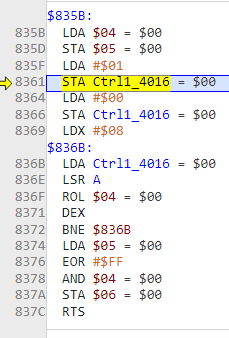
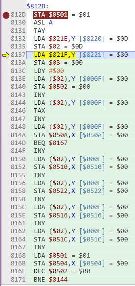
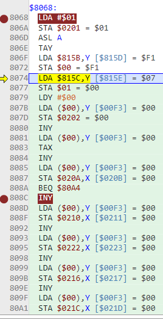

- ## Designing Sound Data
- > We have a skeleton sound engine in place.  Time to pack it with flesh and organs.  Before we can play a song, we will have to load a song.  Before we can load a song, we will need song data.  So our next step is to decide how our sound data will look.  We'll need to design our data format, create some test data and then build our engine to read and play that data.
- It calls the song data model *streams*, which as far as I can tell is just a more confusing way of saying *sequences*
- > A data stream is a sequence of bytes stored in ROM that the sound engine will read and translate into APU writes.
- Yep. Gotta love it. Hey, at least "stream" is shorter than "sequence". But not shorter than "seq", assholes
- So this lesson is how we get multiple channels going, because right now we just have the square channel. I suppose eventually we'll get to arbitrary note lengths and we'll be in business!
- Oh. Yep, we get note lengths... right now!
- We will use *ranges* (tested commonly using BPL and BMI) to differentiate 3 (actually 3.5) types of data:
- 1. Note - what note to play: A3, G#5, C2, etc
  2. Note Length - how long to play the notes: eighth note, quarter note, whole note, etc
  3. Opcodes - opcodes tell the engine to perform specific tasks: loop, adjust volume, change Duty Cycle for squares, etc
  *3.5. Arguments - some opcodes will take arguments as input (e.g. how many times to loop, where to loop to).
- We store song data in pointer tables accessed by indirect mode
- omg, this lesson is fucking huge. But it fleshes out the entire music data format.
- I got it built! Works fucking peachy. Now to trim it and rip it!
- So I'll just have it play song 1, the "creepy minor thirds" thing
- I've got all the drawing stuff out-- the tricky part now is extracting the controller stuff because if I do it haphazardly it acts like it's being constantly pressed and the music does not advance.
- This is the joypad code:
- ```
  ;;; read_joypad will capture the current button state and store it in joypad1.
  ;;; Off-to-on transitions will be stored in joypad1_pressed
  ;;; 
  read_joypad:
  	lda	joypad1
  	sta	joypad1_old	; Save last frame's joypad button states
  
  	lda	#$01
  	sta	$4016
  	lda	#$00
  	sta	$4016
  
  	ldx	#$08
  @loop:
  	lda	$4016
  	lsr	a
  	rol	joypad1		; A, B, select, start, up, down, left right
  	dex
  	bne	@loop
  
  	lda	joypad1_old	; What was pressed last frame. EOR to flip all the bits
  	eor	#$ff		;  to find what was not pressed last frame.
  	and	joypad1		; What is pressed this frame
  	sta	joypad1_pressed	; Stores off-to-on transitions
  	rts
  ```
- I shouldn't have to *care* about the joypad. But as I said before, anything I do ends up having the effect of restarting the song repeatedly...so I suspect what it needs to do is *flip* something so that it only ends up getting the reading once...
- I could change one of the joypad variables to be like... pressed, and once it's pressed, it remains off forever
- So this is the current zero page entries for the joypad:
- ```
  joypad1:		.res	1	; Button states for the current frame
  joypad1_old:		.res 	1	; Last frame's button states
  joypad1_pressed:	.res	1	; Current frame's off_to_on transitions
  ```
- How does the other one just do a one shot? I need to somehow achieve that.
- It might have been that variable that would branch if it was playing or something.
- Ok so let's go through the code and read it better. Stepping through it with the debugger is great because it shows me what the instructions do that I haven't learned yet :)
- ```z80
  reset:
  	sei			; Disable IRQs
  	cld			; Disable decimal mode
  	ldx	#$ff		; Set up stack
  	txs			;  .
  	inx			; Now X = 0
      
  ;; Enable sound channels
  	jsr	sound_init
      
  $8104 sound_init:
  	;; Enable Square 1, Square 2, Triangle and Noise channels
  	lda	#$0f
  	sta	$4015
  
  	lda	#$00
  	sta	sound_disable_flag ; Clear disable flag
  	sta	sound_frame_counter
  
  $8111 se_silence:	
  	lda	#$30
  	sta	$4000		; Set Square 1 volume to 0
  	sta	$4004		; Set Square 2 volumne to 0
  	sta	$400c		; Set Noice volume to 0
  	lda	#$80
  	sta	$4008		; Silence Triangle
  	
  	rts
      
  lda	#$01
  	sta	current_song
  
  	lda	#$88
  	sta	$2000		; Enable NMIs
  	lda	#$18
  	sta	$2001		; Turn PPU on
      
  $8330 forever:
  	inc	sleeping	; Go to sleep (wait for NMI).
      
  	;; Wait for NMI to clear the sleeping flag and wake us up
  @loop:
  	lda	sleeping
  	bne	@loop
  
  	;; When NMI wakes us up, handle input and go back to sleep
  	jsr	read_joypad
  	lda	joypad1_pressed
  	and	#$0f		; Check d-pad only
  	beq	@done
  	and	#$08		; Up
  	lda	current_song
  	jsr	sound_load
  @done:
  	
  	jmp	forever		; Go back to sleep
  ```
- Wait so we jump to the controller code which is the critical piece we're trying to remove.
- ```z80
  $835B read_joypad:
  	lda	joypad1
  	sta	joypad1_old	; Save last frame's joypad button states
  
  	lda	#$01
  	sta	$4016
  	lda	#$00
  	sta	$4016
  
  	ldx	#$08
  @loop:
  	lda	$4016
  	lsr	a
  	rol	joypad1		; A, B, select, start, up, down, left right
  	dex
  	bne	@loop
  
  	lda	joypad1_old	; What was pressed last frame. EOR to flip all the bits
  	eor	#$ff		;  to find what was not pressed last frame.
  	and	joypad1		; What is pressed this frame
  	sta	joypad1_pressed	; Stores off-to-on transitions
  	rts
  
  ```
- 
- This is what is looped:
- ```z80
  @loop:
  	lda	$4016
  	lsr	a
  	rol	joypad1		; A, B, select, start, up, down, left right
  	dex
  	bne	@loop
  ```
- I wonder if I can stick a breakpoint *after* the bne, so I can trigger it without losing track of the plot
- Ok I seem to have done that. So now continuing from after the loop
- ```z80
  lda	joypad1_old	; What was pressed last frame. EOR to flip all the bits
  	eor	#$ff		;  to find what was not pressed last frame.
  	and	joypad1		; What is pressed this frame
  	sta	joypad1_pressed	; Stores off-to-on transitions
  	rts
  ```
- And now we're jumping to $8330
- Huh. I can't seem to get it to trigger. This is strangely difficult.
- What else can I check? I guess... make a gutted version that stammers and try to debug it to see why it keeps resetting
- I could just move ahead with the NSF, and then at least I'll be closer to the target
- I'm getting it to build but it's no surprise it's not working yet.
- The sound engine itself is massively more complex, so I'm not sure how to deal with it yet.
- Left as is, it seems to stop after the `rts` from `se_silence`, after the `sound_init`
- I haven't sufficiently observed the working version to know how it can be ripped. Let's watch it some more.
- We got bogged down with the controller code so I think I never even got into the sound engine!
- There's a lot of stuff here, I'm struggling to make sense of it. Well, I mean I just started learning assembly so...
- argh. it's because I can't seem to even get it to trigger in debug mode.
- ok. I put a breakpoint at `sound_load`.
- ```z80
  $812D sound_load:
  	sta	sound_temp1	; Save song number
  	asl	a		; Multiply by 2. Index into a table of pointers.
  	tay
  	lda	song_headers, y	; Setup the pointer to our song header
  	sta	sound_ptr
  	lda	song_headers+1, y
  	sta	sound_ptr+1
  
  	ldy	#$00
  	lda	(sound_ptr), y	; Read the first byte: # streams
  	;; Store in a temp variable. We will use this as a loop counter: how
  	;; many streams to read stream headers for
  	sta	sound_temp2
  	iny
      
  $8144 @loop:
  	lda	(sound_ptr), y	; Stream number
  	tax			; Strem number acts as our variable index
  	iny
  
  	lda	(sound_ptr), y	; Status byte. 1=enable, 0=disable
  	sta	stream_status, x
  	;; If status byte is 0, stream disable, so we are done
  	beq	@next_stream
  	iny
  
  	lda	(sound_ptr), y	; Channel number
  	sta	stream_channel, x
  	iny
  
  	lda	(sound_ptr), y	; Initial duty and volume settings
  	sta	stream_vol_duty, x
  	iny
  
  	;; Pointer to stream data. Little endian, so low byte first
  	lda	(sound_ptr), y
  	sta	stream_ptr_lo, x
  	iny
  
  	lda	(sound_ptr), y
  	sta	stream_ptr_hi, x
      
  $8167 @next_stream:
  	iny
  
  	lda	sound_temp1	; Song number
  	sta	stream_curr_sound, x
  
  	dec	sound_temp2	; Our loop counter
  	bne	@loop
  	
  	rts
  
  	;; *** Change this to make the notes play faster or slower ***
  	TEMPO = $0C
  ```
- And that is what loops, until we get to sound_play_frame, which is called in NMI.
- ```z80
  $8174 sound_play_frame:
  	lda	sound_disable_flag
  	bne	@done		; If disable flag is set, dont' advance a frame
  
  	inc	sound_frame_counter
  	lda	sound_frame_counter
  	cmp	#TEMPO
  	bne	@done		; Only take action once very TEMPO frames
  
  	;; Silence all channels. se_set_apu will set volumen later for all
  	;; channels that are enabled. The purpose of this subroutine call is
  	;; to silence all channels that aren't used by any streams
  	jsr	se_silence
  
  	ldx	#$00
  $8188 @loop:
  	lda	stream_status, x
  	and	#$01		; Check whether the stream is active
  	beq	@endloop	; If the channel isn't active, skip it
  	jsr	se_fetch_byte
  	jsr	se_set_apu
  @endloop:
  	inx
  	cpx	#$06
  	bne	@loop
  
  	;; Reset frame counter so we can start counting to TEMPO again.
  	lda	#$00
  	sta	sound_frame_counter
  @done:
  	rts
  ```
- ok then we get to jsr	se_fetch_byte, which brings us down to:
- ```z80
  ;;;
  ;;; se_fetch_byte reads one byte from the sound data stream and handles it
  ;;; Inputs:
  ;;; 	X: stream number
  ;;; 
  
  $81A0 se_fetch_byte:
  	lda	stream_ptr_lo, x
  	sta	sound_ptr
  	lda	stream_ptr_hi, x
  	sta	sound_ptr+1
  
  	ldy	#$00
  	lda	(sound_ptr), y
  	bpl	@note		; If < #$80, it's a Note
  	cmp	#$A0
  	bcc	@note_length	; Else if < #$A0, it's a Note Length
  @opcode:			; Else it's an opcode
  	;; Do Opcode stuff
  	cmp	#$ff
  	bne	@end
  	lda	stream_status, x ; If $FF, end of stream so disable it and silence
  	and	#%11111110
  	sta	stream_status, x ; Clear enable flag in status byte
  
  	lda	stream_channel, x
  	cmp	#TRIANGLE
  	;; Triangle is silenced differenlty from squares and noise
  	beq	@silence_tri
  	lda	#$30		; Squaures and noise silenced witht #$30
  	bne	@silence
  @silence_tri:
  	lda	#$80		; Triangle silenced with #$80
  @silence:
  	sta	stream_vol_duty, x ; Store silence value in the stream's volume
  	jmp	@update_pointer	   ; Done
  @note_length:
  	;; Do Note Length stuff
  	jmp	@update_pointer	; Note implemented yet
  @note:
  	;; Do Note stuff
  	sty	sound_temp1	; Save our index into the data stream
  	asl	a
  	tay
  	lda	note_table, y
  	sta	stream_note_lo, x
  	lda	note_table+1, y
  	sta	stream_note_hi, x
  	ldy	sound_temp1	; Restore data stream index
  @update_pointer:
  	iny
  	tya
  	clc
  	adc	stream_ptr_lo, x
  	sta	stream_ptr_lo, x
  	bcc	@end
  	inc	stream_ptr_hi, x
  @end:
  	rts
  ```
- This is where we have the range tests to see if the byte from the data stream is a note, length or an opcode
- Then we `jsr	se_set_apu`, to actually write to the registers.
- ```z80
  ;;; 
  ;;; se_set_apu writes a stream's data to the APU ports
  ;;; Inputs:
  ;;; 	X: stream number
  ;;; 
  $81F9 se_set_apu:
  	lda	stream_channel, x
  	;; Multiply by 4 so our index will point to the right set of registers
  	asl	a
  	asl	a
  	tay
  	lda	stream_vol_duty, x
  	sta	$4000, y
  	lda	stream_note_lo, x
  	sta	$4002, y
  	lda	stream_note_hi, x
  	sta	$4003, y
  
  	lda	stream_channel, x
  	cmp	#TRIANGLE
  	bcs	@end		; If Triangle or Noise, skip this part
  	;; Else set negate flag in sweep unit to allow low notes on Squares
  	lda	#$08
  	sta	$4001, y
  @end:
  	rts
  ```
- Ok! I think that's all the code! Let's break it down into a basic summary:
- ## `sound_init`
	- Enables channels, then runs `se_silence` to silence them all
- ## `sound_load`
	- Takes a song number, looks up stream and sets up channel
- ## `sound_play_frame`
	- `se_silence` - silence all channels that aren't used by any streams
	- `se_fetch_byte` - reads one byte from the sound data stream and handles it (range testing)
	- `se_set_apu` -  writes a stream's data to the APU ports
- This is correctly loading the song headers:
- 
- But the NSF one is different for some reason:
- 
- They should be loading the same thing... unless `song_headers` is different...
- Yeah, it seems that the song data is not being loaded correctly...
- I guess let's try loading it differently, like including it in the same file or something.
- Ugh, I'm burnt out on this and this page is too big. I guess uh... [[NN5 - Headers part 2]]