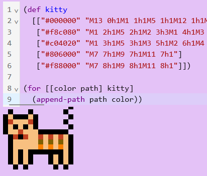

- I guess I'll make another repo for this. Since it's gonna be SVG, I'll call it bobbi-lisp-svg
- So I have this code which makes a pretty circle
- ```js
  var svg = document.createElementNS("http://www.w3.org/2000/svg", "svg");
  document.getElementById("app").appendChild(svg);
  svg.setAttribute("width", "100");
  svg.setAttribute("height", "100");
  var circle = document.createElementNS("http://www.w3.org/2000/svg", "circle");
  circle.setAttribute("cx", "50")
  circle.setAttribute("cy", "50")
  circle.setAttribute("r", "40")
  circle.setAttribute("stroke", "red")
  circle.setAttribute("stroke-width", "4")
  circle.setAttribute("fill", "blue")
  svg.appendChild(circle);
  ```
- So now I need to hook up the interpreter and try to generate that with Lisp, similar to what I did with the audio thing.
- Cool, that's done, I evaluated some code and printed the result to the console.
- This is the "hiccup" data that will compile to the above code:
- ```clojure
  [:svg {:width 100 :height 100}
   [:circle {:cx 50 :cy 50 :r 40 
             :stroke "red" :stroke-width 4 :fill "blue"}]]
  ```
- This is from borkdude's hiccup-like function:
- ```clojure
  (defn html [v]
    (cond (vector? v)
          (let [tag (first v)
                attrs (second v)
                attrs (when (map? attrs) attrs)
                elts (if attrs (nnext v) (next v))
                tag-name (name tag)]
            (format "<%s%s>%s</%s>\n" tag-name (html attrs) (html elts) tag-name))
          (map? v)
          (str/join ""
                    (map (fn [[k v]]
                           (format " %s=\"%s\"" (name k) v)) v))
          (seq? v)
          (str/join " " (map html v))
          :else (str v)))
  ```
- Other than the calls to `format`, it should work
- ```clojure
  (defn hiccup->svg [v]
    (cond (vector? v)
          (let [tag (first v)
                attrs (second v)
                attrs (when (map? attrs) attrs)
                elts (if attrs (nnext v) (next v))
                tag-name (name tag)]
            (str "<" tag-name ">" (hiccup->svg attrs) (hiccup->svg elts) "</" tag-name ">"))
          (map? v)
          (str/join ""
                    (map (fn [[k v]]
                           (str " " (name k) "=\"" v "\"")) v))
          (seq? v)
          (str/join " " (map hiccup->svg v))
          :else (str v)))
  ```
- wait... this makes html, which is not what we want! We're generating pure javascript. Right? Hmm, now I'm not so sure. What would I even do with it? I guess I could use js-eval?
- Yeah... I suppose so. It works... but now I'm not so sure. It might just make more sense to generate a string of HTML and pass it to the InnerHTML property or something
- For some reason it's escaping the quotes in the attribute strings.
- Yeah, this isn't working so well. Too much string business
- I should do a deep-dive into [[Hiccup]]
- Going to just start with an [[SVG path compiler]]
- Something that I haven't done yet, but should, is make a viewer output right in the page, like on Maria.cloud
- I still haven't built the code editor into this one so I guess I'll do that. I originally intended these libraries to be just plugins, but that seems to make it harder to develop. And I'm finding that controlling the results directly from the repl is the main purpose of Lisp.
- I've got the editor in place and it works. But now I need to make it so it actually controls the SVG on the page. Right now it's being generated from Lisp code, but it's being loaded from a file.
- This is the function that renders the kitty:
- ```js
  function renderKitty(x) {
      for (const colorPath of kitty.paths) {
          var path = document.createElementNS("http://www.w3.org/2000/svg", "path");
          path.setAttribute("d", renderPath(move(parsePath(colorPath.path), x, 5)))
          path.setAttribute("stroke", colorPath.color)
          path.setAttribute("stroke-width", "1")
          g.appendChild(path);
      }
  }
  ```
- I guess I could generalize that and define a core function called `render`.
- The code that generates the kitty also includes the `svg-obj` function, which outputs JSON:
- ```clojure
  (defn svg-obj [paths]
    (str "{\"paths\": ["
         (join ", " (into [] (for [path paths] (render-color-path path)))) "]}"))
  ```
- So I suppose I'll want to make that a javascript function.
- Actually I don't need to... I could add it to core.clj
- Ok I've got it so it's rendering a single SVG path which I can modify from the editor. But I need to make it work with a group of paths.
- I have the group of paths for the kitty:
- ```clojure
  (def kitty
    [["#000000" "M13 0h1M1 1h1M5 1h1M12 1h1M0 2h1M2 2h3M6 2h1M13 2h1M0 3h1M6 3h1M12 3h1M0 4h1M2 4h1M4 4h1M6 4h1M13 4h1M0 5h1M7 5h6M1 6h1M3 6h1M13 6h1M1 7h1M13 7h1M1 8h1M13 8h1M1 9h1M3 9h1M5 9h7M13 9h1M1 10h1M3 10h1M5 10h1M9 10h1M11 10h1M13 10h1M1 11h1M3 11h1M5 11h1M9 11h1M11 11h1M13 11h1M2 12h1M4 12h1M10 12h1M12 12h1"]
     ["#f8c080" "M1 2h1M5 2h1M2 3h3M1 4h1M3 4h1M5 4h1M1 5h2M4 5h3M5 6h2M8 6h1M10 6h1M12 6h1M2 7h5M8 7h1M10 7h1M12 7h1M2 8h5M8 8h1M10 8h1M12 8h1M2 9h1M4 9h1M12 9h1M2 10h1M4 10h1M10 10h1M12 10h1M2 11h1M4 11h1M10 11h1M12 11h1"]
     ["#c04020" "M1 3h1M5 3h1M3 5h1M2 6h1M4 6h1M7 6h1M9 6h1M11 6h1"]
     ["#806000" "M7 7h1M9 7h1M11 7h1"]
     ["#f88000" "M7 8h1M9 8h1M11 8h1"]])
  ```
- It works!
- ```clojure
  (for [[color path] kitty]
    (append-path path color))
  ```
- 
- I seem to remember an article linked in one of Zach Oakes' game engines for implementing the isometric view. Let's see if I can find that
- Found it! Wow, what a memory of mine http://clintbellanger.net/articles/isometric_math/
- It was in the play.cljc dungeon-crawler example: https://github.com/oakes/play-cljc-examples/blob/7a2428e49ab394cb8df2f5aebb22c2adc4ee98a3/dungeon-crawler/src/dungeon_crawler/tiles.cljc#L20
- Maybe I should play around with that library and try to learn from it.
- It uses WebGL. It's still under active development, was committed to 3 days ago.
  id:: 6522364a-016e-420a-8577-a43ced932012
- So, [[Isometric Tiles Math]]
