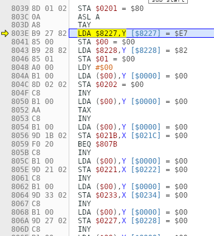
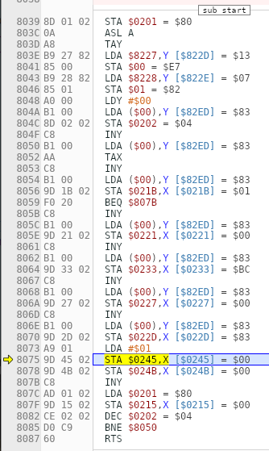

- Ok this is kind of a critical part u ready, lol
- First we actually need to disconnect the previous system which modifies the CPU state as it plays.
- Let's make a new branch called assembled-nsf-driver
- So I've got it all assembled but it's not loading yet. It's giving "Invalid NSF loaded" which is at least something, lol
- I guess now I get to check it one byte at a time...
- ok, it does load, but all I get is a click.
- Got it! Amazing. And I figured out the mystery chunks... it's the note table. Most of it, anyway. I should have realized I didn't even look at any of the other files!
- It's actually *all* of it, with the exception of the first 2 bytes, E7 and 8
- So I guess I should rename it now that it's identified
- Well, except for the E7 and 82... hey, I just found out where it is called (I set a breakpoint before but didn't realize why it stopped there, lol)
- 
- It's sound_load, and apparently the variable is song_headers:
- ```z80
  sound_load:
  	sta	sound_temp1	; Save song number
  	asl	a		; Multiply by 2. Index into a table of pointers.
  	tay
  	lda	song_headers, y	; Setup the pointer to our song header
  	sta	sound_ptr
  	lda	song_headers+1, y
  	sta	sound_ptr+1
  ```
- So that's interesting because those 2 bytes are located immediately preceding the note table, not the song header...
- oh... so it does make sense.... guess what address the song header starts at... $82E7. You can see it at the bottom here:
- 
- So I should probably take that out of the note table so that it makes more sense.
- Cool, got that more organized. I also had header stuff in the main driver part
- But I'm curious how the table lookup happens.
- We stored `$E7` and `$82` at the sound_ptr location, `$00` and `$01`
- Ah, the indirect lookup happens next:
- ```z80
  lda	($00), y
  ```
- Cool, so now that's no mystery.
- I guess we're done here? The next task will be [[generating music data]], but... well, I guess we still need to figure out the deal with the channel data streams, since that's where we will need to adjust the addresses. Let's continue stepping through until we find it, and then we can isolate the addresses.
- ## Locating data streams
- So it's the song header that has the pointers in it. We know that already.
- Where it gets set in `stream_ptr_lo` and `stream_ptr_hi` is actually right here.
- 
- The loop starts at `$8050` with `lda (sound_ptr), y`
- I guess I can start by pulling apart the song header to isolate the different parts.
- For the streams in the header, I could do an object I guess:
- ```z80
  .byte MUSIC_SQ1     ;which stream
  .byte $01           ;status byte (stream enabled)
  .byte SQUARE_1      ;which channel
  .byte $BC           ;initial volume (C) and duty (10)
  .word song1_square1 ;pointer to stream
  ```
- Eh, I guess just an array will be fine because that's how it is in the thing
- Cool, so I built the song header and documented the format:
- ```js
  // Song header
  
  let numStreams = 4;
  const MUSIC_SQ1 = 0;
  const MUSIC_SQ2 = 1;
  const MUSIC_TRI = 2;
  const MUSIC_NOI = 3;
  
  const SQUARE_1 = 0;
  const SQUARE_2 = 1;
  const TRIANGLE = 2;
  const NOISE = 3;
  
  // Song header format:
  // 1. Stream
  // 2. Status (0 = disabled, 1 = enabled)
  // 3. Channel number
  // 4. Initial volume and duty
  // 5. Pointer to stream (2 bytes)
  
  let streams = [
    MUSIC_SQ1, 1, SQUARE_1, 0xBC, 0x00, 0x83,
    MUSIC_SQ2, 1, SQUARE_2, 0x3A, 0x47, 0x83,
    MUSIC_TRI, 1, TRIANGLE, 0x81, 0x88, 0x83,
    MUSIC_NOI, 1, NOISE, 0x1E, 0xA6, 0x83
  ];
  
  const songHeader = [numStreams].concat(streams);
  ```
- So I guess if we changed the song data we could just calculate the new pointer positions based on the length of the channel data.
- The first stream will always be at $8300, or `0x00, 0x83,`
- The square1 stream is 71 bytes long, which puts the second pointer at `$8347`, see:
- ```clojure
  (hex (+ 0x8300 71))
  => 
  "8347" 
  ```
- Square2 is 65 bytes, which puts stream 3 at $8388. This stuff is not difficult.
- So we're basically done here, as far as I can tell. When we are done at [[generating music data]] we will then create a function which will update the streams and the header, and redefine the driver itself
- I can motivate the process by actually building the driver at runtime based on stream data passed to my new function.
- Oh shit, I need to convert a length into a 2 byte little endian word.
- `$8300` + 71 = 33607
- `(33607).toString(16)` = "8347"
- Done! Now it's really time to do the Lisp conversion!