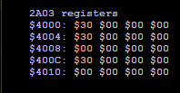
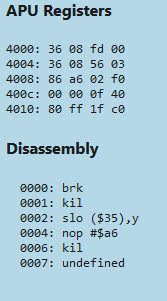
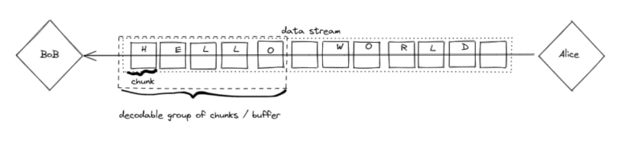
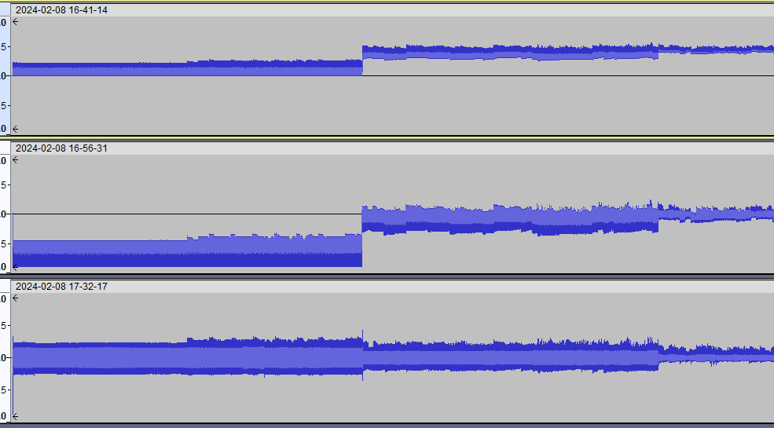

- Alright, so this will be an interesting job. I guess the first thing I can do is just add the cpu and the apu, as well as the audio handler. Oh, and the NSF mapper.
- It will be fun because we get to abstract away the part that just creates the sound from the NSF part, which will cause us to learn more about both.
- So first I'll make a new branch, called emulation
- So how will it render audio files? I guess instead of playing it, it will like... concatenate all the buffers, or something. Might be hard to figure out, and it might be really slow until I figure out ways to speed it up. That's something I hadn't even considered until now.
- This is what I mean about this being fun...
- What might be helpful is if I actually get an NSF playing, and make a debug area so we can see the registers and disassembly, then it will be a *little bit* more clear what we need to do
- Because... god damn. You can't just say "give me a quarter note A!"
- I have the debugger stuff from before, the disassembler and memory viewer thing
- ## Uh...
  collapsed:: true
	- This is getting out of hand reaaally fast. I tried dumping the debugging stuff into the code editor app but got stuck, something in the cpu can't find something that's obviously there...
	- I tried to add too much at once. Let's roll it back.
	- Ah... I figured out the problem. Almost. It's calling `functions[instr]` and inst is undefined.
	- adr: undefined as well.
	- adr is defined by `eff` which is `getAdr(mode);`
	- `instr` is defined by `read(br[PC]++);`.
	- There was previously a call to cycle that succeeded, with `Instr: 0 adr: 0`, so maybe it's whatever is happening before that
	- Hmm, maybe it will be better if I start a *new* application, and put the parts together in a more logical order.
	- ## Take 2
	- Ok. I'll start a new Vite project!
	- I have called it nme for nes music engine. Unfortunately it sounds like "enemy" but right now it seems appropriate!
	- Hold on... I forgot I could put a breakpoint in and trace the execution.
	- I can compare it with the working nsf player side by side.
	- We are in the init routine.
	- Cycle count: 7
	- cpu cycle
	- cyclesleft: 0
	- adr = 16368
	- adr < 0x4000 (16384)
	- here's the problem. The instr is 0 when it should be 32! It must have been during the call to `let instr = read(br[PC]++);`
	- It must be the callarea. It should have been populated. This happens when `loadNsf` is called.
	- We define `initAdr` = 65499
	- ### set up the NSF mapper
	- calling reset in nsfmapper
		- init prgRam
	- init callarea - this is where it should be failing but looks fine so far...
	- ok, calling `playSong` on song 1
	- initialize ram
	- reset apu - stepped out, assuming this is fine...
	- reset cpu
	- The call area is all zeros! wtf
	- but we literally just set them!
	- ok, going through again. somehow our callarea is getting reinitialized.
	- Got it! There was another call area! Because I rearranged it slightly. It works!
- ok, that was an annoying debugging. Swept it under the rug. now let's continue with the memory viewer.
- I have it working, but need to figure out what is what
- Let's look at nsfplay I guess
- ok so the memory viewer needs to be modified because it only *reads*, and the apu registers are *writes*.
- I think I'll just scrap the whole thing and do something like in FT:
- 
- It's the NSF visualizer that is *already* reflecting this information. But that actually doesn't help us much... the whole point of this is simply an investigation, to find out....
- ## What needs to happen?
- What's missing is an *audio driver*. That's the big missing piece... like how FamiTracker has a driver. We need to translate notes into APU writes.
- We need our driver to output code which will be executed by the cpu, just as if it were an NSF.
- So it would actually make sense to hook up the disassembler, which will tell us which *instructions* need to execute. Damn. Let's go...
- ## Disassembler
- Ok I'm getting *some* output... it's not scrolling, however.
- Problem is... I don't quite understand what I'm doing. Let's walk through the disassembler of the NesJs one and see what makes it tick.
- I'm uh... not even sure if I understand the scrolling mechanics.
- I'll put a breakpoint at drawDisassembly.
- Set `adr` to `disScroll` (starts at 0)
- lines = 0
- `let firstData = true;`
- Now we just loop through the address indices
- call peek on it to get op
- get length from oplengths table
- look up in ramcdl if less than 0x8000, else romcdl
- if opcode, formats it and sets textcontent of the element
- hmm, I suppose I should check out the debugger in mesen while playing an nsf
- This seems tedious, but it's critical that I understand how the assembly works.
- So far it's correct... it starts with
- `0000: slo $00` shifts a memory location left 1, ORs a with the result, sets N, Z and C
- I should look at FamiStudio's driver, because that will probably demonstrate what I have to do
- uh... I don't understand any of this shit
- I'm thinking this might have been a wrong turn...
- Come to think of it, I only started looking into this so that I could better understand the DPCM functions, lol
- At least I have a functioning NSF player...
- ## What if...
- I found some middle ground? I could take the audio plumbing and sound processing functions, but drive it with something other than assembly
- Let's like... more closely examine the audio production stuff, while playing an extremely basic NSF file, like simple sequences on one one channel.
- This way we can reverse-engineer it in a more straightforward way...
- 
- I think I got the APU registers right
- Fixed the mixer, now uses the non-linear formula which is nearly twice as loud... corrected the output to be -1 to 1 instead of 0 to 1, and slapped on a 37Hz highpass filter.
- Now I'm reading about audio worklets
- I guess this will replace the `process` function
- This is confusing. So I have the worklet registered, running and connected to the web audio graph... I just don't know how to pass it the input.
- Maybe this would be obvious if I knew more about how the audio system actually works? Like how the nes produces the output...
- Here is the `process` function:
- ```js
  function process(e) {
      if (inputReadPos + 2048 > inputBufferPos) {
          inputReadPos = inputBufferPos - 2048;
      }
      if (inputReadPos + 4096 < inputBufferPos) {
          inputReadPos += 2048;
      }
      let output = e.outputBuffer.getChannelData(0);
      for (let i = 0; i < 2048; i++) {
          output[i] = inputBuffer[(inputReadPos++) & 0xfff];
      }
  }
  ```
- The 2 if statements are for handling buffer under/overruns.
- output is the output buffer... ok good so far
- It then sets every value of the output buffer to the... what does the bit and do there? We take the input read position, increment it, and... what? What is the length of the input buffer?
- It seems to work like a modulo.
- 4095 & 0xfff = 4095
- 4096 & 0xfff = 0
- 4097 & 0xfff = 1
- So by doing this, it effectively loops the input buffer
- Ah... because the inputbufferpos never resets or decrements. It just counts on and on
- So it always writes to the next value of the output buffer.
- This index is compared to the input buffer position.
- What is the difference? I suppose that will make sense later...
- Each frame the nes runs calls `nextBuffer()`.
- ```js
  export function nextBuffer() {
      for (let i = 0; i < samplesPerFrame; i++) {
          let val = sampleBuffer[i];
          inputBuffer[(inputBufferPos++) & 0xfff] = val;
      }
  }
  ```
- So.... this one fills the input buffer with values from the sample buffer. Howw many buffers do we need? 3, I guess...
- The sample buffer is an array of floats the length of samples per frame (735)
- So how does that work...
- every frame there are only 735 new samples.
- Where do the samples actually come from?
- Before nextbuffer is called, this is:
- ```js
  function getSamples(data, count) {
    // apu returns 29780 or 29781 samples (0 - 1) for a frame
    // we need count values (0 - 1)
    let samples = apu.getOutput();
    let runAdd = (29780 / count);
    let total = 0;
    let inputPos = 0;
    let running = 0;
    for (let i = 0; i < count; i++) {
      running += runAdd;
      let total = 0;
      let avgCount = running & 0xffff;
      for (let j = inputPos; j < inputPos + avgCount; j++) {
        total += samples[1][j];
      }
      data[i] = total / avgCount;
      inputPos += avgCount;
      running -= avgCount;
    }
  }
  ```
- It is passed the sampleBuffer and the number of samplesPerFrame
- oh... I guess this is where downsampling happens.
- I was thinking... 29780 or 29781 samples? In a frame? Yes, at 1.789773 MHz! Checks out.
- So we call `apu.getOutput()`, which is
- ```js
  export function getOutput() {
      let ret = [outputOffset, output];
      outputOffset = 0;
      return ret;
  }
  ```
- output is this:
- `let output = new Float32Array(29781);`
- I uh, just changed it to f32, and I think it helped a bit. It's far less choppy. I even just did a recording in obs which bogged it down before. I remember Zeta saying his emu is f32 because Rust's performance tanked on f64 or something. Maybe it was wasm. Whatever, good enough for me.
- Well! This is great! You can do basically anything except put the tab in the background.
- Hey... this article seems to describe what I need https://dev.to/louisgv/quick-guide-to-audioworklet-30df
- > Why do we need buffering? - Let’s take a look at a communication example: Alice is sending Bob a sequence of letters: H, E, L, L, O. If Bob’s short term memory was not functioning, he might have forgotten about the letter H the moment he received the letter E, and so on and so forth. Thus, the lack of buffering prevented Bob from forming a coherent word from Alice, leading to miscommunication. If his memory is normal, he would buffer the letters until his brain recognizes that a group of letters matches a word in his vocabulary.
- 
- hahaha, love it
- This is the full gist: https://gist.github.com/louisgv/f210a1139d955baf511ff35f58fc8db1
- He puts the buffer implementation inside the `class RecorderProcessor extends AudioWorkletProcessor` piece of shit.
- I've got it implemented and am getting no errors. However, I still don't know how to get the samples in! Let's return to the getsamples function.
- it literally gets the samples from the apu, either 29780 or 29781 of them.
- `let runAdd = (29780 / count);`
- `count` is the second parameter, `samplesPerFrame`.
- `runAdd` ends up as `40.517`
  id:: 65c5f6d7-8a30-4ce2-b058-8be2af068145
- wtf is `runAdd`?
- ```js
  let total = 0;
    let inputPos = 0;
    let running = 0;
    for (let i = 0; i < count; i++) {
      running += runAdd;
      let total = 0;
      let avgCount = running & 0xffff;
      for (let j = inputPos; j < inputPos + avgCount; j++) {
        total += samples[1][j];
      }
      data[i] = total / avgCount;
      inputPos += avgCount;
      running -= avgCount;
    }
  ```
- So uhh... we count to 735 for the target samples
- and for each one, add 40.517 to `running`, & it with 0xffff, and save as the `avgCount`.
- Then we loop through that count plus the inputpos, which is incremented by the aveCount each outer loop.
- Each inner loop we add the sample at that index to `total`.
- Remember samples is a 2-item array returned by `getOutput` of the form `[outputOffset, output]`
- This is the improvement I made today:
- 
- ## Current hurdles
- So here I think I'll make some new pages for the specific sub-problems, like:
- [[web audio worklets]] - for perf improvements
	- oh, I guess there's already [[audio buffer]] for that
- [[NSF audio driver]] - essential for basic functionality
- [[Rendering emulated audio]]
- Ok so the assembly driver is ready to go. But how do I get the Lisp code into music data for the assembler? What even is the assembler? I'm not even sure what needs to happen. Let's make a page called uh... [[Lisp assembler]]